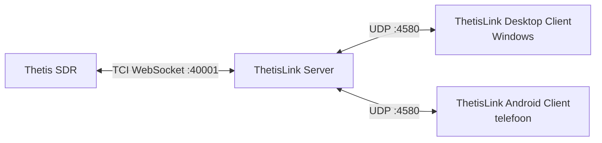

# ThetisLink v2.0.1 - Installatiehandleiding

ThetisLink is een remote bediening voor de ANAN 7000DLE SDR met Thetis. Audio, spectrum, PTT en volledige radiobediening over het netwerk via TCI WebSocket.

**Compatibiliteit:** ThetisLink praat alleen met **Thetis** (via TCI WebSocket) en niet rechtstreeks met de SDR-hardware. Werkt daarom met elk SDR-apparaat dat door **Thetis v2.10.3.15** (officiële release door ramdor) ondersteund wordt — zowel HPSDR Protocol 1 (Hermes, Angelia, Orion) als HPSDR Protocol 2 (ANAN-7000DLE, ANAN-8000DLE, ANAN-G2, Hermes-Lite 2, etc.). Optioneel: Yaesu FT-991A als tweede radio (via COM-poort).

**PA3GHM Thetis fork (optioneel, aanbevolen voor TL2-extensies):** ThetisLink v2.0.1 werkt prima met stock Thetis v2.10.3.15 via TCI alleen — er is geen aparte CAT TCP verbinding nodig. De PA3GHM fork is een **optionele** vervanger die ThetisLink-specifieke TL2 `_ex` extensies toevoegt bovenop stock Thetis: uitgebreide IQ-bandbreedte tot 1536 kHz (vs de 384 kHz stock cap), `tci_caps_ex` capability-broadcast, server-side CTUN auto-recenter (`auto_recenter_ex`), filter-preset en per-RX DDC-rate push-notificaties, plus diversity auto-null met live cirkel-broadcast. Alle uitbreidingen zitten achter de **"ThetisLink extensions"** checkbox in Thetis en zijn standaard uit; met de vink uit blijft het TCI-extensiegedrag van stock v2.10.3.15 behouden (let op: de fork bevat wel een eigen build-tag, release-notes en About-metadata). Zie de Gebruikershandleiding (`User-Manual.md`) voor details.

**Disclaimer:** Deze software bestuurt radiozenders. Gebruik op eigen risico. De auteur is niet verantwoordelijk voor schade aan apparatuur, storing of overtredingen van regelgeving als gevolg van het gebruik van deze software. Controleer alle veiligheidsfuncties (PTT timeout, vermogensgrenzen) voor het zenden.

---

## Wat zit er in dit pakket?

| Bestand | Beschrijving |
|---------|-------------|
| ThetisLink-Server.exe | ThetisLink Server - draait op de PC naast Thetis |
| ThetisLink-Client.exe | ThetisLink Desktop Client - Windows |
| ThetisLink-2.0.1.apk | ThetisLink Android Client - telefoon/tablet |
| thetislink-server.conf | Voorbeeldconfiguratie ThetisLink Server |
| thetislink-client.conf | Voorbeeldconfiguratie ThetisLink Client |
| Installatie.pdf | Deze handleiding (Nederlands) |
| User-Manual.pdf | Gebruikershandleiding (Nederlands) |
| Technische-Referentie.pdf | Technische referentie (Nederlands) |
| Installation.pdf | Installation guide (English) |
| User-Manual-EN.pdf | User manual (English) |
| Technical-Reference.pdf | Technical reference (English) |
| LICENSE | Licentie |
| SHA256SUMS.txt | Checksums ter verificatie |

---

## Overzicht



**Thetis -> ThetisLink Server** (één TCI WebSocket verbinding):
- Audio (RX en TX streams), spectrum/waterfall (IQ data), besturing (frequentie, mode, controls)

**ThetisLink Server -> ThetisLink Clients** (UDP poort 4580):
- Alles: audio, spectrum, besturing, apparaatstatus - in één UDP-verbinding per ThetisLink Client

---

## Vereisten

| Component | Vereiste |
|-----------|---------|
| **ThetisLink Server OS** | Windows 10 of 11 |
| **Thetis** | v2.10.3.15 (ramdor) of PA3GHM fork |
| **SDR hardware** | Elk HPSDR-apparaat dat door Thetis ondersteund wordt (Protocol 1 of 2) |
| **ThetisLink Desktop Client** | Windows 10 of 11 |
| **ThetisLink Android Client** | Android 8.0 (Oreo) of hoger, arm64 |
| **Netwerk** | WiFi of LAN, UDP poort 4580 beschikbaar |

Geen administrator-rechten nodig voor de ThetisLink Server of ThetisLink Clients. ADB is optioneel (alleen nodig voor APK installatie via command line).

---

## Stap 1: Thetis voorbereiden

### 1.0 PA3GHM Thetis fork installeren (aanbevolen)

De PA3GHM fork is een aangepaste versie van Thetis met ThetisLink-specifieke uitbreidingen. Installatie:

1. Installeer eerst de officiele **Thetis v2.10.3.15** via de standaard installer (als je dat nog niet hebt)
2. Download `Thetis.exe` van de PA3GHM fork (branch `thetislink-tl2`)
3. Maak een **backup** van de originele `Thetis.exe` in de Thetis installatiemap (bijv. hernoem naar `Thetis-original.exe`)
4. Kopieer de PA3GHM `Thetis.exe` naar de Thetis installatiemap (overschrijf de originele)
5. Kopieer `ReleaseNotes.txt` naar dezelfde map (overschrijf de bestaande)
6. Start Thetis - in de titelbalk verschijnt "PA3GHM TL2-1" achter het versienummer

> De fork wijzigt alleen `Thetis.exe`. Alle andere bestanden (DLL's, database, instellingen) blijven ongewijzigd. Je kunt altijd terug naar de originele versie door de backup terug te zetten.

### 1.1 TCI Server in Thetis inschakelen

Setup -> Serial/Network/Midi CAT -> Network -> groep **TCI Server**:

1. Zet het **Bind IP:Port** veld op **`0.0.0.0:40001`**
   - `0.0.0.0` = luister op alle netwerk-interfaces (loopback + LAN)
   - `40001` = de poort die de ThetisLink Server standaard verwacht
   - **Let op:** Thetis ships standaard met `127.0.0.1:50001`. Beide waarden moeten dus actief gewijzigd worden.
2. Vink **TCI Server Running** aan

> **Waarom `0.0.0.0` en niet `127.0.0.1`?** Met `0.0.0.0` is de Thetis TCI-server bereikbaar voor:
> - de **ThetisLink Server** op dezelfde PC (die gebruikt `ws://127.0.0.1:40001`)
> - **netwerk-apparaten** die rechtstreeks met Thetis praten (bijv. een **RF2K-S PA** op een ander IP in het LAN)
> - **remote toegang via router/internet** (port-forwarding op poort 40001)
>
> Met alleen `127.0.0.1` werkt enkel het lokale ThetisLink Server-pad — netwerk-apparaten en remote toegang vallen weg.
>
> Wil je niet wijd-open binden, klik dan op **IPv4** (knop naast het Bind-veld); Thetis vult dan je lokale LAN-IP in. Dat beperkt bereikbaarheid tot het LAN.

Bij de PA3GHM Thetis fork, op dezelfde tab:
1. Vink **ThetisLink extensions** aan

> ThetisLink v2.0.1 gebruikt uitsluitend TCI voor radio-besturing. De TCP/IP CAT-server in Thetis hoeft niet aan te staan voor ThetisLink — die is alleen nodig als je een apart loggings-programma of derde-partij CAT-client direct aan Thetis wilt koppelen.

---

## Stap 2: ThetisLink Server (TL2) instellen

### 2.1 ThetisLink Server starten

Kopieer `ThetisLink-Server.exe` naar een map op de Thetis-PC. Dubbelklik om te starten - geen installatie of administrator-rechten nodig.

Bij eerste start wordt automatisch een `thetislink-server.conf` aangemaakt met standaardwaarden. De ThetisLink Server opent een GUI-venster waarin je alles configureert.

### 2.2 Verbinding met Thetis configureren

Vul in de ThetisLink Server GUI in:

| Instelling | Waarde | Toelichting |
|-----------|--------|-------------|
| **TCI** | `ws://127.0.0.1:40001` | TCI WebSocket adres van Thetis |

Als Thetis op dezelfde PC draait (aanbevolen), zijn de standaardwaarden al correct, mits je in stap 1.1 de Thetis TCI Server op `0.0.0.0:40001` (of `127.0.0.1:40001`) hebt ingesteld.

### 2.3 Externe apparaten (optioneel)

In de ThetisLink Server GUI kun je externe apparaten aansluiten. Elk apparaat heeft een enable/disable vinkje - uitgeschakelde apparaten behouden hun configuratie maar worden niet opgestart.

| Apparaat | Verbinding | Instelling |
|----------|-----------|-----------|
| Amplitec 6/2 antenneswitch | Serieel (USB) | COM poort, 19200 baud |
| JC-4s antennetuner (*) | Serieel (USB) | COM poort (gebruikt RTS/CTS lijnen) |
| SPE Expert 1.3K-FA PA | Serieel (USB) | COM poort, 115200 baud |
| RF2K-S PA | HTTP REST | IP:poort (bijv. `192.168.1.50:8080`) |
| UltraBeam RCU-06 antennecontroller | Serieel (USB) | COM poort |
| EA7HG Visual Rotor | UDP | IP:poort (bijv. `192.168.1.66:2570`) |
| Yaesu FT-991A | Serieel (USB) | COM poort (zie hieronder) |

> (*) De JC-4s antennetuner heeft geen standaard seriele interface. Aansturing werkt alleen met een eigen USB-serieel uitbreiding die de RTS/CTS lijnen gebruikt voor tune/abort signalen. Dit is geen standaard product - neem contact op voor details.

#### Yaesu FT-991A USB driver

De Yaesu FT-991A gebruikt een **Silicon Labs CP210x** USB-naar-serieel chip. De driver is te downloaden op:

https://www.silabs.com/developer-tools/usb-to-uart-bridge-vcp-drivers

Na installatie van de driver en het aansluiten van de Yaesu via USB verschijnen er **twee COM-poorten** in Apparaatbeheer (bijv. COM5 en COM6). Selecteer de **laagste** van de twee - dit is de CAT/serieel poort. De andere poort is voor USB audio.

Voor Yaesu audio: selecteer in de ThetisLink Server GUI bij het Yaesu apparaat **USB Audio CODEC** als audioapparaat. De ThetisLink Server stuurt dit audiokanaal door naar alle verbonden ThetisLink Clients.

### 2.4 Firewall

Bij eerste start vraagt Windows Firewall om toestemming. Sta **privaatnetwerk** toe.

De ThetisLink Server luistert op **UDP poort 4580**. Als de firewall-melding niet verschijnt:

1. Windows Defender Firewall -> Geavanceerde instellingen
2. Binnenkomende regel -> Nieuwe regel -> Programma
3. Selecteer `ThetisLink-Server.exe`
4. Toestaan op privaatnetwerk

### 2.5 Windows Defender uitsluiting

Windows Defender scant `ThetisLink-Server.exe` continu omdat het een onbekend programma is. Dit kost onnodig processing power. Sluit de map uit van real-time scanning:

1. Windows Beveiliging -> Virus- en bedreigingsbeveiliging -> Instellingen beheren
2. Scroll naar **Uitsluitingen** -> Uitsluitingen toevoegen of verwijderen
3. Voeg een **Mapuitsluiting** toe voor de map waarin `ThetisLink-Server.exe` staat

### 2.6 Wachtwoord en 2FA

Een wachtwoord is **verplicht**. De ThetisLink Server start niet zonder een geldig wachtwoord (minimaal 8 tekens, letters en cijfers). Stel het wachtwoord in via de ThetisLink Server GUI onder **Security**. ThetisLink Clients moeten hetzelfde wachtwoord invoeren om te verbinden.

De authenticatie gebruikt HMAC-SHA256 challenge-response: het wachtwoord wordt nooit over het netwerk verstuurd. Brute-force bescherming is ingebouwd per ThetisLink Client.

**2FA (optioneel, aanbevolen):** Onder het wachtwoord staat een **2FA (TOTP)** checkbox. Bij het inschakelen verschijnt een QR code. Scan deze met een authenticator app (Google Authenticator, Authy, Microsoft Authenticator, etc.). Na het scannen genereert de app elke 30 seconden een 6-cijferige code.

Bij het verbinden voert de ThetisLink Client eerst het wachtwoord in, waarna een tweede invoerveld verschijnt voor de 6-cijferige 2FA code. Zonder de code is verbinden niet mogelijk.

### 2.7 Configuratiebestand

Alle instellingen worden automatisch opgeslagen in `thetislink-server.conf` naast de exe. Dit bestand wordt bij eerste start aangemaakt en bijgewerkt bij elke wijziging in de GUI.

---

## Stap 3: ThetisLink Desktop Client installeren (Windows)

> De ThetisLink Desktop Client is momenteel alleen beschikbaar voor Windows. Een macOS build (Intel) is experimenteel getest maar niet opgenomen in de distributie.

### 3.1 Installatie

Kopieer `ThetisLink-Client.exe` naar een map op de Desktop Client-PC. Geen installatie nodig.

### 3.2 Eerste keer starten — begeleide setup-wizard

Bij de allereerste start toont ThetisLink een 4-stappen **setup-wizard**. Volgende starts skippen de wizard automatisch en komen direct in de normale UI.

1. **Vind de server.** Servers op dezelfde WiFi/LAN verschijnen automatisch in een "Found"-dropdown (mDNS / Bonjour). Kies de jouwe of typ het adres handmatig als `<server-IP>:4580` (bijv. `192.168.1.79:4580`).
2. **Vul het wachtwoord in** (zie stap 2.6). Een "Show"-vinkje toont het wachtwoord in klare tekst.
3. **2FA-code** — alleen wanneer de server het vraagt. Vul de 6-cijferige code uit je authenticator-app in.
4. **Verbonden.** Klik *Done* om naar de normale UI te gaan.

Bij een fout toont ThetisLink een specifieke melding (bv. "Wrong password", "Server name not found", "Thetis is not running on the server PC") en stuurt je terug naar de juiste stap. Rechtsboven kun je **Skip wizard** klikken om direct naar het handmatige connect-formulier te gaan.

Als ThetisLink Server en Desktop Client op dezelfde PC draaien: gebruik `127.0.0.1:4580`.

> Bij de eerste verbinding kan het aan beide zijden even duren voordat alles is opgestart — de Server moet de TCI-verbinding met Thetis opbouwen en alle externe apparaten initialiseren. Dit is eenmalig; bij volgende verbindingen gaat het direct.

De wizard kun je altijd opnieuw starten via de **Wizard**-knop op de Server-tab.

### 3.3 Configuratie

Instellingen worden automatisch opgeslagen in `thetislink-client.conf` naast de exe:
- Server adres, volumes, TX gain, AGC
- Spectrum instellingen (ref, range, zoom, contrast per band)
- Band memories
- TX profielen
- MIDI mappings
- `language=en` of `language=nl` — UI-tekst voor connect-status en connect-fouten (default: en)
- `successful_connects=N` — first-run wizard teller. De wizard verschijnt zodra dit `0` is of ontbreekt. Verwijder deze regel (of zet hem op `0`) om de wizard bij de volgende start te forceren.

### 3.4 Server-tab — serverstatus in één oogopslag

De Server-tab in de client toont live verbindingsstatus, audio-niveau-balken per kanaal, en een **Wizard**-knop (klein, rechtsboven in de Server-adres rij) om de setup-wizard opnieuw te starten zonder config te wissen.

Als de server zelf op de Thetis-PC draait, heeft zijn venster twee tabs: **Status** (compact server-state paneel: bind-adres, Thetis TCI-link, actieve clients met RTT/loss/jitter, audio-routing chips, recente connect-pogingen, geconfigureerde apparaten) en **Logs**. Het Status-paneel is de snelste manier om support-vragen te beantwoorden zoals *"luistert de server?"* of *"is mijn connect-poging aangekomen?"* — een screenshot ervan dekt meestal 80% van de diagnose.

---

## Stap 4: ThetisLink Android Client installeren

### 4.1 APK installeren

**Via bestandsbeheer:**
1. Kopieer `ThetisLink-2.0.1.apk` naar je telefoon (USB, e-mail, of cloud)
2. Open het APK-bestand op de telefoon
3. Sta "Installeren van onbekende bronnen" toe als gevraagd
4. Installeer

**Via ADB** (met USB-debugging ingeschakeld):
```
adb install ThetisLink-2.0.1.apk
```

### 4.2 Verbinden — begeleide setup-wizard

De Android-app toont bij de eerste start dezelfde 4-stappen **setup-wizard** (Vind server → Wachtwoord → 2FA → Verbonden). Op hetzelfde WiFi-netwerk wordt de Server automatisch gevonden via mDNS (Bonjour) en verschijnt in een *Choose discovered server*-dropdown — geen IP-typewerk nodig. De system back-button gaat naar de vorige wizard-stap; op stap 1 vraagt hij of je naar het handmatige formulier wilt overslaan.

Volgende starts gaan direct naar de normale UI. Om de wizard later opnieuw te starten: tik op de **Wizard**-knop op het Radio-scherm (naast *Settings / MIDI / About*).

Sta microfoontoegang toe als daarom wordt gevraagd bij de eerste start.

### 4.3 Bluetooth headset

De ThetisLink Android Client detecteert automatisch aangesloten Bluetooth headsets. Na het koppelen van een BT headset wordt deze automatisch gebruikt voor audio in/uit.

### 4.4 Bluetooth PTT knop

ThetisLink ondersteunt Bluetooth remote shutter knoppen (bijv. ZL-01) als draadloze PTT. Deze knoppen zijn verkrijgbaar als eenvoudige one-button Bluetooth afstandsbedieningen voor telefoons. Na het koppelen via Android Bluetooth-instellingen wordt de knop automatisch herkend als PTT.

---

## Bediening

Na een succesvolle verbinding is ThetisLink klaar voor gebruik. Zie de **Gebruikershandleiding** (`User-Manual.md`) voor:

- Audio, PTT en frequentie-instelling
- Spectrum en waterval bediening
- Externe apparaten (Amplitec, UltraBeam, SPE, RF2K, Yaesu, Rotor)
- MIDI controller configuratie
- Diversity ontvangst en DX Cluster
- Macro's en naamconventies

---

## Netwerk

### Discovery binnen lokaal netwerk (mDNS)

Clients op dezelfde WiFi/LAN vinden de server automatisch via mDNS
(Bonjour / Avahi) — geen IP-adres intypen nodig. De "Found:"-dropdown
in de desktop-client en de "Choose discovered server"-lijst in de
Android-app vullen zichzelf binnen ~1 seconde na het openen van het
connect-scherm.

Draai je **meerdere ThetisLink-servers** op hetzelfde netwerk? Zet dan
een leesbare naam in `thetislink-server.conf` zodat de dropdown ze van
elkaar onderscheidt:

```
friendly_name=Shack PC
```

Zonder `friendly_name` wordt de OS-hostname als label gebruikt.
Handmatige IP-invoer blijft beschikbaar voor cross-subnet, VPN en
internet-scenario's waar mDNS niet doorheen komt.

De Android-app heeft de permissie `CHANGE_WIFI_MULTICAST_STATE` nodig
voor mDNS-scanning. Dit is een *normal* Android-permissie die
automatisch bij installatie wordt verleend — geen runtime-prompt.

### Bandbreedte

| Situatie | Bandbreedte |
|---------|-------------|
| Audio alleen | ~50 kbps |
| Audio + spectrum | ~500 kbps |

### Latency

Hoe lager de netwerklatency, hoe beter de ervaring - met name voor PTT en audio.

| Netwerk | Verwachting |
|---------|------------|
| LAN / WiFi thuis | Uitstekend (< 5 ms) |
| 4G/5G mobiel | Goed (adaptieve jitter buffer past zich aan) |
| Internet met port forwarding | Goed, afhankelijk van route |

### Gebruik via internet (port forwarding)

Om ThetisLink van buitenshuis te gebruiken moet je router het verkeer doorsturen naar de ThetisLink Server PC:

1. Log in op je router (meestal `192.168.1.1` of `192.168.178.1` in de browser)
2. Zoek de **port forwarding** instelling (soms "NAT", "virtuele server" of "poort doorsturen" genoemd)
3. Maak een regel aan:
   - **Protocol:** UDP
   - **Externe poort:** 4580
   - **Interne poort:** 4580
   - **Intern IP-adres:** het IP van de ThetisLink Server PC (bijv. `192.168.1.79`)
4. Sla op en herstart de router indien nodig

In de ThetisLink Client gebruik je dan je **publieke IP-adres** als ThetisLink Server-adres. Je publieke IP vind je op bijv. whatismyip.com. Bij een wisselend IP-adres kun je een DynDNS dienst gebruiken (bijv. No-IP, DuckDNS) zodat je altijd via dezelfde naam verbindt.

> **Beveiliging:** Het wachtwoord is altijd verplicht (zie stap 2.6). Bij gebruik via internet wordt 2FA (TOTP) sterk aanbevolen als extra beveiligingslaag. Overweeg als alternatief een VPN-oplossing (bijv. WireGuard) waarmee de ThetisLink Server PC niet direct aan internet wordt blootgesteld.

---

## Problemen oplossen (installatie en verbinding)

| Probleem | Oplossing |
|----------|-----------|
| Geen audio na connect | Controleer of de Thetis TCI Server actief is (Setup -> Serial/Network/Midi CAT -> Network) en het Bind IP:Port veld op `0.0.0.0:40001` of `127.0.0.1:40001` staat |
| Frequentie verandert niet | Controleer of de Thetis TCI Server aan staat (Setup -> Serial/Network/Midi CAT -> Network, poort 40001) en dat het adres in de ThetisLink Server GUI overeenkomt (default `ws://127.0.0.1:40001`) |
| ThetisLink Client kan niet verbinden | Firewall blokkeert UDP 4580 - controleer firewall-regels op de ThetisLink Server PC |
| Disconnect na paar seconden | Instabiel WiFi of firewall blokkade. Check loss% onderaan de ThetisLink Client |
| Spectrum toont niets | Thetis TCI Server moet actief zijn. Controleer ook de TCI-poort in de ThetisLink Server GUI |
| Externe apparaten reageren niet | Check COM-poort instelling in de ThetisLink Server GUI en of het apparaat aan staat |
| Rotor offline | Check IP:poort in de ThetisLink Server GUI. Visual Rotor software mag niet tegelijk draaien |
| Yaesu reageert niet | Check COM-poort in de ThetisLink Server GUI. Zorg dat geen ander programma de COM-poort gebruikt |
| APK installeert niet | Sta "onbekende bronnen" toe in Android-instellingen |

Voor problemen tijdens het gebruik, zie de Gebruikershandleiding (`User-Manual.md`).

---

## Remote beheer (headless ThetisLink Server PC setup)

Voor een onbemande Thetis + ThetisLink Server PC die op afstand beheerd wordt via ThetisLink.

> **Let op:** Automatisch inloggen zonder wachtwoord is alleen verantwoord als de PC fysiek beveiligd is (bijv. in een afgesloten shack) en bij voorkeur op een apart netwerksegment staat. Doe dit niet op een PC die publiek toegankelijk is of op een gedeeld netwerk zonder vertrouwen.

### Automatisch inloggen (zonder wachtwoord)

1. Open PowerShell als Administrator:
   ```powershell
   reg add "HKLM\SOFTWARE\Microsoft\Windows NT\CurrentVersion\PasswordLess\Device" /v DevicePasswordLessBuildVersion /t REG_DWORD /d 0 /f
   ```
2. Run `netplwiz` (Win+R -> `netplwiz`)
3. Vink **"Users must enter a user name and password to use this computer"** UIT -> OK
4. Voer je **account wachtwoord** in (twee keer) - **niet** je PIN!
   - Bij een Microsoft account: je Microsoft wachtwoord
   - Bij een domeinaccount: je domein wachtwoord
   - De Windows Hello PIN werkt hier niet

**Let op:** als er na deze stap twee identieke gebruikers op het inlogscherm verschijnen, open `netplwiz` opnieuw, selecteer de dubbele en klik Remove.

### ThetisLink Server automatisch starten

Leg een snelkoppeling naar `ThetisLink-Server.exe` in de Startup map:
```
Win+R -> shell:startup -> plak snelkoppeling
```

### Remote reboot via ThetisLink

De ThetisLink Client kan de ThetisLink Server PC herstarten via de reboot-knop. Dit vereist een Windows Scheduled Task:

```powershell
schtasks /create /tn "ThetisLinkReboot" /tr "shutdown /r /t 5 /f" /sc once /st 00:00 /ru SYSTEM /rl HIGHEST /f
```

Deze task wordt eenmalig aangemaakt. De ThetisLink Server voert `schtasks /run /tn ThetisLinkReboot` uit bij een remote reboot verzoek.

### SSH toegang (voor bestandsbeheer via WinSCP)

Installeer OpenSSH Server op de ThetisLink Server PC:

1. **Settings -> Apps -> Optional features -> Add a feature** -> zoek "OpenSSH Server" -> Install
2. Start de service (PowerShell als Administrator):
   ```powershell
   Start-Service sshd
   Set-Service -Name sshd -StartupType 'Automatic'
   ```
3. Verbind via WinSCP op poort 22 met je Windows gebruikersnaam en wachtwoord

---

## Verificatie

Controleer de integriteit van de bestanden:

**Linux/macOS/Git Bash:**
```
sha256sum -c SHA256SUMS.txt
```

**PowerShell (Windows):**
```powershell
Get-Content SHA256SUMS.txt | ForEach-Object {
    $parts = $_ -split '  '
    $expected = $parts[0]; $file = $parts[1]
    $actual = (Get-FileHash $file -Algorithm SHA256).Hash.ToLower()
    if ($actual -eq $expected) { "$file OK" } else { "$file FAILED" }
}
```


