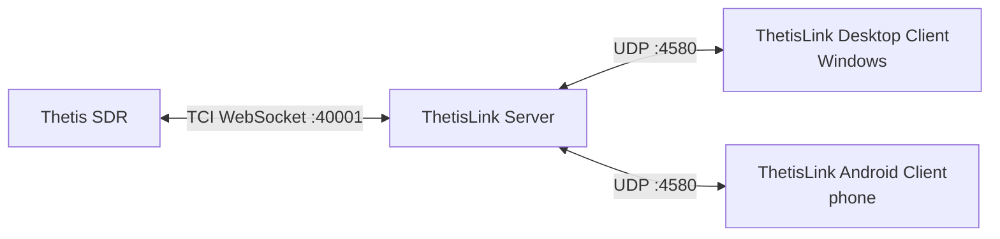

# ThetisLink v2.0.0 - Installation Guide

ThetisLink is a remote control application for the ANAN 7000DLE SDR with Thetis. Audio, spectrum, PTT and full radio control over the network via TCI WebSocket.

**Compatibility:** ThetisLink talks only to **Thetis** (via TCI WebSocket) and not directly to the SDR hardware. It therefore works with any SDR device supported by **Thetis v2.10.3.15** (official release by ramdor) — both HPSDR Protocol 1 (Hermes, Angelia, Orion) and HPSDR Protocol 2 (ANAN-7000DLE, ANAN-8000DLE, ANAN-G2, Hermes-Lite 2, etc.). Optional: Yaesu FT-991A as a second radio (via COM port).

**PA3GHM Thetis fork (optional, recommended for TL2 extensions):** ThetisLink v2.0.0 works fine with stock Thetis v2.10.3.15 over TCI alone — no separate CAT TCP connection is required. The PA3GHM fork is an **optional** drop-in replacement that adds ThetisLink-specific TL2 `_ex` extensions on top of stock Thetis: extended IQ bandwidth up to 1536 kHz (vs the 384 kHz stock cap), `tci_caps_ex` capability broadcast, server-side CTUN auto-recenter (`auto_recenter_ex`), filter-preset and per-RX DDC-rate push notifications, and diversity auto-null with live circle broadcast. All extensions sit behind the **"ThetisLink extensions"** checkbox in Thetis and are disabled by default; with the checkbox unchecked the TCI extension behaviour is preserved (stock v2.10.3.15 — note the fork still carries its own build tag, release notes and About metadata). See the User Manual (`User-Manual-EN.md`) for details.

**Disclaimer:** This software controls radio transmitters. Use at your own risk. The author is not responsible for damage to equipment, interference or violations of regulations resulting from the use of this software. Verify all safety features (PTT timeout, power limits) before transmitting.

---

## What is included in this package?

| File | Description |
|------|-------------|
| ThetisLink-Server.exe | ThetisLink Server - runs on the PC alongside Thetis |
| ThetisLink-Client.exe | ThetisLink Desktop Client - Windows |
| ThetisLink-2.0.0.apk | ThetisLink Android Client - phone/tablet |
| thetislink-server.conf | Example ThetisLink Server configuration |
| thetislink-client.conf | Example ThetisLink Client configuration |
| Installation.pdf | Installation guide (English, this document) |
| User-Manual-EN.pdf | User manual (English) |
| Technical-Reference.pdf | Technical reference (English) |
| Installatie.pdf | Installatiehandleiding (Nederlands) |
| User-Manual.pdf | Gebruikershandleiding (Nederlands) |
| Technische-Referentie.pdf | Technische referentie (Nederlands) |
| LICENSE | License |
| SHA256SUMS.txt | Checksums for verification |

---

## Overview



**Thetis -> ThetisLink Server** (single TCI WebSocket connection):
- Audio (RX and TX streams), spectrum/waterfall (IQ data), control (frequency, mode, controls)

**ThetisLink Server -> ThetisLink Clients** (UDP port 4580):
- Everything: audio, spectrum, control, device status - in a single UDP connection per ThetisLink Client

---

## Requirements

| Component | Requirement |
|-----------|-------------|
| **ThetisLink Server OS** | Windows 10 or 11 |
| **Thetis** | v2.10.3.15 (ramdor) or PA3GHM fork |
| **SDR hardware** | Any HPSDR device supported by Thetis (Protocol 1 or 2) |
| **ThetisLink Desktop Client** | Windows 10 or 11 |
| **ThetisLink Android Client** | Android 8.0 (Oreo) or higher, arm64 |
| **Network** | WiFi or LAN, UDP port 4580 available |

No administrator rights required for the ThetisLink Server or ThetisLink Clients. ADB is optional (only needed for APK installation via command line).

---

## Step 1: Preparing Thetis

### 1.0 Installing the PA3GHM Thetis fork (recommended)

The PA3GHM fork is a modified version of Thetis with ThetisLink-specific extensions. Installation:

1. First install the official **Thetis v2.10.3.15** using the standard installer (if you have not already done so)
2. Download `Thetis.exe` from the PA3GHM fork (branch `thetislink-tl2`)
3. Make a **backup** of the original `Thetis.exe` in the Thetis installation folder (e.g. rename to `Thetis-original.exe`)
4. Copy the PA3GHM `Thetis.exe` to the Thetis installation folder (overwrite the original)
5. Copy `ReleaseNotes.txt` to the same folder (overwrite the existing file)
6. Start Thetis - the title bar will show "PA3GHM TL2-1" after the version number

> The fork only modifies `Thetis.exe`. All other files (DLLs, database, settings) remain unchanged. You can always revert to the original version by restoring the backup.

### 1.1 Enabling the TCI Server in Thetis

Setup -> Serial/Network/Midi CAT -> Network -> **TCI Server** group:

1. Set the **Bind IP:Port** field to **`0.0.0.0:40001`**
   - `0.0.0.0` = listen on all network interfaces (loopback + LAN)
   - `40001` = the port the ThetisLink Server expects by default
   - **Note:** Thetis ships with `127.0.0.1:50001` by default. Both values must therefore be actively changed.
2. Check **TCI Server Running**

> **Why `0.0.0.0` instead of `127.0.0.1`?** With `0.0.0.0` the Thetis TCI server is reachable for:
> - the **ThetisLink Server** on the same PC (which uses `ws://127.0.0.1:40001`)
> - **network devices** that talk to Thetis directly (e.g. an **RF2K-S PA** on a different LAN IP)
> - **remote access via router/internet** (port-forwarding on port 40001)
>
> With `127.0.0.1` only the local ThetisLink Server path works — network devices and remote access drop out.
>
> If you do not want to bind wide-open, click **IPv4** (button next to the Bind field); Thetis will then fill in your local LAN IP. That restricts reachability to the LAN.

With the PA3GHM Thetis fork, on the same tab:
1. Check **ThetisLink extensions**

> ThetisLink v2.0.0 uses TCI exclusively for radio control. The TCP/IP CAT server in Thetis does not need to be enabled for ThetisLink — it is only required if you want to connect a separate logging program or third-party CAT client to Thetis directly.

---

## Step 2: Configuring the ThetisLink Server (TL2)

### 2.1 Starting the ThetisLink Server

Copy `ThetisLink-Server.exe` to a folder on the Thetis PC. Double-click to start - no installation or administrator rights required.

On first start, a `thetislink-server.conf` is automatically created with default values. The ThetisLink Server opens a GUI window where you configure everything.

### 2.2 Configuring the connection to Thetis

Enter the following in the ThetisLink Server GUI:

| Setting | Value | Notes |
|---------|-------|-------|
| **TCI** | `ws://127.0.0.1:40001` | TCI WebSocket address of Thetis |

If Thetis is running on the same PC (recommended), the default values are already correct, provided you set the Thetis TCI Server to `0.0.0.0:40001` (or `127.0.0.1:40001`) in step 1.1.

### 2.3 External devices (optional)

In the ThetisLink Server GUI you can connect external devices. Each device has an enable/disable checkbox - disabled devices retain their configuration but are not started.

| Device | Connection | Setting |
|--------|-----------|---------|
| Amplitec 6/2 antenna switch | Serial (USB) | COM port, 19200 baud |
| JC-4s antenna tuner (*) | Serial (USB) | COM port (uses RTS/CTS lines) |
| SPE Expert 1.3K-FA PA | Serial (USB) | COM port, 115200 baud |
| RF2K-S PA | HTTP REST | IP:port (e.g. `192.168.1.50:8080`) |
| UltraBeam RCU-06 antenna controller | Serial (USB) | COM port |
| EA7HG Visual Rotor | UDP | IP:port (e.g. `192.168.1.66:2570`) |
| Yaesu FT-991A | Serial (USB) | COM port (see below) |

> (*) The JC-4s antenna tuner does not have a standard serial interface. Control only works with a custom USB-serial extension that uses the RTS/CTS lines for tune/abort signals. This is not a standard product - contact for details.

#### Yaesu FT-991A USB driver

The Yaesu FT-991A uses a **Silicon Labs CP210x** USB-to-serial chip. The driver can be downloaded at:

https://www.silabs.com/developer-tools/usb-to-uart-bridge-vcp-drivers

After installing the driver and connecting the Yaesu via USB, **two COM ports** will appear in Device Manager (e.g. COM5 and COM6). Select the **lowest** of the two - this is the CAT/serial port. The other port is for USB audio.

For Yaesu audio: in the ThetisLink Server GUI, select **USB Audio CODEC** as the audio device for the Yaesu device. The ThetisLink Server forwards this audio channel to all connected ThetisLink Clients.

### 2.4 Firewall

On first start, Windows Firewall will ask for permission. Allow **private network**.

The ThetisLink Server listens on **UDP port 4580**. If the firewall prompt does not appear:

1. Windows Defender Firewall -> Advanced settings
2. Inbound rules -> New rule -> Program
3. Select `ThetisLink-Server.exe`
4. Allow on private network

### 2.5 Windows Defender exclusion

Windows Defender continuously scans `ThetisLink-Server.exe` because it is an unknown program. This wastes processing power unnecessarily. Exclude the folder from real-time scanning:

1. Windows Security -> Virus & threat protection -> Manage settings
2. Scroll to **Exclusions** -> Add or remove exclusions
3. Add a **Folder exclusion** for the folder containing `ThetisLink-Server.exe`

### 2.6 Password and 2FA

A password is **required**. The ThetisLink Server will not start without a valid password (minimum 8 characters, letters and digits). Set the password in the ThetisLink Server GUI under **Security**. ThetisLink Clients must enter the same password to connect.

Authentication uses HMAC-SHA256 challenge-response: the password is never sent over the network. Brute-force protection is built in per ThetisLink Client.

**2FA (optional, recommended):** Below the password there is a **2FA (TOTP)** checkbox. When enabled, a QR code is displayed. Scan it with an authenticator app (Google Authenticator, Authy, Microsoft Authenticator, etc.). After scanning, the app generates a 6-digit code every 30 seconds.

When connecting, the ThetisLink Client first enters the password, after which a second input field appears for the 6-digit 2FA code. Without the code, connecting is not possible.

### 2.7 Configuration file

All settings are automatically saved in `thetislink-server.conf` next to the exe. This file is created on first start and updated with every change in the GUI.

---

## Step 3: Installing the ThetisLink Desktop Client (Windows)

> The ThetisLink Desktop Client is currently only available for Windows. A macOS build (Intel) has been experimentally tested but is not included in the distribution.

### 3.1 Installation

Copy `ThetisLink-Client.exe` to a folder on the Desktop Client PC. No installation required.

### 3.2 First launch

1. Start `ThetisLink-Client.exe`
2. Select your **microphone** (Input) and **speaker/headset** (Output) at the top
3. Enter the **ThetisLink Server address**: `<server-IP>:4580` (e.g. `192.168.1.79:4580`)
4. Enter the **password** (see step 2.6)
5. Click **Connect**
6. Enter the **2FA code** if TOTP is enabled on the ThetisLink Server (6 digits from your authenticator app)

If the ThetisLink Server and ThetisLink Desktop Client are running on the same PC: use `127.0.0.1:4580`.

> On the first connection it may take a moment on both sides before everything is ready - the ThetisLink Server needs to establish the TCI connection with Thetis and initialize all external devices. This is a one-time delay; subsequent connections are immediate.

### 3.3 Configuration

Settings are automatically saved in `thetislink-client.conf` next to the exe:
- Server address, volumes, TX gain, AGC
- Spectrum settings (ref, range, zoom, contrast per band)
- Band memories
- TX profiles
- MIDI mappings

---

## Step 4: Installing the ThetisLink Android Client

### 4.1 Installing the APK

**Via file manager:**
1. Copy `ThetisLink-2.0.0.apk` to your phone (USB, email, or cloud)
2. Open the APK file on the phone
3. Allow "Install from unknown sources" if prompted
4. Install

**Via ADB** (with USB debugging enabled):
```
adb install ThetisLink-2.0.0.apk
```

### 4.2 Connecting

1. Open ThetisLink
2. Enter the **ThetisLink Server address**: `<server-IP>:4580`
3. Set the **password** via Settings (gear icon)
4. Tap **Connect**
5. Enter the **2FA code** if TOTP is enabled (6 digits from your authenticator app)
6. Allow microphone access if prompted

### 4.3 Bluetooth headset

The ThetisLink Android Client automatically detects connected Bluetooth headsets. After pairing a BT headset, it is automatically used for audio in/out.

### 4.4 Bluetooth PTT button

ThetisLink supports Bluetooth remote shutter buttons (e.g. ZL-01) as wireless PTT. These buttons are available as simple one-button Bluetooth remote controls for phones. After pairing via Android Bluetooth settings, the button is automatically recognized as PTT.

---

## Operation

After a successful connection, ThetisLink is ready to use. See the **User Manual** (`User-Manual-EN.md`) for:

- Audio, PTT and frequency control
- Spectrum and waterfall operation
- External devices (Amplitec, UltraBeam, SPE, RF2K, Yaesu, Rotor)
- MIDI controller configuration
- Diversity reception and DX Cluster
- Macros and naming conventions

---

## Network

### Bandwidth

| Situation | Bandwidth |
|-----------|-----------|
| Audio only | ~50 kbps |
| Audio + spectrum | ~500 kbps |

### Latency

The lower the network latency, the better the experience - especially for PTT and audio.

| Network | Expectation |
|---------|-------------|
| LAN / home WiFi | Excellent (< 5 ms) |
| 4G/5G mobile | Good (adaptive jitter buffer adjusts) |
| Internet with port forwarding | Good, depending on route |

### Using via internet (port forwarding)

To use ThetisLink from outside your home network, your router must forward traffic to the ThetisLink Server PC:

1. Log in to your router (usually `192.168.1.1` or `192.168.178.1` in the browser)
2. Find the **port forwarding** setting (sometimes called "NAT", "virtual server" or "port redirect")
3. Create a rule:
   - **Protocol:** UDP
   - **External port:** 4580
   - **Internal port:** 4580
   - **Internal IP address:** the IP of the ThetisLink Server PC (e.g. `192.168.1.79`)
4. Save and restart the router if necessary

In the ThetisLink Client, use your **public IP address** as the ThetisLink Server address. You can find your public IP at e.g. whatismyip.com. If your IP address changes frequently, you can use a DynDNS service (e.g. No-IP, DuckDNS) so you always connect via the same hostname.

> **Security:** A password is always required (see step 2.6). When using over the internet, 2FA (TOTP) is strongly recommended as an additional security layer. Consider as an alternative a VPN solution (e.g. WireGuard) so that the ThetisLink Server PC is not directly exposed to the internet.

---

## Troubleshooting (installation and connection)

| Problem | Solution |
|---------|----------|
| No audio after connect | Check that the Thetis TCI Server is active (Setup -> Serial/Network/Midi CAT -> Network) and the Bind IP:Port field is set to `0.0.0.0:40001` or `127.0.0.1:40001` |
| Frequency does not change | Check that the Thetis TCI Server is enabled (Setup -> Serial/Network/Midi CAT -> Network, port 40001) and the address in the ThetisLink Server GUI matches (default `ws://127.0.0.1:40001`) |
| ThetisLink Client cannot connect | Firewall is blocking UDP 4580 - check firewall rules on the ThetisLink Server PC |
| Disconnect after a few seconds | Unstable WiFi or firewall block. Check loss% at the bottom of the ThetisLink Client |
| Spectrum shows nothing | The Thetis TCI Server must be active. Also check the TCI port in the ThetisLink Server GUI |
| External devices not responding | Check COM port setting in the ThetisLink Server GUI and whether the device is powered on |
| Rotor offline | Check IP:port in the ThetisLink Server GUI. Visual Rotor software must not be running at the same time |
| Yaesu not responding | Check COM port in the ThetisLink Server GUI. Make sure no other program is using the COM port |
| APK will not install | Allow "unknown sources" in Android settings |

For problems during use, see the User Manual (`User-Manual-EN.md`).

---

## Remote management (headless ThetisLink Server PC setup)

For an unattended Thetis + ThetisLink Server PC managed remotely via ThetisLink.

> **Note:** Automatic login without a password is only appropriate if the PC is physically secured (e.g. in a locked shack) and preferably on a separate network segment. Do not do this on a PC that is publicly accessible or on a shared network without trust.

### Automatic login (without password)

1. Open PowerShell as Administrator:
   ```powershell
   reg add "HKLM\SOFTWARE\Microsoft\Windows NT\CurrentVersion\PasswordLess\Device" /v DevicePasswordLessBuildVersion /t REG_DWORD /d 0 /f
   ```
2. Run `netplwiz` (Win+R -> `netplwiz`)
3. Uncheck **"Users must enter a user name and password to use this computer"** -> OK
4. Enter your **account password** (twice) - **not** your PIN!
   - For a Microsoft account: your Microsoft password
   - For a domain account: your domain password
   - The Windows Hello PIN does not work here

**Note:** If two identical users appear on the login screen after this step, open `netplwiz` again, select the duplicate and click Remove.

### Auto-starting ThetisLink Server

Place a shortcut to `ThetisLink-Server.exe` in the Startup folder:
```
Win+R -> shell:startup -> paste shortcut
```

### Remote reboot via ThetisLink

The ThetisLink Client can restart the ThetisLink Server PC via the reboot button. This requires a Windows Scheduled Task:

```powershell
schtasks /create /tn "ThetisLinkReboot" /tr "shutdown /r /t 5 /f" /sc once /st 00:00 /ru SYSTEM /rl HIGHEST /f
```

This task is created once. The ThetisLink Server executes `schtasks /run /tn ThetisLinkReboot` upon a remote reboot request.

### SSH access (for file management via WinSCP)

Install OpenSSH Server on the ThetisLink Server PC:

1. **Settings -> Apps -> Optional features -> Add a feature** -> search for "OpenSSH Server" -> Install
2. Start the service (PowerShell as Administrator):
   ```powershell
   Start-Service sshd
   Set-Service -Name sshd -StartupType 'Automatic'
   ```
3. Connect via WinSCP on port 22 with your Windows username and password

---

## Verification

Verify the integrity of the files:

**Linux/macOS/Git Bash:**
```
sha256sum -c SHA256SUMS.txt
```

**PowerShell (Windows):**
```powershell
Get-Content SHA256SUMS.txt | ForEach-Object {
    $parts = $_ -split '  '
    $expected = $parts[0]; $file = $parts[1]
    $actual = (Get-FileHash $file -Algorithm SHA256).Hash.ToLower()
    if ($actual -eq $expected) { "$file OK" } else { "$file FAILED" }
}
```
