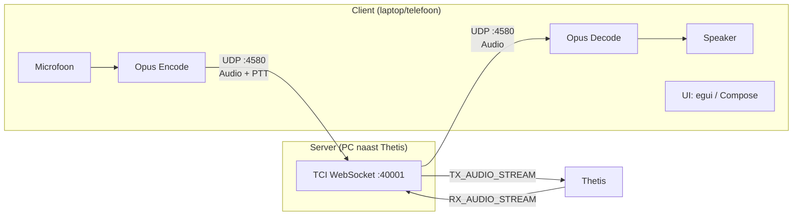
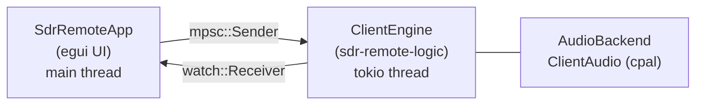
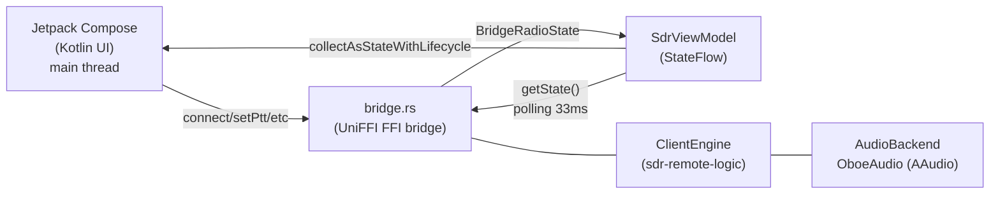
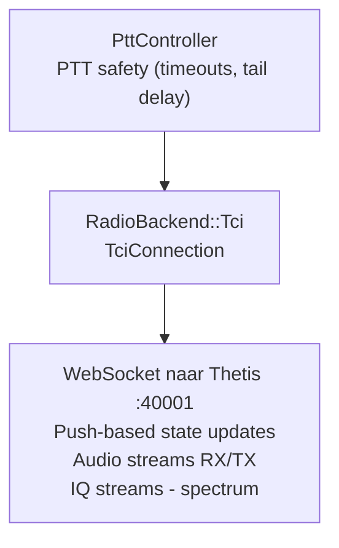
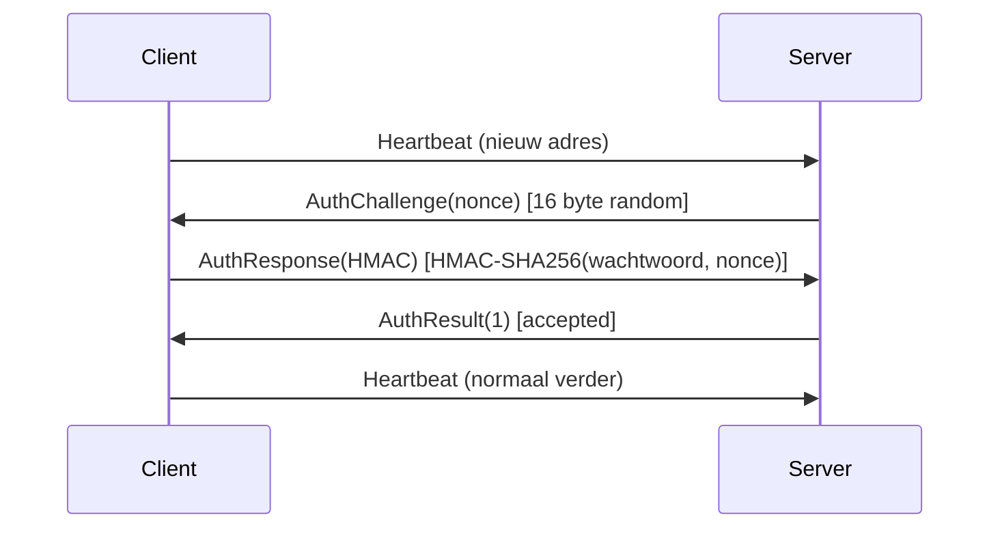
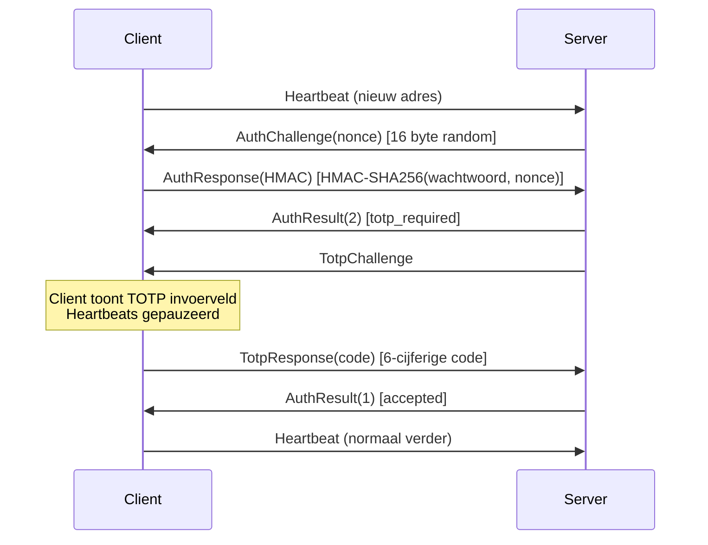

# ThetisLink v2.1.0 — Technische Documentatie

## 1. Overzicht

ThetisLink is een systeem voor het op afstand bedienen van een ANAN 7000DLE + Thetis SDR-ontvanger en een Yaesu FT-991A transceiver via een netwerkverbinding. Het biedt bidirectionele real-time audio streaming, PTT-bediening, DDC spectrum/waterfall display, volledige RX2/VFO-B ondersteuning, diversity, Yaesu memory channel management en radio settings editor over UDP met Opus codec.

**Versie:** v2.1.0 (gedeeld versienummer in `sdr-remote-core::VERSION`)
**Ontwikkeltaal:** Rust + Kotlin (Android UI)
**Doelplatform:** Windows 10/11, macOS (Intel/Apple Silicon), Android 8+ (arm64)
**Ontwerpprioriteit:** latency > bandbreedte > features

### Thetis compatibiliteit

ThetisLink vereist **Thetis v2.10.3.15** of nieuwer (de laatste officiële release door Richard Samphire, MW0LGE / [ramdor/Thetis](https://github.com/ramdor/Thetis)). Oudere Thetis versies ondersteunen het TCI WebSocket protocol niet volledig — met name IQ streaming en audio routing werken niet correct.

Daarnaast is er een **PA3GHM ThetisLink fork** ([cjenschede/Thetis](https://github.com/cjenschede/Thetis/tree/thetislink-tl2), branch `thetislink-tl2`) met uitbreidingen specifiek voor ThetisLink. Deze fork voegt toe:

- **Extended IQ spectrum**: tot **1536 kHz** IQ bandbreedte via TCI (standaard Thetis beperkt tot 384 kHz)
- **TCI `_ex` commando's**: CTUN, VFO sync, step attenuator, FM deviation, diversity, DDC sample rate, AGC auto, VFO swap — allemaal via TCI in plaats van CAT
- **Push-notificaties**: real-time state updates naar TCI clients bij wijzigingen in Thetis
- **Diversity auto-null**: Smart en Ultra algoritmen die server-side in Thetis draaien (DSP-snelheid)
- **BroadcastDiversityPhase/Gain**: real-time cirkelplot updates tijdens auto-null sweep

Alle uitbreidingen zitten achter de **"ThetisLink extensions"** checkbox in Setup → Network → IQ Stream. Met deze vink uit blijft het stock TCI-extensiegedrag van v2.10.3.15 behouden (de fork bevat wel een eigen build-tag, release-notes en About-metadata). De huidige ThetisLink fork build tag is **TL2-1**.

De standaard IQ sample rate is 384 kHz. Met ThetisLink extensions kan de gebruiker kiezen uit: 48, 96, 192, 384, 768 of **1536 kHz** — selecteerbaar per receiver via de DDC sample rate dropdown in de client.

**Repos:**
- ThetisLink: [cjenschede/ThetisLink](https://github.com/cjenschede/ThetisLink) (publieke release repo, tag `v2.1.0`)
- Thetis fork: [cjenschede/Thetis](https://github.com/cjenschede/Thetis) (branch `thetislink-tl2`)
- Origineel Thetis: [ramdor/Thetis](https://github.com/ramdor/Thetis)

### v2.1.0 highlights

**Yaesu G-1000DXC rotor via MCP2221A, opt-in wideband Thetis RX, Amplitec reconnect, RX2 filter fixes.** Backwards-compatible met v2.0.4 — wire-protocol ongewijzigd; alle uitbreidingen zijn server-side en zichtbaar via bestaande Rotor/Amplitec/TCI kanalen. Server, desktop client en Android client dragen dezelfde `VERSION = "2.1.0"`; combineer met **Thetis fork PA3GHM TL2-4** voor de volledige feature-set, val terug op stock Thetis zonder veiligheidsgaranties op te geven.

- **Yaesu G-1000DXC rotor via Adafruit MCP2221A** — derde rotor-backend naast EA7HG en PstRotator. Directe aansturing van de Yaesu EXT CONTROL DIN-7 connector via een MCP2221A breakout in **5 V mode** (3V solder-jumper doorgesneden, 5V-pad gebrugd op de Adafruit onderkant). GPIO0/1 → BST82 SOT-23 low-side switches op pin 1 (R/CW) en pin 2 (L/CCW) van de Yaesu, met 100 kΩ gate-pulldown om spontane rotatie tijdens USB-reset te voorkomen. GP2 (DAC, 5-bit) → speed-pin 3 met DAC-Vref = Vdd. GP3 (ADC, 10-bit, intern Vrm = 4,096 V) ← position-pin 4 via een **1,8 kΩ + 2,2 kΩ** deler (ratio 1,818, max meting ~7,45 V — sommige G-1000DXC units overschrijden de schema-spec van 4,5 V en gaan tot ~7,3 V op pin 4 bij 450°). Server-side poll-thread combineert adaptive sample-rate (motion 30 Hz / idle 1 Hz, mediaan-filter voor 50/100 Hz ripple-onderdrukking), soft-start / soft-stop ramp (`ramp_pct_per_sec`, 1-200 %/s, default 50), GoTo deadband 1° met decel-distance-gebaseerde landing, kortste-route optie voor `max_deg > 360°` (target ± 360 wordt overwogen tegen de gemechaniseerde afstand), en een manual-mode override die de server-UI test-knoppen + speed-slider laat winnen boven de ramp-loop. Driver-instantie publiceert dezelfde `Rotor`-facade als de andere backends zodat het bestaande Rotor-window in beide clients zonder wijzigingen werkt.
- **Opt-in wideband Thetis RX audio** — checkbox in het Server-tabblad verhoogt de RX-audio sample rate boven de stock 48 kHz wanneer de Thetis-fork-extensie aanwezig is. Default uit; stock-Thetis pad blijft onveranderd. Vereist Thetis fork **PA3GHM TL2-4** voor het wideband-IQ commando.
- **Modulaire multi-tuner wizard** — `Vec<TunerConfig>` schema vervangt het oude 2-tuner-hardcoded pad. Per-slot Add via board-scan + classificatie (Tuner / Rotor / Unprogrammed) + EEPROM-write van de gekozen functie. Per-slot Rename, Delete (met server-restart) en threshold/hysterese slider. Het MCP2221A-blok in het Status-paneel is collapsible; open/dicht state persist over restart.
- **Amplitec 6/2 reconnect + offline-start** — serial-worker thread heeft een retry-loop met 5 s interval. Bij power-cycle van de Amplitec markeert de driver `connected = false` en probeert continu opnieuw te openen tot het bord terug is — zonder server-restart. Bij server-start met de Amplitec offline wordt de instance toch direct aangemaakt zodat het venster verschijnt; verbinding volgt automatisch zodra de poort beschikbaar is.
- **RX2 mode-switch filter restore** — client `handleModulation`-pad respecteert nu de server filter-band update tijdens een mode-switch (USB → CW etc.) i.p.v. de stale filter-edges van de vorige modus over te nemen.
- **RX2 spectrum filter-drag isolation** — per-channel filter-edge drag-state keys ontkoppelen RX1 en RX2; een filter-edge drag op RX2 trekt RX1's filter niet meer mee.
- **Yaesu EQ profile mic-gain persistence** — de mic-gain slider wordt nu mee opgeslagen met band/treble bij EQ-profiel save.
- **Yaesu TX resampler anti-alias** — scherpere filter-curve op de client TX resampler reduceert aliasing-artefacten in het verzonden audio.
- **Status-paneel scroll-stabiliteit** — `try_lock`-contentie op de SessionManager toonde voorheen een 1-regel "snapshot busy..." placeholder waardoor de ScrollArea-scroll-positie clampte zodra de bovenliggende sectie kromp. Snapshot-cache vangt nu lock-failures op en houdt de sectie-hoogte constant.
- **Graceful server auto-restart** — Drop-handlers op alle hardware-Arcs (Yaesu, Amplitec, Tuner, SPE, RF2K, UltraBeam) lopen nu vóór de child-process spawn zodat cpal audio-streams + TCI WebSocket netjes worden vrijgegeven. Audio op de nieuwe instance werkt direct zonder handmatige stop+start cyclus.
- **UI polish** — alle CollapsingHeader widgets vervangen door `chevron_label` met geometrische driehoek-glyph (ASCII-only, geen egui-default-font tofu). Server Settings-tab in een ScrollArea voor kleinere displays. Amplitec antenne-rename via right-click context-menu + auto-scale knoppen bij lange namen. Client frequency-digit hover blokkeert parent ScrollArea zodat mouse-wheel-edits niet de omliggende panel scrollen. Rotor-poll log-spam (per-tick `set_direction` + 5 s ADC stats) gedegradeerd naar `debug!`.
- **Hardware-noot Yaesu rotor printje** — bouwers die hetzelfde setup willen reproduceren: gebruik **1,8 kΩ + 2,2 kΩ** voor de position-feedback deler (ratio 1,818). De initiele 1,8 kΩ + 10 kΩ design (ratio 1,18) clipte boven ~365° op sommige G-1000DXC units omdat pin 4 daar boven 4,8 V uitkomt. Een 10 µF condensator parallel aan de 2,2 kΩ onderdrukt de 100 Hz netvoeding-rectifier ripple op het positie-signaal. Na elke deler-wijziging **opnieuw kalibreren** via Park CCW + Park CW — de opgeslagen `v_at_0deg` / `v_at_max_deg` waarden hangen aan de ratio.

### v2.0.4 highlights

**Bandbreedte-toolkit, preventieve TX-inhibit, power-cap, PstRotator.** Backwards-compatible met v2.0.3 — wire-protocol uitsluitend additief (één nieuwe `ControlId::DxSpotsEnabled = 0x65`). Server, desktop client en Android client dragen alle dezelfde `VERSION = "2.0.4"`; combineer met **Thetis fork PA3GHM TL2-3** voor de volledige feature-set, val terug op stock Thetis zonder veiligheidsgaranties op te geven.

- **Preventieve RX-only TX-inhibit** — nieuw `rx_only_ex` TCI-commando laat ThetisLink Thetis' "Receive only" flag direct zetten op een RX-only Amplitec-A positie. MOX, spatiebalk, hardware-PTT en VOX worden aan de bron geweigerd, niet reactief teruggeflipt. Server-side state-machine handelt overname, level-maintain (echo-gegate) en teruggave af, inclusief een bootstrap-stale clear binnen ~1 ms na cap-detectie. De Thetis-fork `RXOnly` setter broadcast nu een TCI push-notify zodat externe Setup → "Receive only" toggles real-time zichtbaar zijn voor ThetisLink. De reactieve `ZZTX0` catch-all blijft de veiligheidsvloer voor stock Thetis.
- **Reactieve RF-power cap per Amplitec-positie** — `amplitec_max_w[]` per positie; de actieve PA's eigen `DriveDown` knop (SPE Expert of RF2K-S) wordt gestuurd totdat de FWD-meter onder de cap zit. Mode-multipliers SSB/CW × 1.0, AM × 0.5, FM/DIG × 0.4. Rate-limited tot één stap per seconde zodat de PA-meter kan settelen — korte CW-bursts onder dat interval kunnen de reactieve cap passeren; preventieve dekking bestaat alleen op RX-only posities. Per-PA `DriveDown` counter wordt hersteld als `DriveUp` bij switch weg van de positie. Nieuwe first-class GUI-editor in het Amplitec-tabblad vervangt file-edit workflows.
- **PstRotator UDP/XML rotor-backend** — native PstRotator-protocol naast de bestaande rotctl-TCP backend. Per-installation keuze via `rotor_backend = pstrotator`. Integer-graad AZIMUTH-commando's; AZ/EL-replies fallible geparset; offline-timeout markeert status `false`. Host-veld is een **numeriek IP-adres** (geen DNS-resolutie — `SocketAddr::parse` accepteert alleen numerieke literals).
- **Server-tab bandbreedte-monitor** — live Down (RX) en Up (TX) Kbit/s, geüpdatet elke 500 ms; de Down-regel is klikbaar om een per-`PacketType` breakdown uit te klappen die elke 5 s ververst. De monitor telt UDP application-payload bytes (header + opus/control/spectrum); de besturingssysteem-netwerkmeter leest typisch 1,5-2× hoger omdat die IP/UDP/Ethernet-headers meeneemt. Gebruik de relatieve verschillen tussen instellingen, niet het absolute getal, bij vergelijking met OS-niveau rapportage.
- **DX-cluster spot broadcast storm fix (~90 Kbit/s → ~6 Kbit/s)** — server stuurde voorheen alle gecachte spots elke equipment-tick (5 Hz); nu dedup op `(callsign, freq, mode)` en een volledige age-refresh elke 10 s. Een nieuwe per-client opt-out (`ControlId::DxSpotsEnabled = 0x65`, default AAN) laat metered-link gebruikers de stream volledig uitschakelen. Desktop-checkbox in het Server-tabblad; Android-switch in Settings. De Android opt-out reset naar AAN bij app-restart (geen preference-persistentie).
- **WebSDR favorites edit-toggle** — expliciete Edit / Done flow voor hernoemen van favorieten; commit op `lost_focus` en blijft bewaard bij reconnect.
- **Server-log cleanup** — `PowerCap state` logt nu alleen op `(pos, mode, pa_in_operate, cap)` transities (was: elke 2 s heartbeat). DX-cluster reconnect emitteert één regel per failure plus één regel op herstel (was: drie regels per backoff-cycle). Beide verminderen log-ruis tijdens lange runs zonder transitie-zichtbaarheid op te geven.

### v2.0.3 highlights

**Multi-tuner release + wire-protocol breaking change.** Wire-protocol `VERSION` u8 bumped van 2 → 3 (S-meter payload herschikt). v2.0.2 clients tegen een v2.0.3 server (of omgekeerd) krijgen een gelocaliseerde `ProtocolVersionMismatch` modal ("Server is te oud" / "Client is te oud") in plaats van garbled audio of een stille connect-fail — server stuurt een 4-byte back-channel rejection-packet `[MAGIC, VERSION, 0xFF, 0x00]` zodat de client de mismatch kan detecteren.

- **Multi-tuner runtime** — tot twee fysieke StockCorner JC-4s / JC-3s tuners parallel via Adafruit MCP2221A USB-HID breakouts (vervangt de v2.0.2 serial-port RTS/CTS aansturing). Per-tuner threshold + hysterese schuiven op de gele tune-status draad (1 MΩ + 1 MΩ deler, default 2.25 V / 0.50 V). Board scan + serial programming UI in het status-paneel. Automatische USB-reconnect met 5 s retry-interval. Inklapbaar MCP2221A-blok waarvan de open/dicht-stand persist over restart.
- **S-meter overhaul** — multi-source subscription via `rx_channel_sensors_ex` (Sig peak-hold, Avg true-mean, MaxBin), S9-frequency band shift met fork-broadcast `s9_frequency_ex` (fallback 50 MHz tegen stock), TX FWD-power blijft updaten onder Sig/MaxBin selection.
- **CTUN coupled-recenter + RX1/RX2 spectrum mirror** — beide RX-spectra blijven sync tijdens snel tunen, Auto FFT hertuned naar ~25 FPS, connect-time balancing zodat RX1 en RX2 gelijktijdig opkomen.
- **MIDI client-side VFO coalesce + auto-recenter handshake** — extreem MIDI-wheel-input vult Thetis' VFO-queue niet meer; auto-recenter ownership handshake met de Thetis-fork werkt nu ook wanneer geen ThetisLink-server actief is.
- **PA active_pa + drive-snapshot persistence** — overleven proces-kill / power-loss zonder dat de volgende `start_server()`-write nodig is.
- **Status-panel protocol version-mismatch banner** — voorheen silent, nu zichtbare regel + ringbuffer-entry.
- **Hardware-doc update** — de impedantie van de yellow-line spanningsdeler is verhoogd van 10 kΩ + 10 kΩ naar **1 MΩ + 1 MΩ** (verhouding 1:1, ×2 in spanning, ongewijzigd; alleen veel minder belasting van de JC-Control LED-keten).
- **Cleanup** — `assume_tuned` / `TUNER_DONE_ASSUMED` (state 5) / 500 ms assume-deadline pad verwijderd nu feedback-driven detection in productie betrouwbaar werkt. `tuner_port` / `tuner_enabled` legacy COM-port settings UI weg uit de Settings-tab (multi-tuner config loopt nu via het status-paneel). Oude config-keys (`tuner_assume_tuned`, `tuner_port`, `threshold_ratio`, `baseline_override`) worden stilzwijgend genegeerd zodat bestaande config-files niet breken.
- **Compliance** — vendored Rust crate `mcp2221-hal` v0.1.0 (Copyright © 2025 Rob Wells), dual-licensed `MIT OR Apache-2.0` — ThetisLink gebruikt de **MIT**-tak (Apache-2.0 niet compatible met GPL-2.0-only). Attributie in `NOTICE.md` + volledige MIT-tekst in `compliance/THIRD-PARTY-LICENSES.html` + SPDX SBOM in `compliance/sbom.spdx.json`.

### v2.0.2 highlights

Hotfix release. `TciConnection::handle_notification` logde elke `DiversityPhaseEx`, `DiversityGainEx` en `DiversityGainMultiEx` notification op INFO. Thetis pusht deze elke diversity-tick (~10-20 Hz) ongeacht of de waarde verandert, waardoor de server-log honderdduizenden identieke regels per sessie verzamelde (~650k voor een meer-uren run). De drie notification-handlers vergelijken nu de inkomende waarde met de gecachte; alleen bij een echte edge wordt INFO geëmit — onveranderde pushes gaan naar debug (onderdrukt op default log-level). State-propagatie, broadcasts en wire-protocol identiek; pure logging-niveau fix. Volledig interoperabel met v2.0.0 / v2.0.1.

### v2.0.1 highlights

De v2.0.1 release focust op de **connect-ervaring**: een nieuwe gebruiker met minder frictie van "ik heb de app geïnstalleerd" naar "ik zit te zenden" krijgen. Belangrijkste wijzigingen bovenop v2.0.0:

- **First-run connection wizard** — 4 zichtbare stappen (Vind server → Wachtwoord → 2FA → Verbonden). Volgende starts skippen de wizard automatisch.
- **mDNS local-network discovery** — `_thetislink._udp.local.` gepubliceerd door de server en gebrowst door beide clients. De "Found"-dropdown vult zichzelf op dezelfde WiFi/LAN, geen IP-typewerk meer als eerste hindernis. Falen is stil; manuele invoer blijft beschikbaar.
- **Gedifferentieerde connect-error feedback** — 9 connect-states (DnsResolutionFailed, NoUdpResponse, WrongPassword, WrongTotp, ProtocolVersionMismatch, TciUnreachable, …) elk via een gedeelde NL/EN i18n-helper. Hints zijn platform-bewust (desktop wijst naar de Thetis-tab; Android wijst naar de Power-knop in het Radio-scherm).
- **Server Status-paneel** — nieuwe tab in de server-UI met bind-adres, Thetis TCI-link, actieve clients met RTT/loss/jitter en `connected_since`, audio-routing chips per kanaal met frame-tellers, recente connect-pogingen ringbuffer (N=10) en geconfigureerde apparaten.
- **Slimme TciUnreachable hint** — de server rapporteert `THETIS_RUNNING` en `THETIS_STARTING` bits zodat de client weet of de aanwijzing "druk op Start om Thetis te starten" of "controleer TCI server in Thetis Setup" moet zijn, én de foutmelding tijdens de normale opstartperiode onderdrukken.
- **Server-side RX2 audio-filter** — multi-channel bundler respecteert nu de per-client `rx2_enabled` vink, zodat een client met RX2 uit niet langer CH2 audio binnenkrijgt (hoorbare RX2 + onnodige bandbreedte, aanwezig in v2.0.0).
- **Setup-wizard opnieuw starten** — kleine knop op de desktop Server-tab en het Android Radio-scherm om de wizard handmatig opnieuw te starten zonder config te wissen.
- **Documentatie** — Installation/Installatie secties herschreven rond de wizard, mDNS, language-toggle, `successful_connects` config-gate en de nieuwe Status/Logs split.

Wire-protocol blijft VERSION = 2; v2.0.0 clients en servers blijven volledig interoperabel met v2.0.1 (geen breaking change).

### v2.0.0 highlights

De v2.0.0 release is een grote stap ten opzichte van de v0.x-lijn. Belangrijkste wijzigingen:

- **Wire-protocol VERSION = 2** — breaking change. v0.x clients/servers werken niet met v2.0.0. Zie §5.
- **TCI als enig transport** — het CAT (TCP) pad is volledig verwijderd. Alle radio-commando's en audio gaan via TCI WebSocket :40001. Zie §9.
- **Server-side CTUN auto-recenter** (fork) — wanneer CTUN aan staat en de VFO naar de rand van het zichtbare spectrum drift, toggelt de TL-server CTUN (`ZZCN`/`ZZCO` via de TCI `run_cat_ex` relay) om een recenter af te dwingen. De `auto_recenter_ex` capability is alleen advertentie. Zie §13.
- **Yaesu FT-991A auto-DFM met memory-restore** — bij PTT switcht de server tijdelijk FM → DATA-FM en bij PTT-off wordt via `MC<nnn>;` hersteld zodat memory-mode en het actieve kanaal behouden blijven. Zie §26.
- **DDC sample rate dropdown per RX** — 48/96/192/384/768/1536 kHz, selecteerbaar per ontvanger (RX1/RX2). 768 en 1536 kHz alleen met de fork. Zie §16.
- **Filter preset tracking** (fork) — F1..VAR2/NONE labels worden van Thetis teruggelezen en zijn zichtbaar in de client.
- **Diversity live circle broadcast** (fork) — real-time fase/gain updates tijdens Smart/Ultra auto-null sweep. Zie §22.
- **Android EQ auto-switch** — mic-profiel en BT-headset-profiel wisselen automatisch op basis van het geselecteerde output device.
- **ZL-01 BT remote PTT** — ondersteund als PTT-input op Android.
- **TX meter SWR kleur-coded** — groen &lt;1:2, oranje 1:2..1:3, rood &gt;1:3.
- **DX cluster click-to-tune** — 15 px snap op het spectrum.
- **CW keyer + macros + stop** — keyer met macro-knoppen en een directe stop-knop.

---

## 2. Architectuur

ThetisLink v2.1.0 gebruikt één enkele TCI WebSocket verbinding naar Thetis voor audio, IQ en alle radio-commando's. Met de PA3GHM fork breiden de aanvullende `_ex` commando's het oppervlak uit (CTUN auto-recenter, diversity, per-RX DDC sample rate, `rx_only_ex` preventieve TX-inhibit). Tegen zowel stock v2.10.3.15 als de fork is geen parallelle CAT-verbinding meer nodig.



Audio, IQ en alle commando's lopen via die ene TCI WebSocket (RX_AUDIO_STREAM / TX_AUDIO_STREAM plus tekst-TCI commando's). ThetisLink onderhoudt geen aparte CAT-verbinding meer.

### Client Architectuur



De UI leest state via een `watch` channel (non-blocking borrow) en stuurt commands via een `mpsc` channel. De engine is eigenaar van alle netwerk- en audiostate. Dit maakt de business logic platform-onafhankelijk: de Android client implementeert alleen `AudioBackend` (Oboe) en de UI (Compose), de engine blijft identiek.

### Android Client Architectuur



**UniFFI bridge:** `sdr_remote.udl` definieert de FFI interface. `uniffi-bindgen` genereert Kotlin bindings. De bridge runt de `ClientEngine` in een tokio runtime op een achtergrond thread. UI pollt state via `getState()` op 30fps.

**Audio:** Oboe (AAudio) met `PerformanceMode::LowLatency`, `SharingMode::Exclusive`. Capture: `InputPreset::VoiceRecognition` (geen AGC/noise suppression). Playback: `Usage::Media`.

### Server Architectuur



---

## 3. Workspace Structuur

```
sdr-remote/
├── Cargo.toml                  # Workspace root
├── Technische-Referentie.md    # Dit document
├── sdr-remote-core/            # Gedeelde library (protocol, codec, jitter, auth)
│   └── src/
│       ├── lib.rs              # Constanten (sample rates, frame sizes, poort)
│       ├── protocol.rs         # Packet format, serialisatie, deserialisatie
│       ├── codec.rs            # Opus encode/decode wrapper
│       ├── jitter.rs           # Adaptieve jitter buffer
│       └── auth.rs             # HMAC-SHA256 authenticatie
├── sdr-remote-logic/           # Platform-onafhankelijke client engine
│   └── src/
│       ├── lib.rs              # Crate root
│       ├── state.rs            # RadioState (read-only, broadcast via watch channel)
│       ├── commands.rs         # Command enum (UI → engine via mpsc channel)
│       ├── audio.rs            # AudioBackend trait (platform-abstractie)
│       └── engine.rs           # ClientEngine (netwerk, codec, resampling, jitter)
├── sdr-remote-server/          # Windows server (draait naast Thetis)
│   └── src/
│       ├── main.rs             # Opstart, argument parsing, shutdown
│       ├── network.rs          # UDP send/receive, resampling, playout timer
│       ├── tci.rs              # TciConnection: TCI WebSocket client + state + streams
│       ├── tci_commands.rs     # TCI command sender (audio/IQ/_ex commando's)
│       ├── tci_parser.rs       # TCI tekst/binair parser
│       ├── ctun_recenter.rs    # CTUN auto-recenter (auto_recenter_ex cap)
│       ├── audio_loops.rs      # Audio bundling + IQ consumer loops
│       ├── ptt.rs              # PttController: PTT safety (bevat TciConnection)
│       ├── session.rs          # Client sessie management (multi-client)
│       ├── spectrum.rs         # SpectrumProcessor: DDC FFT pipeline + test generator
│       ├── dxcluster.rs        # DX Cluster telnet client
│       ├── macros.rs           # CW keyer macro's
│       ├── yaesu.rs            # Yaesu FT-991A CAT serieel controller (auto-DFM)
│       ├── amplitec.rs         # Amplitec antenne-switch
│       ├── rf2k.rs             # RF2K-S PA HTTP controller
│       ├── spe_expert.rs       # SPE Expert 1.3K-FA serieel controller
│       ├── ultrabeam.rs        # UltraBeam RCU-06 serieel controller
│       ├── rotor.rs            # EA7HG Visual Rotor UDP controller
│       ├── tuner.rs            # JC-4s/JC-3s tuner controllers (MCP2221A USB-HID)
│       ├── mcp2221_debug.rs    # MCP2221A USB-HID bridge (GP2 + GP1 ADC)
│       ├── mcp2221_scan.rs     # USB-HID board scan + serial programming
│       ├── config.rs           # Server configuratie (persistent)
│       └── ui/                 # Server GUI (egui)
├── sdr-remote-client/          # Desktop client (egui)
│   └── src/
│       ├── main.rs             # Opstart, engine + UI threading
│       ├── audio.rs            # cpal AudioBackend impl + device listing
│       ├── ui.rs               # egui UI, config opslag
│       ├── websdr.rs           # Win32 venster + wry WebView (embedded WebSDR/KiwiSDR)
│       └── catsync.rs          # WebSDR kanaalcommunicatie, favorites, debounced freq sync
└── sdr-remote-android/         # Android client (Kotlin/Compose + Rust via UniFFI)
    ├── src/
    │   ├── lib.rs              # JNI entrypoint, Android logging
    │   ├── bridge.rs           # UniFFI bridge (Rust ↔ Kotlin)
    │   ├── audio_oboe.rs       # Oboe AudioBackend impl (AAudio)
    │   └── sdr_remote.udl      # UniFFI interface definitie
    └── android/                # Android Studio project
        └── app/src/main/java/com/sdrremote/
            ├── MainActivity.kt
            ├── viewmodel/SdrViewModel.kt
            └── ui/
                ├── screens/MainScreen.kt
                └── components/         # Compose UI componenten
```

---

## 4. Dependencies

| Crate | Versie | Doel |
|-------|--------|------|
| `tokio` | 1 (full) | Async runtime (UDP, TCP, timers) |
| `audiopus` | 0.3.0-rc.0 | Opus codec bindings (8kHz narrowband, 16kHz wideband) |
| `cpal` | 0.15 | Audio I/O (WASAPI op Windows, desktop client) |
| `rubato` | 0.14 | Resampling (sinc interpolatie) |
| `ringbuf` | 0.4 | Lock-free SPSC ring buffer (audio thread ↔ netwerk thread) |
| `eframe`/`egui` | 0.29 | Desktop client UI |
| `bytemuck` | 1 | Zero-copy byte casting |
| `log`/`env_logger` | 0.4/0.11 | Logging |
| `anyhow` | 1 | Foutafhandeling |
| `oboe` | 0.6 | Audio I/O (AAudio op Android) |
| `uniffi` | 0.28 | Rust ↔ Kotlin FFI bridge |
| `rustfft` | 6 | FFT voor spectrum verwerking (server) |
| `tokio-tungstenite` | 0.24 | WebSocket client voor TCI (server) |
| `futures-util` | 0.3 | StreamExt/SinkExt voor WebSocket (server) |
| `serialport` | 4.7 | Serieel USB communicatie (apparaten) |
| `midir` | 0.10 | MIDI interface |
| `wry` | 0.x | WebView voor embedded WebSDR/KiwiSDR venster (client) |
| `hmac`/`sha2` | — | HMAC-SHA256 authenticatie |
| `rand` | — | Random nonce generatie |

**Build-optimalisatie:** Dependencies worden ook in dev mode geoptimaliseerd (`[profile.dev.package."*"] opt-level = 2`) omdat Opus en rubato te traag zijn zonder optimalisatie.

---

## 5. UDP Protocol

Binair handgeschreven protocol op UDP poort **4580**. Alle multi-byte waarden zijn big-endian. Maximum packet grootte: 33.000 bytes (voor spectrum data).

### Header (4 bytes)

Elk packet begint met dezelfde header:

| Offset | Grootte | Veld | Waarde |
|--------|---------|------|--------|
| 0 | 1 | Magic | `0xAA` |
| 1 | 1 | Version | `2` (was `1` in v0.x; v1 clients zijn niet wire-compatibel met v2 servers en vice versa) |
| 2 | 1 | PacketType | Zie onder |
| 3 | 1 | Flags | Bit 0 = PTT actief |

### Packet Types

#### Audio Packet (0x01) — variabele lengte

Draagt gecodeerde Opus audio + PTT status. Wordt 50x per seconde verzonden (elke 20ms).

| Offset | Grootte | Veld | Beschrijving |
|--------|---------|------|--------------|
| 0-3 | 4 | Header | Magic, version, type=0x01, flags |
| 4-7 | 4 | Sequence | Oplopend volgnummer (u32, wrapping) |
| 8-11 | 4 | Timestamp | Milliseconden sinds start (u32) |
| 12-13 | 2 | OpusLen | Lengte opus data in bytes (u16) |
| 14+ | N | OpusData | Opus-gecodeerde audio |

**Totaal:** 14 + N bytes (typisch ~40-60 bytes bij 12.8 kbps narrowband, ~60-80 bytes bij wideband)

PTT-only packets (zonder audio) hebben OpusLen=0 en worden gebruikt voor PTT burst bij state change.

#### AudioRx2 (0x0E)

RX2 audio van de tweede ontvanger. Zelfde binair formaat als Audio.

#### AudioYaesu (0x16)

Yaesu FT-991A audio stream. Zelfde binair formaat als Audio.

#### Heartbeat (0x02) — 16-20 bytes

Periodiek (elke 500ms) door client verzonden voor verbindingsbewaking en RTT-meting.

| Offset | Grootte | Veld | Beschrijving |
|--------|---------|------|--------------|
| 0-3 | 4 | Header | Magic, version, type=0x02, flags |
| 4-7 | 4 | Sequence | Heartbeat volgnummer (u32) |
| 8-11 | 4 | LocalTime | Client timestamp in ms (u32) |
| 12-13 | 2 | RTT | Laatst gemeten RTT in ms (u16) |
| 14 | 1 | LossPercent | Geschat packet loss % (u8) |
| 15 | 1 | JitterMs | Geschatte jitter in ms (u8) |
| 16-19 | 4 | Capabilities | Client capability flags (u32, optioneel) |

Backward compatible: oude clients zonder capabilities (16 bytes) worden geaccepteerd.

#### HeartbeatAck (0x03) — 12-16 bytes

Server antwoord op Heartbeat. Echoot de client's timestamp terug voor RTT-berekening.

| Offset | Grootte | Veld | Beschrijving |
|--------|---------|------|--------------|
| 0-3 | 4 | Header | Magic, version, type=0x03, flags |
| 4-7 | 4 | EchoSequence | Geechode heartbeat sequence |
| 8-11 | 4 | EchoTime | Geechode client timestamp |
| 12-15 | 4 | Capabilities | Negotiated capabilities (u32, optioneel) |

**Capability flags:**

| Bit | Naam | Beschrijving |
|-----|------|--------------|
| 0 | WIDEBAND_AUDIO | 16kHz wideband Opus |
| 1 | SPECTRUM | Spectrum/waterfall data |
| 2 | RX2 | RX2/VFO-B dual receiver |

Negotiation via intersectie: server stuurt alleen flags die beide kanten ondersteunen.

#### Control Packet (0x04) — 7 bytes

Stuurt bedieningscommando's (bidirectioneel).

| Offset | Grootte | Veld | Beschrijving |
|--------|---------|------|--------------|
| 0-3 | 4 | Header | Magic, version, type=0x04, flags |
| 4 | 1 | ControlId | Type besturing (zie onder) |
| 5-6 | 2 | Value | Waarde (u16) |

**ControlId waarden — Thetis RX1:**

| ID | Naam | Waarden | TCI commando |
|----|------|---------|--------------|
| 0x01 | Rx1AfGain | 0-100 | `volume` / `rx_volume:0,0,dB` |
| 0x02 | PowerOnOff | 0/1 | `start;` / `stop;` |
| 0x03 | TxProfile | 0-99 | `tx_profile_ex` push + set |
| 0x04 | NoiseReduction | 0-4 (0=uit, 1=NR1..4=NR4) | `rx_nr_enable_ex:0,enabled,level` |
| 0x05 | AutoNotchFilter | 0/1 | `rx_anf_enable:0,bool` |
| 0x06 | DriveLevel | 0-100 | `drive:0,level` |
| 0x0D | ThetisStarting | 0/1 | `start;` / `stop;` |
| 0x1E | MonitorOn | 0/1 | `mon_enable:bool` |
| 0x1F | ThetisTune | 0/1 | `tune:0,bool` |

**ControlId waarden — Spectrum:**

| ID | Naam | Waarden | Beschrijving |
|----|------|---------|-------------|
| 0x07 | SpectrumEnable | 0/1 | Spectrum aan/uit per client |
| 0x08 | SpectrumFps | 5-30 | Frame rate |
| 0x09 | SpectrumZoom | 10-10240 | Zoom niveau (waarde/10 = factor, bijv. 320=32x) |
| 0x0A | SpectrumPan | 0-10000 | Pan positie ((pan+0.5)x10000, 5000=center) |
| 0x0B | FilterLow | signed Hz | Filter low cut (i16 als u16) |
| 0x0C | FilterHigh | signed Hz | Filter high cut (i16 als u16) |
| 0x1A | SpectrumMaxBins | 64-32768 | Max bins per packet (0=default 8192) |
| 0x1C | SpectrumFftSize | 32/64/128/256 | FFT grootte in K (0=auto) |
| 0x1D | SpectrumBinDepth | 8/16 | Bin depth: 8=u8 (1 byte/bin), 16=u16 (2 bytes/bin) |

**ControlId waarden — RX2/VFO-B:**

| ID | Naam | Waarden | Beschrijving |
|----|------|---------|-------------|
| 0x0E | Rx2Enable | 0/1 | RX2 aan/uit |
| 0x0F | Rx2AfGain | 0-100 | RX2 AF volume — TCI `rx_volume:1,0,dB` |
| 0x10 | Rx2SpectrumZoom | 10-10240 | Zoom |
| 0x11 | Rx2SpectrumPan | 0-10000 | Pan |
| 0x12 | Rx2FilterLow | signed Hz | RX2 filter low |
| 0x13 | Rx2FilterHigh | signed Hz | RX2 filter high |
| 0x14 | VfoSync | 0/1 | VFO-B volgt VFO-A |
| 0x15 | Rx2SpectrumEnable | 0/1 | RX2 spectrum |
| 0x16 | Rx2SpectrumFps | 5-30 | RX2 spectrum FPS |
| 0x17 | Rx2NoiseReduction | 0-4 | RX2 NR level |
| 0x18 | Rx2AutoNotchFilter | 0/1 | RX2 ANF |
| 0x19 | VfoSwap | trigger | VFO A<->B swap — TCI `vfo_swap_ex` |
| 0x1B | Rx2SpectrumMaxBins | 64-32768 | RX2 max bins |
| 0x3D | DdcSampleRateRx1 | kHz (bijv. 384) | Per-RX DDC rate (stock `iq_samplerate`, fork `ddc_sample_rate_ex`) |
| 0x3E | DdcSampleRateRx2 | kHz | Per-RX DDC rate RX2 |
| 0x3F | Rx2SpectrumFftSize | 32/64/128/256 | FFT grootte in K (RX2) |

**ControlId waarden — TCI Controls (v0.5.3):**

| ID | Naam | Waarden | TCI commando |
|----|------|---------|-------------|
| 0x30 | AgcMode | 0-5 (off/long/slow/med/fast/custom) | `agc_mode` |
| 0x31 | AgcGain | 0-120 | `agc_gain` |
| 0x32 | RitEnable | 0/1 | `rit_enable` |
| 0x33 | RitOffset | i16 als u16 (Hz) | `rit_offset` |
| 0x34 | XitEnable | 0/1 | `xit_enable` |
| 0x35 | XitOffset | i16 als u16 (Hz) | `xit_offset` |
| 0x36 | SqlEnable | 0/1 | `sql_enable` |
| 0x37 | SqlLevel | 0-160 | `sql_level` |
| 0x38 | NoiseBlanker | 0/1 | `rx_nb_enable` |
| 0x39 | CwKeyerSpeed | 1-60 WPM | `cw_keyer_speed` |
| 0x3A | VfoLock | 0/1 | `vfo_lock` |
| 0x3B | Binaural | 0/1 | `rx_bin_enable` |
| 0x3C | ApfEnable | 0/1 | `rx_apf_enable` |

**ControlId waarden — Diversity:**

| ID | Naam | Waarden | Beschrijving |
|----|------|---------|-------------|
| 0x40 | DiversityEnable | 0/1 | Diversity aan/uit |
| 0x41 | DiversityRef | 0=RX2, 1=RX1 | Referentiebron |
| 0x42 | DiversitySource | 0=RX1+RX2, 1=RX1, 2=RX2 | RX bron |
| 0x43 | DiversityGainRx1 | gain x1000 | Bijv. 2500 = 2.500 |
| 0x44 | DiversityGainRx2 | gain x1000 | Bijv. 2500 = 2.500 |
| 0x45 | DiversityPhase | phase x100 + 18000 | 18000=0deg, 0=-180deg, 36000=+180deg |
| 0x46 | DiversityRead | trigger | Lees diversity state uit Thetis |
| 0x47 | DiversityGainMulti | 100-1000 (×100, = 1.00..10.00) | Diversity gain multiplier (`diversity_gain_multi_ex`, alleen fork) |
| 0x48 | AgcAutoRx1 | 0/1 | AGC auto mode RX1 |
| 0x49 | AgcAutoRx2 | 0/1 | AGC auto mode RX2 |
| 0x4A | DiversityAutoNull | 1=start | Start Smart auto-null (Thetis-side) |

**ControlId waarden — RX2 TCI Controls:**

| ID | Naam | Waarden | TCI commando |
|----|------|---------|-------------|
| 0x50 | Rx2AgcMode | 0-5 | `agc_mode` rx=1 |
| 0x51 | Rx2AgcGain | 0-120 | `agc_gain` rx=1 |
| 0x52 | Rx2SqlEnable | 0/1 | `sql_enable` rx=1 |
| 0x53 | Rx2SqlLevel | 0-160 | `sql_level` rx=1 |
| 0x54 | Rx2NoiseBlanker | 0/1 | `rx_nb_enable` rx=1 |
| 0x55 | Rx2Binaural | 0/1 | `rx_bin_enable` rx=1 |
| 0x56 | Rx2ApfEnable | 0/1 | `rx_apf_enable` rx=1 |
| 0x57 | Rx2VfoLock | 0/1 | `vfo_lock` rx=1 |

**ControlId waarden — Extra Controls (v0.6.x):**

| ID | Naam | Waarden | Beschrijving |
|----|------|---------|-------------|
| 0x58 | TuneDrive | 0-100 | Tune drive level |
| 0x59 | MonitorVolume | 0-100 | Monitor volume |
| 0x5A | Mute | 0/1 | Master mute |
| 0x5B | RxMute | 0/1 | RX mute |
| 0x5C | ManualNotchFilter | 0/1 | Handmatige notch filter RX1 |
| 0x5D | RxBalance | -100..+100 (als u16) | RX audio balans |
| 0x5E | CwKey | 0/1 | CW key down/up |
| 0x5F | CwMacroStop | trigger | Stop CW macro |
| 0x60 | Rx2ManualNotchFilter | 0/1 | Handmatige notch filter RX2 |
| 0x61 | ThetisSwr | SWR x100 | SWR broadcast tijdens TX (bijv. 150 = 1.50:1) |
| 0x62 | AudioMode | 0-2 | Audio routing (0=Mono, 1=Binaural, 2=Split) |
| 0x63 | AllowZoomBelow2x | 0/1 | Per-client setup-vink voor sub-2× zoom (smear trade-off; gebruikt door `auto_recenter_ex`) |

**ControlId waarden — Yaesu:**

| ID | Naam | Waarden | Beschrijving |
|----|------|---------|-------------|
| 0x20 | YaesuEnable | 0/1 | Yaesu audio+state stream |
| 0x21 | YaesuPtt | 0/1 | Yaesu TX |
| 0x22 | YaesuFreq | — | Gebruikt FrequencyPacket formaat |
| 0x23 | YaesuMicGain | gain x10 | ThetisLink TX gain (200 = 20.0x) |
| 0x24 | YaesuMode | mode nr | Operating mode |
| 0x25 | YaesuReadMemories | trigger | Lees alle geheugens |
| 0x26 | YaesuRecallMemory | 1-99 | Memory channel recall |
| 0x27 | YaesuWriteMemories | trigger | Schrijf alle geheugens |
| 0x28 | YaesuSelectVfo | 0=A, 1=B, 2=swap | VFO selectie |
| 0x29 | YaesuSquelch | 0-255 | Squelch niveau |
| 0x2A | YaesuRfGain | 0-255 | RF gain |
| 0x2B | YaesuRadioMicGain | 0-100 | Radio mic gain (niet ThetisLink TX gain) |
| 0x2C | YaesuRfPower | 0-100 | RF vermogen |
| 0x2D | YaesuButton | button ID | Raw CAT button |
| 0x2E | YaesuReadMenus | trigger | Lees alle 153 EX menu items |
| 0x2F | YaesuSetMenu | menu nr | Stel EX menu in |

Control packets zijn **bidirectioneel**: client->server stuurt wijzigingen, server->client broadcast de huidige staat.

#### Disconnect Packet (0x05) — 4 bytes

Nette afmelding. Alleen de header, geen payload.

#### PttDenied Packet (0x06) — 4 bytes

Server -> client. Verstuurd wanneer een client PTT aanvraagt terwijl een andere client de TX lock bezit.

#### Frequency Packet (0x07) — 12 bytes

Bidirectioneel: server->client (readback) en client->server (set).

| Offset | Grootte | Veld | Beschrijving |
|--------|---------|------|--------------|
| 0-3 | 4 | Header | Magic, version, type=0x07, flags |
| 4-11 | 8 | FrequencyHz | VFO-A frequentie in Hz (u64) |

#### FrequencyRx2 (0x0F) — 12 bytes

Zelfde formaat als Frequency, voor VFO-B.

#### FrequencyYaesu (0x18) — 12 bytes

Zelfde formaat, voor Yaesu frequentie instelling.

#### Mode Packet (0x08) — 5 bytes

Bidirectioneel. Mode waarden: 00=LSB, 01=USB, 05=FM, 06=AM (Thetis ZZMD waarden).

| Offset | Grootte | Veld | Beschrijving |
|--------|---------|------|--------------|
| 0-3 | 4 | Header | Magic, version, type=0x08, flags |
| 4 | 1 | Mode | Operating mode (u8) |

#### ModeRx2 (0x10) — 5 bytes

Zelfde formaat, voor RX2 mode.

#### S-meter Packet (0x09) — 6 bytes

Server->client. Raw waarde 0-260 (12 per S-unit, S9=108). Tijdens TX: forward power in watts x10.

| Offset | Grootte | Veld | Beschrijving |
|--------|---------|------|--------------|
| 0-3 | 4 | Header | Magic, version, type=0x09, flags |
| 4-5 | 2 | Level | S-meter niveau of TX power (u16) |

#### SmeterRx2 (0x11) — 6 bytes

Zelfde formaat, RX2 S-meter.

#### Spectrum Packet (0x0A) — 18 + N bytes

Server->client. Spectrum data gecentreerd op VFO frequentie (DDC I/Q modus). Aantal bins is dynamisch per client (afhankelijk van schermresolutie x zoom).

| Offset | Grootte | Veld | Beschrijving |
|--------|---------|------|--------------|
| 0-3 | 4 | Header | Magic, version, type=0x0A, flags |
| 4-5 | 2 | Sequence | Frame volgnummer (u16, wrapping) |
| 6-7 | 2 | NumBins | Aantal spectrum bins (u16, 512-32768) |
| 8-11 | 4 | CenterFreqHz | Centrum frequentie in Hz (u32) |
| 12-15 | 4 | SpanHz | Span in Hz (u32, = DDC sample rate) |
| 16 | 1 | RefLevel | Referentieniveau dBm (i8) |
| 17 | 1 | DbPerUnit | Bin depth: 1=u8 (1 byte/bin), 2=u16 (2 bytes/bin) |
| 18+ | NxB | Bins | Log power waarden (u8: 0-255 of u16: 0-65535, maps -150...-30 dB) |

**Dynamic bins:** Desktop client berekent automatisch `screen_width x zoom` (range 512-32768). Server extraheert per client het juiste aantal bins uit de FFT smoothed buffer.

#### FullSpectrum (0x0B) / FullSpectrumRx2 (0x13)

Volledige DDC spectrum row voor waterfall history. Zelfde formaat als Spectrum.

#### SpectrumRx2 (0x12)

RX2 spectrum data. Zelfde formaat als Spectrum.

#### EquipmentStatus (0x0C) — variabele lengte

Server -> client, elke 200ms. Status van extern apparaat.

| Veld | Type | Beschrijving |
|------|------|-------------|
| device_type | u8 | DeviceType enum |
| switch_a | u8 | Apparaat-specifiek |
| switch_b | u8 | Apparaat-specifiek |
| connected | bool | Hardware online |
| labels | Option\<String\> | Komma-gescheiden extra data |

#### EquipmentCommand (0x0D) — variabele lengte

Client -> server. Commando naar extern apparaat.

| Veld | Type | Beschrijving |
|------|------|-------------|
| device_type | u8 | Doelapparaat |
| command_id | u8 | Commando (apparaat-specifiek) |
| data | Vec\<u8\> | Parameters (variabele lengte) |

#### Spot (0x14) — variabele lengte

DX cluster spot (server -> client).

#### TxProfiles (0x15) — variabele lengte

TX profiel lijst met namen (server -> client).

#### YaesuState (0x17) — variabele lengte

Yaesu radio state (server -> client).

#### YaesuMemoryData (0x19) — variabele lengte

Yaesu memory data (server -> client, tab-separated text).

#### AudioBinR (0x1A) — [deprecated]

Binaural right channel audio. Vervangen door AudioMultiCh (0x1B).

#### AudioMultiCh (0x1B) — variabele lengte

Multi-channel audio: bundelt 1-4 mono Opus frames in een enkel UDP packet. Perfecte sync: alle kanalen delen een sequence number en timestamp.

| Offset | Grootte | Veld | Beschrijving |
|--------|---------|------|--------------|
| 0-3 | 4 | Header | Magic, version, type=0x1B, flags |
| 4-7 | 4 | Sequence | Oplopend volgnummer (u32, wrapping) |
| 8-11 | 4 | Timestamp | Milliseconden sinds start (u32) |
| 12 | 1 | ChannelCount | Aantal kanalen (1-4) |
| 13+ | variabel | Channels | Per kanaal: channel_id(1) + opus_len(2) + opus_data(N) |

**Channel IDs:**

| ID | Kanaal | Beschrijving |
|----|--------|-------------|
| 0 | RX1 | RX1 mono (of RX1-L bij binaural) |
| 1 | BinR | RX1-R binaural right (alleen aanwezig bij BIN aan) |
| 2 | RX2 | RX2 mono |
| 3 | Yaesu | Gereserveerd voor toekomstige bundeling |

**Per-client filtering:** Server stuurt alle kanalen, client filtert op basis van platform en audio routing mode. Android ontvangt standaard alleen CH0 (RX1).

#### Authentication Packets

| Type ID | Naam | Richting | Payload |
|---------|------|----------|---------|
| 0x30 | AuthChallenge | Server -> Client | 16-byte nonce |
| 0x31 | AuthResponse | Client -> Server | 32-byte HMAC |
| 0x32 | AuthResult | Server -> Client | 1 byte: 0=rejected, 1=accepted, 2=totp_required |
| 0x33 | TotpChallenge | Server -> Client | (geen payload, signaleert TOTP invoer) |
| 0x34 | TotpResponse | Client -> Server | 2-byte length + UTF-8 TOTP code (6 cijfers) |

---

## 6. Opus Codec Configuratie

### Narrowband (RX audio)

| Parameter | Waarde | Reden |
|-----------|--------|-------|
| Sample rate | 8 kHz | Narrowband, voldoende voor SSB/CW ontvangst |
| Kanalen | Mono | Een audiokanaal |
| Applicatie | VOIP | Geoptimaliseerd voor spraak |
| Bitrate | 12.800 bps | Net boven 12.4k FEC-drempel |
| Bandbreedte | Narrowband | Past bij 8 kHz |
| Frame duur | 20 ms | 160 samples per frame |
| FEC | Aan | In-band Forward Error Correction |
| DTX | Aan | Discontinuous Transmission (stilte-onderdrukking) |
| Verwacht verlies | 10% | Optimaliseert FEC-overhead |

### Wideband (TX audio)

| Parameter | Waarde | Reden |
|-----------|--------|-------|
| Sample rate | 16 kHz | Wideband, betere spraakkwaliteit voor TX |
| Kanalen | Mono | Een audiokanaal |
| Applicatie | VOIP | Geoptimaliseerd voor spraak |
| Bitrate | ~24 kbps | Wideband kwaliteit |
| Frame duur | 20 ms | 320 samples per frame |
| FEC | Aan | In-band Forward Error Correction |

### Constanten (`sdr-remote-core/src/lib.rs`)

| Constante | Waarde | Beschrijving |
|-----------|--------|-------------|
| `NETWORK_SAMPLE_RATE` | 8000 | Narrowband Opus rate |
| `NETWORK_SAMPLE_RATE_WIDEBAND` | 16000 | Wideband Opus rate |
| `DEVICE_SAMPLE_RATE` | 48000 | Audio device rate |
| `FRAME_DURATION_MS` | 20 | Opus frame duur |
| `FRAME_SAMPLES` | 160 | 8kHz x 20ms |
| `FRAME_SAMPLES_WIDEBAND` | 320 | 16kHz x 20ms |
| `DEVICE_FRAME_SAMPLES` | 960 | 48kHz x 20ms |
| `DEFAULT_PORT` | 4580 | Server UDP poort |
| `MAX_PACKET_SIZE` | 33000 | Max UDP packet grootte |
| `DEFAULT_SPECTRUM_BINS` | 8192 | Default spectrum bins |
| `MAX_SPECTRUM_SEND_BINS` | 32768 | Max spectrum bins per packet |
| `DDC_FFT_SIZE` | 262144 | FFT size voor DDC I/Q |
| `FULL_SPECTRUM_BINS` | 8192 | Full waterfall row bins |
| `DEFAULT_SPECTRUM_FPS` | 15 | Default spectrum FPS |

**Bandbreedte:** ~30 kbps per richting (narrowband RX), ~60 kbps totaal inclusief overhead.

---

## 7. Resampling

Alle resampling gebruikt **rubato SincFixedIn** met sinc interpolatie voor hoge audiokwaliteit.

### Parameters

| Parameter | Waarde |
|-----------|--------|
| Sinc lengte | 128 taps |
| Cutoff frequentie | 0.95 (relatief aan Nyquist) |
| Oversampling factor | 128 |
| Interpolatie | Cubic |
| Window functie | Blackman |

### Waarom SincFixedIn (en niet FftFixedIn)

`FftFixedIn` met slechts 320 input samples (16kHz x 20ms) heeft te weinig FFT-resolutie voor een goed anti-aliasing filter. Frequenties boven 4kHz vouwen terug als hoorbare artefacten. `SincFixedIn` met 128-punt sinc filter en Blackman window geeft schonere audio, onafhankelijk van de input frame grootte.

### Resample paden

| Pad | Van | Naar | Waar |
|-----|-----|------|------|
| Server RX (TCI -> client) | 48kHz (TCI) | 8kHz | TCI RX_AUDIO_STREAM -> Opus narrowband encoder |
| Server TX (client -> TCI) | 16kHz (Opus wideband) | 48kHz | Opus wideband decode -> TCI TX_AUDIO_STREAM |
| Client TX (48kHz mic) | 48kHz | 16kHz | Resample ratio 3:1 |
| Client TX (16kHz headset) | 16kHz | 16kHz | **1:1 (geen resample nodig)** |
| Client RX | 8kHz | Device rate (bv. 44.1kHz) | Opus decode -> Speaker playback |

---

## 8. PTT Veiligheid (5 lagen)

PTT-veiligheid is kritiek: een vastzittende zender kan schade veroorzaken aan de eindtrap en interfereert met andere gebruikers.

### Laag 1: PTT flag in elk audio packet

Elk audio packet (50x/sec) draagt de PTT-status in de flags byte. De server controleert deze bij elk ontvangen packet.

### Laag 2: Burst bij state change

Bij PTT aan/uit stuurt de client **5 kopieen** van het audio packet. Dit garandeert dat de server de state change ziet, zelfs bij packet loss.

### Laag 3: Packet timeout (500ms)

Als de server **500ms lang geen packets** ontvangt terwijl PTT actief is, wordt PTT automatisch uitgeschakeld. Log level: WARN.

### Laag 4: Heartbeat timeout (2s)

Als de server **2 seconden lang geen heartbeat** ontvangt, wordt de verbinding als verloren beschouwd en PTT wordt uitgeschakeld. Log level: ERROR (noodsituatie).

### Laag 5: PTT tail delay (150ms)

Bij PTT loslaten wacht de server **150ms** voordat PTT uitgeschakeld wordt via TCI (`TRX:0,false;`). Dit geeft de audio pipeline (jitter buffer + resampling) tijd om te draineren, zodat de laatste audio niet afgeknipt wordt.

### Safety check loop

De server voert elke **100ms** een safety check uit (PTT timeouts + state polling) en elke **1 seconde** een sessie timeout check + reconnect poging.

---

## 9. TCI Protocol

TCI (Transceiver Control Interface) is een WebSocket-gebaseerd protocol ingebouwd in Thetis. Standaard op `ws://127.0.0.1:40001`.

### Stock vs fork TCI sub-protocol

ThetisLink v2.1.0 praat TCI met zowel **stock Thetis v2.10.3.15** als de **PA3GHM fork (TL2-4)**. Het basisprotocol is identiek — maar de fork voegt een `_ex` extensielaag toe die ThetisLink gebruikt wanneer beschikbaar, inclusief de `rx_only_ex` preventieve TX-inhibit (TL2-3+) en de wideband-IQ extensie (TL2-4).

**Capability-negotiation:** bij verbinden vraagt de client `tci_caps_ex;` op. Met de fork (en de "ThetisLink extensions" Setup-checkbox aan) antwoordt Thetis met een lijst van ondersteunde `_ex` capabilities (`auto_recenter_ex`, `rx_filter_preset_ex`, `ddc_sample_rate_ex`, `diversity_ex`, ...). Stock Thetis implementeert `tci_caps_ex` niet en het verzoek timet uit → ThetisLink valt terug op stock-mode gedrag.

| Feature | Stock TCI | Fork TCI (`_ex`) |
|---------|-----------|------------------|
| Capability discovery | n.v.t. | `tci_caps_ex;` retourneert ondersteunde extensies |
| CTUN auto-recenter | niet beschikbaar (geen recenter) | server-gedreven via `ZZCN`/`ZZCO` toggle, `auto_recenter_ex` alleen advertentie (geen command, geen push) |
| RX filter preset (F1..VAR2/NONE) | niet beschikbaar | `rx_filter_preset_ex` push + set |
| DDC sample rate | globaal, `IQ_SAMPLERATE` | per-RX, `ddc_sample_rate_ex:<rx>,<rate>;` |
| Max IQ rate | 384 kHz | 1536 kHz |
| Diversity auto-null | client-side sweep | server-side Smart/Ultra in DSP |
| Diversity live circle | n.v.t. | `diversity_phase_ex` / `diversity_gain_ex` push tijdens sweep |
| TX profile name push | n.v.t. | `tx_profiles_ex` / `tx_profile_ex` push |
| Server-initiated shutdown | n.v.t. | `run_cat_ex:ZZBY;` |
| AllowZoomBelow2x gate | altijd toegestaan | gegate op SetupForm ControlId `0x63` |

**Gedrag voor de gebruiker:**
- Met de fork → geen apart CAT-proces nodig voor ThetisLink-interne besturing; alles loopt over de enige TCI WebSocket.
- Zonder de fork → ThetisLink werkt nog steeds maar verliest de fork-only features hierboven (DDC > 384 kHz, server-side recenter, filter preset readback, live diversity circle).
- **Externe CAT clients** (logging software, N1MM, etc.) verbinden rechtstreeks met de Thetis CAT TCP server — onafhankelijk van welke TCI-mode ThetisLink gebruikt. Zie §10.

### Verbinding

1. WebSocket connect naar Thetis TCI server
2. Wacht op `READY;` melding
3. Subscribe op sensors: `RX_SENSORS_ENABLE:true,100;`, `TX_SENSORS_ENABLE:true,100;`
4. Start audio: `AUDIO_SAMPLERATE:48000;`, `AUDIO_START:0;`, `AUDIO_START:1;`
5. Start IQ: `IQ_SAMPLERATE:{rate};`, `IQ_START:0;`

### Push-based State Updates (text messages)

| TCI notification | Beschrijving | Mapped state |
|-----------------|-------------|-------------|
| `vfo:0,0,freq;` | VFO-A frequentie | vfo_a_freq |
| `vfo:0,1,freq;` / `vfo:1,0,freq;` | VFO-B frequentie | vfo_b_freq |
| `modulation:0,mode;` | Operating mode RX1 | vfo_a_mode |
| `modulation:1,mode;` | Operating mode RX2 | vfo_b_mode |
| `trx:0,bool;` | TX actief | tx_active |
| `drive:0,val;` | Drive level | drive_level |
| `rx_filter_band:0,lo,hi;` | RX1 filter grenzen | filter_low_hz, filter_high_hz |
| `rx_filter_band:1,lo,hi;` | RX2 filter grenzen | rx2_filter_low/high |
| `dds:0,freq;` | DDC center frequentie RX1 | dds_freq[0] |
| `dds:1,freq;` | DDC center frequentie RX2 | dds_freq[1] |
| `rx_channel_sensors:R,C,dBm;` | S-meter (dBm) | smeter |
| `tx_sensors:R,mic,pwr,peak,swr;` | TX telemetrie | fwd_power, swr |
| `start;` / `stop;` | Thetis start/stop | thetis_starting |
| `mon_enable:bool;` | TX Monitor | mon_on |
| `agc_mode:R,mode;` | AGC mode | agc_mode |
| `agc_gain:R,gain;` | AGC gain | agc_gain |
| `rit_enable:R,bool;` | RIT | rit_enable |
| `rit_offset:R,hz;` | RIT offset | rit_offset |
| `xit_enable:R,bool;` | XIT | xit_enable |
| `xit_offset:R,hz;` | XIT offset | xit_offset |
| `sql_enable:R,bool;` | Squelch enable | sql_enable |
| `sql_level:R,level;` | Squelch level | sql_level |
| `rx_nb_enable:R,bool;` | Noise Blanker | nb_enable |
| `cw_keyer_speed:speed;` | CW keyer snelheid | cw_keyer_speed |
| `vfo_lock:bool;` | VFO lock | vfo_lock |
| `rx_bin_enable:R,bool;` | Binaural | binaural |
| `rx_apf_enable:R,bool;` | Audio Peak Filter | apf_enable |
| `tx_profiles_ex:names;` | TX profiel namen (lijst) | tx_profile_names |
| `tx_profile_ex:name;` | Actief TX profiel naam | tx_profile_name |
| `rx_channel_enable:R,C,bool;` | RX channel enable | — |
| `volume:db;` | Master volume | — |

### Binary Streams

| Stream type | Type code | Data |
|------------|-----------|------|
| `IQ_STREAM` | 0 | Complex float32 I/Q pairs |
| `RX_AUDIO_STREAM` | 1 | PCM int16/int32/float32 |
| `TX_AUDIO_STREAM` | 2 | PCM int16/int32/float32 |
| `TX_CHRONO` | 3 | Server stuurt TX audio als response |

TCI binary header: 16 x u32 = 64 bytes. Stream type op offset 24, sample format op offset 8 (0=int16, 2=int32, 3=float32).

### Commando's via TCI

| Actie | TCI commando |
|-------|-------------|
| PTT aan/uit | `TRX:0,true;` / `TRX:0,false;` |
| VFO-A freq | `VFO:0,0,{freq};` |
| VFO-B freq | `VFO:0,1,{freq};` |
| Mode | `MODULATION:0,{mode_str};` |
| Drive | `DRIVE:0,{val};` |
| Filter | `RX_FILTER_BAND:0,{lo},{hi};` |
| NR | `RX_NB_ENABLE:0,{bool};` |
| ANF | `RX_ANF_ENABLE:0,{bool};` |
| Tune | `TUNE:0,{bool};` |
| Monitor | `MON_ENABLE:{bool};` |
| AGC mode | `AGC_MODE:{R},{mode};` |
| AGC gain | `AGC_GAIN:{R},{gain};` |
| RIT | `RIT_ENABLE:{R},{bool};` / `RIT_OFFSET:{R},{hz};` |
| XIT | `XIT_ENABLE:{R},{bool};` / `XIT_OFFSET:{R},{hz};` |
| Squelch | `SQL_ENABLE:{R},{bool};` / `SQL_LEVEL:{R},{level};` |
| NB | `RX_NB_ENABLE:{R},{bool};` |
| CW speed | `CW_KEYER_SPEED:{speed};` |
| VFO lock | `VFO_LOCK:{bool};` |
| Binaural | `RX_BIN_ENABLE:{R},{bool};` |
| APF | `RX_APF_ENABLE:{R},{bool};` |

---

## 10. Legacy CAT Referentie (historisch)

Eerdere ThetisLink versies (≤ v1.x) gebruikten een parallelle TCP CAT-verbinding naast TCI voor commando's die TCI niet ondersteunde. **ThetisLink v2.0.0 heeft het CAT-pad volledig verwijderd** — alle radio-besturing loopt via de enkele TCI WebSocket uit §9. De ZZ-commando lijst hieronder blijft staan als Thetis-CAT-referentie voor gebruikers die externe CAT-clients (logging-software, N1MM, etc.) direct aan de Thetis CAT-server koppelen (Thetis Setup → Serial/Network/Midi CAT → Network → TCP/IP CAT Server).

| ZZ commando | TCI-tegenhanger gebruikt door ThetisLink v2.0.3 |
|-------------|-------------------------------------------------|
| `ZZLA` / `ZZLB` (RX1/RX2 AF volume) | `volume` / `rx_volume:1,...` |
| `ZZBY` (shutdown) | `run_cat_ex:ZZBY;` (alleen server-initiated) |
| `ZZCT` (CTUN) | `rx_ctun_ex` push + `rx_ctun_ex:rx,enabled;` set |
| `ZZPS` (power) | `start;` / `stop;` |
| `ZZTP` (TX profiel) | `tx_profile_ex` push + `tx_profile_ex:name;` |
| `ZZTX` (PTT) | `trx:0,true;` / `trx:0,false;` |
| `ZZFA` / `ZZFB` (VFO A/B freq) | `vfo:0,0,Hz;` / `vfo:0,1,Hz;` |
| `ZZMD` / `ZZME` (RX1/RX2 mode) | `modulation:0,mode;` / `modulation:1,mode;` |
| `ZZRM1`/`ZZRM2`/`ZZRM5` (S-meter / TX power) | TCI binair `MeterPacket` push |
| `ZZPC` (drive) | `drive:0,level;` |
| `ZZNE`/`ZZNV` (NR level RX1/RX2) | `rx_nr_enable_ex:0/1,enabled,level;` |
| `ZZNT`/`ZZNU` (ANF RX1/RX2) | `rx_anf_enable:0/1,bool;` |
| `ZZFL`/`ZZFH` / `ZZFS`/`ZZFR` (filter low/high) | `rx_filter_band:0/1,low,high;` |
| `ZZVS2` (VFO swap) | `vfo_swap_ex;` (stock-supported, geen cap geadverteerd) |

De enige CAT-achtige escape-hatch in v2.0.3 is `run_cat_ex:<ZZ-cmd>;` over TCI: dit is een TCI-only relay die Thetis vraagt een ZZ-commando uit te voeren op de eigen interne CAT-parser (response komt terug via TCI). Door de server gebruikt voor specifieke operaties zoals `ZZCN0/ZZCN1` (CTUN auto-recenter) en `ZZBY` (Thetis shutdown).

---

## 11. Jitter Buffer

Adaptieve jitter buffer gebaseerd op RFC 3550 jitter-schatting met dual-alpha EMA.

### Werking

1. **Push:** Ontvangen packets worden gesorteerd op volgnummer in een `BTreeMap`
2. **Pull:** Frames worden in volgorde afgeleverd, een per 20ms playout tick
3. **Initialisatie:** Wacht tot `target_depth` frames gebufferd zijn voordat playout begint
4. **Missende frames:** Triggert Opus FEC (Forward Error Correction) of PLC (Packet Loss Concealment)
5. **Late packets:** Worden verworpen als het volgnummer al gepasseerd is

### Configuratie

| Parameter | Waarde | Beschrijving |
|-----------|--------|--------------|
| min_depth | 3 frames | Minimaal 60ms buffer |
| max_depth | 20 frames | Maximaal 400ms buffer (mobiele netwerken) |
| initial_fill | 25 frames | Grace period na init/reset |

### Jitter schatting (dual-alpha EMA)

```
ts_diff_ms = (packet.timestamp - last_timestamp) / 8.0    // 8kHz sample rate
arrival_diff = packet.arrival_ms - last_arrival_ms
deviation = |arrival_diff - ts_diff_ms|
alpha = if deviation > jitter_estimate { 0.25 } else { 1/16 }  // Snel omhoog, langzaam omlaag
jitter_estimate += (deviation - jitter_estimate) * alpha
```

De dual-alpha aanpak zorgt ervoor dat de buffer onmiddellijk groeit bij een latency-spike (4G in tunnel) maar langzaam krimpt wanneer het netwerk stabiliseert. Voorkomt hakkelen zonder onnodige latency op LAN.

### Spike peak hold

Naast de EMA jitter schatting is er een spike peak hold met instant attack en ~1 minuut exponentieel verval:

```
if deviation > spike_peak:
    spike_peak = deviation          // instant attack
else:
    spike_peak *= 1.0 - (1.0 / 3000.0)  // Bij 50 pkt/sec: 3000 = 1 minuut decay
```

Target depth gebruikt de hogere van jitter_estimate en spike_peak:

```
desired = (max(jitter_estimate, spike_peak) / 15.0) + 2
target_depth = clamp(desired, min_depth, max_depth)
```

### Overflow recovery

Bij variabele netwerken (WiFi, 4G/5G) kunnen packets in bursts aankomen waardoor de buffer volloopt. Omdat playout rate == arrival rate (beide 50 frames/sec) draineert de buffer niet vanzelf terug naar target depth.

**3-delige oplossing:**
1. **`pull()` geleidelijke recovery:** Als `depth > target_depth + 4`, drop 1 frame per pull(). Spreidt recovery over meerdere ticks — geen hoorbare klik/stutter.
2. **`push()` harde limiet:** `max_depth + 10` — voorkomt extreme opbouw.
3. **Underflow recovery:** Bij lege buffer pauzeert playout (`refilling = true`) tot buffer weer op target depth zit.

### Sequence wrapping

32-bit volgnummers met correcte wraparound detectie:
```rust
fn is_seq_before(a: u32, b: u32) -> bool {
    a.wrapping_sub(b) > 0x8000_0000
}
```

---

## 12. Client UI

De desktop client gebruikt **egui** (via eframe) voor een cross-platform GUI.

### Scherm indeling

```
┌─────────────────────────────────┐
│  ThetisLink                     │
├─────────────────────────────────┤
│  Server: [192.168.1.79:4580]    │
│  Status: Connected              │
├─────────────────────────────────┤
│         ┌─────────┐             │
│         │   PTT   │             │
│         └─────────┘             │
│    (muis of spatiebalk)         │
├─────────────────────────────────┤
│  14.345.000 Hz  S9+10 / TX 50W │
│  Stap: [100] [1k] [10k] [100k] │
│  Mode: [LSB] [USB] [AM] [FM]   │
│  M1  M2  M3  M4  M5  [Save]    │
├─────────────────────────────────┤
│  [POWER ON]  [NR2]  [ANF] [AGC]│
│  [MON] [TUNE] [NB] [APF] [BIN] │
│  TX Profile: [Normaal]          │
│  Drive:  ═══════●══  75%       │
│  AGC: Fast  Gain: 80           │
│  RIT: +150 Hz  XIT: OFF        │
│  SQL: 50  CW: 25 WPM           │
├─────────────────────────────────┤
│  RX Volume: ────●────── 20%    │
│  TX Gain:   ──────●──── 50%    │
├─────────────────────────────────┤
│  MIC: ████████░░░░░░ -12 dB    │
│  RX:  ██████░░░░░░░░ -18 dB    │
├─────────────────────────────────┤
│  RTT:        12 ms              │
│  Jitter:     2.3 ms             │
│  Buffer:     3 frames           │
│  RX packets: 14523              │
└─────────────────────────────────┘
```

### Thetis Controls

Alle controls zijn bidirectioneel: server ontvangt push updates via TCI en broadcast naar alle clients.

| Control | UI element | Gedrag |
|---------|-----------|--------|
| **Power** | Toggle knop | Groen = aan, rood = uit |
| **NR** | Cycle knop | Klik: OFF -> NR1 -> NR2 -> NR3 -> NR4 -> OFF |
| **ANF** | Toggle knop | Gehighlight wanneer actief |
| **AGC (TX)** | Toggle knop | TX Automatic Gain Control aan/uit |
| **TX Profile** | Toggle knop | Wisselt tussen profielen, toont naam |
| **Drive** | Slider | 0-100% |
| **Monitor** | Toggle knop | TX Monitor aan/uit |
| **Tune** | Toggle knop | Thetis TUNE |
| **AGC Mode** | Cycle knop | OFF/Long/Slow/Med/Fast/Custom |
| **AGC Gain** | Slider | 0-120 |
| **RIT** | Toggle + offset | Enable + Hz offset |
| **XIT** | Toggle + offset | Enable + Hz offset |
| **SQL** | Toggle + level | Squelch enable + level (0-160) |
| **NB** | Toggle knop | Noise Blanker |
| **CW Speed** | Slider | 1-60 WPM |
| **VFO Lock** | Toggle knop | VFO vergrendeling |
| **Binaural** | Toggle knop | Binaural mode |
| **APF** | Toggle knop | Audio Peak Filter |
| **Diversity** | Panel | Enable, ref, source, gain, phase |

### PTT bediening

- **Muisklik:** Indrukken op PTT knop = TX, loslaten (overal) = RX
- **Spatiebalk:** Ingedrukt houden = TX, loslaten = RX
- PTT knop kleurt **rood** tijdens TX

### S-meter / TX Power Indicator

De meter bar is context-afhankelijk op basis van PTT status:
- **RX:** S-meter met 0-260 schaal (12 per S-unit, S9=108). Groen tot S9, rood boven S9.
- **TX:** Forward power bar met 0-100W schaal. Volledig rood.

### Configuratie bestand

`thetislink-client.conf` (of `sdr-remote-client.conf`) naast het executable, key=value formaat:

```
server=192.168.1.79:4580
password=MijnGeheim
volume=0.20
tx_gain=0.50
input_device=Microphone (RODE NT-USB)
output_device=Speakers (Realtek(R) Audio)
tx_profiles=21:Normaal,25:Remote
mem1=3630000,0
mem2=7073000,0
mem3=14345000,1
spectrum_enabled=false
websdr_favorites=https://websdr.ewi.utwente.nl:8901/,https://kiwisdr.example.com:8073/
```

| Sleutel | Beschrijving | Default |
|---------|-------------|---------|
| `server` | Server adres:poort | `127.0.0.1:4580` |
| `password` | Server wachtwoord (verplicht, obfuscated na opslaan) | leeg |
| `volume` | RX volume 0.0-1.0 | `0.2` |
| `tx_gain` | TX gain 0.0-3.0 (0-300%) | `0.5` |
| `input_device` | Microfoon device naam (exact match) | (systeem default) |
| `output_device` | Speaker device naam (exact match) | (systeem default) |
| `tx_profiles` | TX profiel index:naam paren (komma-gescheiden) | `00:Default` |
| `memN` | Geheugen N: frequentie_hz,mode (N=1-5) | leeg |
| `spectrum_enabled` | Spectrum display aan/uit | `false` |
| `websdr_favorites` | Favoriete WebSDR/KiwiSDR URL's (komma-gescheiden) | leeg |

**TX Profiles:** De index correspondeert met de positie in Thetis' TX profiel dropdown (0-based). In TCI modus worden profielnamen automatisch via `tx_profiles_ex` ontvangen.

### Embedded WebSDR/KiwiSDR WebView

De desktop client biedt een geintegreerd WebView-venster (via `wry`, Win32 + WebView2) waarmee websdr.org- en KiwiSDR-ontvangers direct vanuit ThetisLink te bedienen zijn.

- **Frequentiesync:** Tuning in ThetisLink stuurt (debounced, 500ms) de frequentie door via JavaScript-injectie
- **Auto-detectie:** SDR-type (websdr.org of KiwiSDR) wordt automatisch herkend
- **TX mute:** Bij PTT wordt het WebSDR-geluid onmiddellijk gedempt via JavaScript (geen netwerkvertraging)
- **Favorieten:** Persistente lijst in config bestand
- **Spectrum zoom:** Bij openen wordt het WebSDR-spectrum automatisch naar maximale zoom ingesteld

---

## 13. Server Architectuur

### Opstart

```bash
ThetisLink-Server.exe --tci ws://127.0.0.1:40001
```

De server verbindt via de enkele TCI WebSocket met Thetis voor audio, IQ en alle commando's. Er is geen aparte CAT verbinding (verwijderd in v2.0.0).

### Sessie Management

De server ondersteunt **meerdere gelijktijdige clients** met single-TX arbitratie.

- Meerdere clients kunnen tegelijk verbinden en RX audio ontvangen
- TX (PTT) is first-come-first-served: eerste client die PTT indrukt krijgt de TX lock
- Andere clients ontvangen een `PttDenied` packet
- Bij disconnect of timeout: TX lock wordt vrijgegeven
- Session timeout: **15 seconden** zonder activiteit (mobiele resilience)
- Bij nieuwe client: jitter buffer en Opus decoder worden gereset

### Connect flow

1. Client stuurt eerste Heartbeat naar server adres
2. Server stuurt AuthChallenge -> client antwoordt met AuthResponse (HMAC-SHA256)
3. Als TOTP ingeschakeld: Server stuurt AuthResult(2) + TotpChallenge -> client toont invoerveld -> client stuurt TotpResponse
4. Server registreert client sessie (`TouchResult::NewClient`)
4. Server reset jitter buffer + decoder
5. Server antwoordt met HeartbeatAck (+ negotiated capabilities)
6. Client markeert verbinding als "Connected" bij ontvangst HeartbeatAck

### Disconnect flow (timeout)

1. Client ontvangt geen HeartbeatAck EN geen audio pakketten langer dan **max(6s, rtt x 8)**
2. Client markeert als "Disconnected" maar buffer draineert via PLC zodat audio vloeiend hervat als pakketten terugkomen
3. Server merkt timeout na **15 seconden** en verwijdert sessie

### Packet loss tracking

Client berekent loss per heartbeat-window (500ms) met EMA smoothing (alpha=0.3):
```
raw_loss = (expected_packets - received_packets) / expected_packets x 100
smoothed_loss = smoothed_loss x 0.7 + raw_loss x 0.3
```

### Spectrum throttling bij packet loss

Server past spectrum FPS per client aan op basis van gerapporteerde loss:
- **0-5% loss:** Normale FPS
- **5-15% loss:** Halve FPS (skip every other frame)
- **>15% loss:** Spectrum gepauzeerd — audio heeft prioriteit

### Server-side CTUN auto-recenter (fork)

Met de PA3GHM fork ingeschakeld en `auto_recenter_ex` aangekondigd in `tci_caps_ex` neemt de **TL-server CTUN-recentering over**. De capability-vlag is uitsluitend een advertentie — er is geen `auto_recenter_ex:` command handler in Thetis en geen `pan_ex` push-contract. De server polt VFO/DDC-state en toggelt CTUN om Thetis te dwingen de bandscope op de huidige VFO te hercentreren.

- **Trigger-evaluatie** (`ctun_recenter::evaluate_trigger`): de server controleert per-RX of de VFO de safety-band van het zichtbare spectrum verlaat, gegate op `effective_zoom`, `vfo_freq`, `dds_freq`, `ddc_sample_rate` en `tx_active`. PTT (lokaal of extern `thetis_tx_active`) blokkeert recenter.
- **Recenter-actie**: een korte CTUN UIT/AAN burst getoggeld via de TCI `run_cat_ex` relay:
  - **RX1**: `ZZCN0` → 50 ms → `ZZCN1`
  - **RX2**: `ZZCO0` → 50 ms → `ZZCO1` (let op: **niet** `ZZCP`, dat is compander)
  - Tijdens de burst is een 200 ms `recentering` vlag per RX gezet zodat een tweede trigger de toggle niet kan onderbreken.
- **Gating**: alleen actief wanneer de fork `auto_recenter_ex` adverteert. De **AllowZoomBelow2x** SetupForm-checkbox (ControlId `0x63`) is de per-client setup-vink die regelt of sub-2× zoom is toegestaan terwijl recenter aan staat (smear trade-off).
- **Band-switch detectie**: VFO-sprongen groter dan de DDC-bandbreedte forceren CTUN re-enable (Thetis kan CTUN per band intern droppen).
- **Stock fallback**: zonder `auto_recenter_ex` slaat de server recenter volledig over. De client kan het zichtbare venster nog steeds handmatig scrollen/pannen; er is geen automatische recenter tegen stock v2.10.3.15.

---

## 14. Audio Pipeline

### Ring buffers

| Buffer | Capaciteit | Doel |
|--------|-----------|------|
| Capture | 2s @ device rate | Mic -> netwerk thread |
| Playback | 2s @ device rate | Netwerk thread -> speaker |

Lock-free SPSC (Single Producer Single Consumer) ring buffers scheiden de audio callback thread van de tokio netwerk thread.

### Capture processing (client TX)

1. cpal/Oboe callback vangt audio op van microfoon
2. Multi-kanaal -> mono (eerste kanaal)
3. Push naar capture ring buffer
4. Netwerk loop (20ms tick): pop naar accumulatiebuffer
5. Verwerk complete frames: resample -> AGC (optioneel) -> TX gain -> Opus wideband 16kHz encode -> UDP send
6. Onvolledige frames blijven in accumulatiebuffer voor volgende tick

**Belangrijk:** De accumulatiebuffer voorkomt sample verlies. Eerdere implementatie met `pop_slice` op een grote buffer verloor het restant na elke frame, wat brokkelige audio veroorzaakte.

### Server RX (TCI -> client)

1. TCI RX_AUDIO_STREAM binnenkomst (48kHz PCM float32)
2. Resample 48kHz -> 8kHz
3. Opus narrowband encode
4. UDP send als Audio packet (0x01) naar alle verbonden clients

### Server TX (client -> TCI)

1. UDP Audio packet ontvangen -> push naar jitter buffer
2. Playout timer (elke 20ms): trek 1 frame uit jitter buffer
3. Opus wideband 16kHz decode
4. Resample 16kHz -> 48kHz
5. Stuur via TCI TX_AUDIO_STREAM naar Thetis

### Client RX playout

1. UDP Audio packets ontvangen -> push naar jitter buffer
2. Playout timer (elke 20ms): trek 1 frame uit jitter buffer
3. Opus narrowband 8kHz decode
4. Resample 8kHz -> device rate
5. Push naar playback ring buffer
6. Audio callback leest uit playback ring buffer

### RX1/RX2 Audio

De server stuurt RX1 en RX2 als aparte packet types (`Audio` 0x01 en `AudioRx2` 0x0E). De client decodeert en mixt ze:
- RX1 audio -> links of mono
- RX2 audio -> rechts of mono

### Yaesu Audio

Yaesu RX audio wordt als apart packet type (`AudioYaesu` 0x16) verstuurd. De server captureert van de Yaesu USB Audio CODEC en encodeert met Opus narrowband 8kHz. TX audio voor de Yaesu gebruikt Opus wideband 16kHz.

### TX Automatic Gain Control (AGC)

Schakelbare client-side AGC in het TX audiopad. Signaalpad:

```
Mic capture -> resample 16kHz -> [AGC] -> TX gain -> Opus wideband encode -> UDP
```

AGC zit voor TX gain zodat de gain slider als extra boost/demping werkt bovenop het genormaliseerde signaal.

Peak-based envelope follower met noise gate:

| Parameter | Waarde | Beschrijving |
|-----------|--------|-------------|
| Target | -12 dB (0.25) | Gewenst piekniveau na AGC |
| Max gain | +20 dB (10x) | Maximale versterking |
| Min gain | -20 dB (0.1x) | Minimale versterking |
| Attack | 0.3 | Snel reageren op luide pieken |
| Release | 0.01 | Langzaam terugkeren naar hogere gain |
| Noise gate | -60 dB (0.001) | Geen gain boost bij stilte |

### Jitter Buffer Reset bij Device Switch

Bij wisseling van audio device (microfoon of speaker) worden alle jitter buffers gereset om frame-ophoping te voorkomen. Zonder reset kan de buffer oplopen tot 38+ frames (~760ms vertraging).

### RX Volume Synchronisatie

De RX Volume (RX1 AF Gain) is bidirectioneel gesynchroniseerd tussen Thetis en alle clients via TCI:

1. **Server -> Client:** Thetis pusht `volume:dB;` (of `rx_volume:0,0,dB;` voor stock .14+) → server forwardt als ControlPacket → client update
2. **Client -> Server:** Slider-wijziging → ControlPacket(Rx1AfGain) → server stuurt `rx_volume:0,0,dB;` over TCI

**Sync protocol:** Client stuurt pas volume naar server nadat de eerste waarde van de server is ontvangen (`rx_volume_synced` flag). Dit voorkomt dat de client zijn lokale waarde naar Thetis pusht bij connect.

---

## 15. Externe Apparaten

ThetisLink heeft 7 wire-protocol `DeviceType`-waarden (0x01..0x07). Status wordt door de server uitgelezen en doorgestuurd naar alle verbonden clients. Elk apparaat kan individueel worden in-/uitgeschakeld in de server settings. De `Rotor`-waarde (0x06) dekt drie verschillende rotor-backends die mutex-exclusief geselecteerd worden via `rotor_backend` in de server-config.

### DeviceType enum

| Waarde | Apparaat | Verbinding |
|--------|----------|-----------|
| 0x01 | Amplitec 6/2 Antenneschakelaar | Serieel USB-TTL, 9600 baud |
| 0x02 | JC-4s / JC-3s Antenna Tuner (tot 2 parallel) | Adafruit MCP2221A USB-HID |
| 0x03 | SPE Expert 1.3K-FA Eindversterker | Serieel USB, 115200 baud |
| 0x04 | RF2K-S Eindversterker | TCP/IP |
| 0x05 | UltraBeam RCU-06 Antennecontroller | Serieel USB, 19200 baud |
| 0x06 | Rotor (3 backends, één tegelijk actief): EA7HG Visual Rotor / PstRotator (XML/UDP) / Yaesu G-1000DXC (MCP2221A, v2.1.0+) | UDP / UDP-XML / USB-HID afhankelijk van backend |
| 0x07 | RemoteServer | Intern (geen externe hardware — server-side reboot/shutdown control) |

### Amplitec 6/2 Antenneschakelaar

6-poorts coax switch met twee onafhankelijke schakelaars (A en B).

**ThetisLink protocol:**
- **Status:** switch_a = positie A (1-6), switch_b = positie B (1-6), labels = CSV met positie-namen
- **Commands:** SetSwitchA (0x01, value=positie 1-6), SetSwitchB (0x02, value=positie 1-6)

### JC-4s / JC-3s Antenna Tuners (MCP2221A USB-HID bridge)

Vanaf v2.0.3 worden tot twee StockCorner JC-4s / JC-3s tuners parallel aangestuurd via een **Adafruit MCP2221A USB-naar-HID breakout** per tuner (vervangt het serial-RTS/CTS-flow uit v2.0.2). Het protocol is identiek voor JC-4s en JC-3s; het model-label is cosmetisch.

**Hardware (per tuner):**
- GP2 (digital out) → serie-gate-weerstand → transistor (2N7000 / MMBT3904) → grey "start"-draad naar GND.
- GP1 (ADC) → midpunt 1 MΩ + 1 MΩ 1:1 spanningsdeler op de yellow "tune-status"-draad (idle ≈ 4.5 V, tune-actief ≈ 0 V).
- Volledige wiring-schema's met componentwaardes en BJT/MOSFET-varianten: zie de interne MCP2221A-JC4s wiring reference (beschikbaar op aanvraag bij PA3GHM).

**Native library:** `mcp2221-hal` v0.1.0 — vendored als `vendor/mcp2221-hal/`, dual-licensed `MIT OR Apache-2.0`; ThetisLink kiest de MIT-tak (Apache-2.0 ↔ GPL-2.0-only incompatible). Zie `NOTICE.md` en `compliance/THIRD-PARTY-LICENSES.html` voor attributie.

**Tune aan/uit** gaat naar Thetis via TCI `tune:0,true;` / `tune:0,false;` (doorgestuurd via een tokio channel).

**Tuner states:**

| State | Waarde | Beschrijving | Kleur in UI |
|-------|--------|-------------|------------|
| Idle | 0 | Geen tune actief | Grijs |
| Tuning | 1 | Tune bezig | Blauw |
| DoneOk | 2 | Tune succesvol | Groen |
| Timeout | 3 | Geen ACK binnen 3s of geen complete binnen 30s | Amber (3s, dan Idle) |
| Aborted | 4 | Gebruiker afgebroken | Amber (3s, dan Idle) |

State `5` (DoneAssumed) bestond in v2.0.2 voor de assume-tuned compensatie en is in v2.0.3 verwijderd; oude clients die nog state 5 verwachten zien dit nooit meer van een v2.0.3 server.

**Per-tuner config keys** (in `thetislink-server.conf`):
- `tuner{1,2}_enabled` — slot aan/uit
- `tuner{1,2}_model` — `jc-4s` / `jc-3s` (cosmetisch label)
- `tuner{1,2}_mcp_serial` — USB-serienummer van het toegewezen MCP2221A bord
- `tuner{1,2}_amplitec_pos` — Amplitec-A positie (1..6) waarachter de tuner fysiek hangt
- `tuner{1,2}_threshold_v` — switch-niveau op de gele draad (default 2.25 V)
- `tuner{1,2}_hysteresis_v` — dood-band rond de threshold (default 0.50 V)
- `mcp2221_section_expanded` — open/dicht-stand van het status-paneel MCP-blok

Legacy v2.0.2 keys (`tuner_assume_tuned`, `tuner{1,2}_assume_tuned`, `threshold_ratio`, `baseline_override`) worden stilzwijgend genegeerd bij inlezen — bestaande config-files breken niet.

**PA bescherming:** tijdens tuning wordt SPE Expert of RF2K-S automatisch in Standby gezet en na tune hersteld naar Operate.

**Stale detectie:** DoneOk wordt grijs als de VFO-frequentie meer dan 25 kHz is verschoven t.o.v. de laatst succesvolle tune (per-tuner-slot bijgehouden zodat een tweede tuner niet de freq van de eerste meekrijgt).

**USB auto-reconnect:** de tuner-thread retry't elke 5 s zolang de bridge disconnected is; bij succes reset de timer. Geen exponential back-off.

### SPE Expert 1.3K-FA Eindversterker

Lineaire eindversterker, 1300W.

**Hardware protocol:** Eigen binair protocol met `0xAA 0xAA` preamble + command byte + data + XOR checksum.

| Command | Byte | Beschrijving |
|---------|------|-------------|
| Status query | 0x00 | Volledige status |
| Operate | 0x01 | Operate modus |
| Standby | 0x02 | Standby |
| Tune | 0x03 | Start tune cyclus |
| Antenna | 0x04 | Wissel antenne |
| Input | 0x05 | Wissel input |
| Power level | 0x06 | L/M/H |
| Band up/down | 0x07/0x08 | Band schakelen |
| Power on/off | 0x09/0x0A | Aan/uit |

**Status:** band, antenne, input, power level, forward/reflected power, SWR, temperatuur, spanning, stroom, alarm/warning flags, ATU bypass.

**UI:** Power bar met peak-hold en automatische schaal (L=500W, M=1000W, H=1500W), telemetrie, optioneel protocol log.

### RF2K-S Eindversterker

RF2K-S (RFKIT) solid-state eindversterker.

**Verbinding:** TCP/IP (bijv. `192.168.1.50:8080`).

**Status:** band, frequentie, temperatuur, spanning, stroom, forward/reflected power, SWR, error state, antenne type/nummer, tuner mode/setup, max power, device name.

**Commands:** rf2k_operate(bool), rf2k_tune, rf2k_ant1..4/ext, rf2k_error_reset, rf2k_close, rf2k_drive_up/down, rf2k_tuner (mode/bypass/reset/store/L/C/K bediening).

**UI:** Band en frequentie display, forward/reflected power met SWR, temperatuur, spanning, stroom, antenna selectie (4 + ext), ingebouwde tuner bediening, error status met reset knop.

### UltraBeam RCU-06 Antennecontroller

Controller voor UltraBeam stuurbare Yagi-antenne. Bestuurt elementlengtes via stappenmotoren over een lange (typisch 50 m) kabel naar de mast. De RCU-06 zelf houdt de motorposities bij via encoders op die kabel; ThetisLink relayt enkel gebruikerscommando's en leest status terug.

**Hardware protocol:** Eigen framed binair protocol over RS-232 (USB-serieel, 19200 baud). Frame-format: `STX` (0xF5) + DLE-gequoot (`SEQ`, `COM`, `DAT…`, `CHK`) + `ETX` (0xFA). DLE-byte is `0xF6`. Checksum init `0x55`, per byte `chk = (chk ^ b) + 1` over `SEQ + COM + DAT…`; verificatie ontvangst is "berekening over `SEQ + COM + DAT… + CHK` moet 1 zijn".

| Command | ID | Beschrijving |
|---------|----|----|
| Status query | 1 | Band, richting, per-motor moving bitfield, controller-state, frequentie |
| Retract | 2 | Trek alle elementen in (transportstand) |
| Set frequency | 3 | kHz + richting (normaal / 180° / bidirectioneel) |
| Read elements | 9 | Element-posities in mm (6 × u16) |
| Motor progress | 10 | Afgelegde afstand (mm) + completion (0..60), één gedeelde waarde voor beide motoren |
| Modify element | 12 | Handmatig één element-lengte instellen |

**Status-respons (14 bytes DAT) — per-motor bitfield (v2.0.0):**

| Byte | Veld | Opmerkingen |
|------|------|-------------|
| 0 | fw_major | Firmware major (bv. 0x42 = 66) |
| 1 | fw_minor | Firmware minor (bv. 0x04 = 4) |
| 2 | operation | 0=normaal, 2=user_adj, 3=setup |
| 3-4 | frequency_khz | LE u16, kHz |
| 5 | band | 0=6m … 10=160m |
| 6 | direction | 0=normaal, 1=180°, 2=bidir |
| 7 | flags | bit 0 = "any motor moving" / busy-flag |
| 8 | controller_state | Interne state-byte (typisch 0x22 / 0x23); geen motion-info |
| **9** | **motors_moving** | **Per-motor bitfield: bit 0 = motor 1, bit 1 = motor 2.** 0x00 = idle, 0x01 = alleen M1 beweegt, 0x02 = alleen M2, 0x03 = beide. |
| 10 | freq_max_mhz | Maximum frequentie (MHz) |
| 11-13 | trailing / reserved | Genegeerd door ThetisLink |

Pre-v2.0.0 las de parser byte 8 als `motors_moving` — die byte is in werkelijkheid een controller-state-waarde die zelfs in idle non-zero is, waardoor de motor-progress-poll continu vuurde en de per-motor weergave betekenisloos was. Vanaf v2.0.0 leest de parser byte 9 (gevalideerd door byte-transities te volgen tijdens een 40m → 20m band-switch en een retract-operatie: de bit die langer aan blijft staan correspondeert met de motor met de grootste element-positie-delta).

**Motor-progress (CMD 10) is één gecombineerde waarde** voor beide motoren. De RCU-06-firmware deelt geen voortgang per motor. ThetisLink toont twee M1 / M2 status-indicatoren (gestuurd door de byte-9 bitfield) plus één gedeelde voortgangsbalk.

**Unsolicited broadcasts:** Ongeveer elke 84-148 seconden stuurt de RCU-06 een 3-burst sequence van ongevraagde frames met dezelfde DAT als een CMD_STATUS-respons maar met `COM = 0x00` en een checksum die een andere init/algoritme gebruikt — `read_packet` rapporteert die als "Checksum mismatch (got 129)". De poll-loop herstelt zich automatisch binnen ~30 seconden. Gelogd op debug-niveau. Geen functionele impact (motorposities worden door de RCU-06 zelf bijgehouden, onafhankelijk van onze PC-verbinding).

**UI:** Frequentie/band display, richtingsindicator (forward/reverse), per-motor M1 + M2 indicatoren, gedeelde motor-progress-balk, elementlengtes per element, retract-knop.

### EA7HG Visual Rotor

Rotor controller voor draaibare antennes. Arduino Mega 2560 met W5100 LAN module.

**Verbinding:** UDP, poort 2570. Gebaseerd op Prosistel protocol.

**Commando's:**

| Commando | Beschrijving |
|----------|-------------|
| `AA?` + CR | Positie query. Antwoord: `STX A,?,<hoek>,<status> CR` |
| `AAG<nnn>` + CR | GoTo hoek (nnn = 000-360 graden) |
| `AAG999` + CR | Noodstop |

**Belangrijk:** Geen STX (0x02) prefix bij versturen. De response van de Arduino bevat wel STX.

**Status:** `R` = Ready (stilstand), `B` = Busy (draait).

**Polling:** Elke 200ms. Offline na 3 seconden zonder response.

**ThetisLink protocol:**
- **Status labels:** `angle_x10,rotating,target_x10` (hoek in tienden van graden, 0-3600)
- **Commands:** CMD_ROTOR_GOTO (0x01, data=angle_x10 LE u16), CMD_ROTOR_STOP (0x02), CMD_ROTOR_CW (0x03), CMD_ROTOR_CCW (0x04)

**UI:** Klikbare kompas-cirkel met groene naald (huidige positie), gele lijn (doelpositie), N/E/S/W labels met 30-graden tick marks, STOP knop, GoTo tekstveld.

---

## 16. Spectrum/Waterfall

### TCI IQ Modus

In TCI modus ontvangt de server IQ data via de TCI WebSocket (`IQ_STREAM`). De server verwerkt complex float32 I/Q pairs via de FFT pipeline.

```
TCI IQ_STREAM (receiver 0 of 1) → Complex float32 I/Q pairs → Accumulatie
→ Blackman-Harris window → Complex FFT forward (rustfft)
→ FFT-shift (DC naar centrum)
→ |c|^2 normalisatie (/ N^2)
→ dB schaal → 0-255 mapping (-150 dB → 0, -30 dB → 255)
→ EMA smoothing (alpha=0.4)
→ Per-client extract_view(zoom, pan) → max 32768 bins
→ Rate limit (fps per client)
→ SpectrumPacket → clients
```

### TCI IQ Stream

Spectrum data komt via de TCI WebSocket IQ stream.

- **Bron:** TCI `IQ_STREAM` commando, receiver 0 (RX1) en receiver 1 (RX2)
- **Sample formaat:** Float32 I/Q paren
- **Sample rate:** zie "DDC sample rate per RX" hieronder
- **Consumer:** Dedicated tokio task draineert IQ channels naar de spectrum processor

### DDC sample rate per RX

De IQ sample rate is per ontvanger configureerbaar via de **DDC sample rate dropdown** in de client (Spectrum-panel).

| Sample rate | Stock v2.10.3.15 | PA3GHM fork (TL2-1) | Opmerkingen |
|-------------|------------------|---------------------|-------------|
| 48 kHz | ja | ja | minimaal IQ-venster, laagste CPU/netwerk |
| 96 kHz | ja | ja | |
| 192 kHz | ja | ja | |
| 384 kHz | ja | ja | default |
| 768 kHz | nee | ja | vereist `tci_caps_ex` + `ddc_sample_rate_ex` |
| 1536 kHz | nee | ja | maximum, vereist fork |

- **Stock TCI** (`IQ_SAMPLERATE`): de rate is globaal per Thetis-instance. Instellen voor RX1 beïnvloedt ook RX2; de client-dropdown clipt naar de globale waarde.
- **Fork TCI `_ex`** (`ddc_sample_rate_ex:<rx>,<rate>;`): rate is onafhankelijk selecteerbaar per RX0 en RX1. De server stuurt een push-update (`ddc_sample_rate_ex:<rx>,<rate>;`) zodat andere clients de wijziging live zien.
- **Netwerk-impact**: Float32 I/Q op 1536 kHz is ~12 MB/s raw. Opus op het audio-pad wordt niet beïnvloed; alleen de IQ-stream schaalt met de rate. ThetisLink streamt IQ van het server-procesgeheugen naar de spectrum processor van de client — er gaat geen IQ over UDP naar de client; alleen `SpectrumPacket` (binned + smoothed) gaat over de lijn.
- **FFT-grootte**: `ddc_fft_size()` schaalt mee met de sample rate; de bins/pixel-ratio blijft constant over alle rates.

### FFT Configuratie

Dynamische FFT grootte op basis van sample rate (`ddc_fft_size()` in `lib.rs`):

```rust
pub fn ddc_fft_size(sample_rate_hz: u32) -> usize {
    let target = (sample_rate_hz as usize) * 2 / 3;
    target.next_power_of_two().max(4096)
}
```

87.5% overlap (hop = FFT size / 8) voor Thetis-kwaliteit frequentieresolutie.

**Instelbare FFT size (client -> server):**

| FFT size | Hz/bin @384kHz | FFT/sec | Data window |
|----------|---------------|---------|-------------|
| 32768 | 11.7 | ~47 | 85ms |
| 65536 | 5.9 | ~23 | 171ms |
| 131072 | 2.9 | ~12 | 341ms |
| 262144 (auto) | 1.5 | ~6 | 683ms |

### Server-Side Zoom/Pan

Elke client heeft eigen zoom/pan state op de server. De smoothed buffer wordt eenmalig per FFT frame berekend; per client wordt een view geextraheerd:

- **extract_view(zoom, pan, max_bins)**: selecteert visible bins, decimeert naar max 32768
- **Float stride**: `stride = visible as f64 / max_bins as f64` — dekt volledige zichtbare range af
- **Max-per-group**: behoud signaalpieken bij decimatie
- **center_freq_hz + span_hz**: per-view frequentie metadata in Hz-precisie

### Frequency Tracking

- Server ontvangt VFO frequentie via TCI push (`vfo:0,0,freq;`)
- `center_freq_hz` in SpectrumPacket = Hz-precisie
- DDS center freq uit TCI `dds:0,freq;` of HPSDR HP packet NCO phaseword
- Band change detectie: buffer reset bij sprong > sample_rate/4

### VFO Marker Stabiliteit

- Client `pending_freq` tracking voorkomt VFO marker bounce bij tuning
- `pending_freq` wordt pas gecleard als spectrum center binnen 500 Hz van pending waarde
- Tijdens pending: VFO marker vastgepind op display center
- `tune_base_hz`: scroll-tuning accumuleert op werkelijke VFO (niet display-VFO)

### Desktop Client Rendering

- **Spectrum plot** (150px): cyan spectrumlijn, max-per-pixel aggregatie (bins -> pixels)
- **Waterfall** (150px): scrollende textuur met ring buffer, contrast instelling
- **VFO marker**: rode verticale lijn, stabiel bij tuning (pending_freq pinning)
- **Filter passband**: grijze achtergrond + gele randlijnen, signed Hz offsets
- **Band markers**: alleen zichtbaar als band binnen display bereik
- **Band highlight**: memory-knoppen kleuren blauw bij actieve band
- **Dynamische freq-as**: tick spacing past zich aan aan zoom niveau
- **Scroll-to-tune**: scroll wheel in spectrum of waterfall = +/- 1 kHz
- **Drag-to-tune**: klik en sleep in spectrum = VFO volgt muis (100 Hz snap)
- **Click-to-tune**: enkele klik op spectrum -> VFO verplaatst (1 kHz snap)
- **Zoom/Pan sliders**: server-side zoom (1x-1024x), pan met 100ms debounce
- **Ref level (-80..0 dB) / range (20..130 dB) sliders**: instelbaar display bereik
- **Waterfall contrast slider**: power curve aanpassing
- **Colormap**: zwart -> blauw -> cyan -> geel -> rood -> wit (5-punt lineair)

### TX Spectrum Auto-Override

Bij PTT overschrijft de server automatisch de spectrum weergave:
- **TX:** Ref level -30 dBm, range 100 dB (120 dB met PA actief)
- **RX:** Gebruikersinstellingen hersteld

### Android Client

- **SpectrumPlot**: Compose Canvas, 120dp hoog
- **WaterfallView**: Bitmap ring buffer, 100dp hoog
- **FPS**: 5 fps standaard (bespaart 4G bandbreedte)
- **Toggle**: Button in MainScreen
- **Click-to-tune**: tik op spectrum -> VFO verplaatst

### Test Spectrum Generator

Zonder IQ data genereert de server gesimuleerde spectrum:
- DDC test: signalen rond VFO (+/- 10 kHz, +/- 30 kHz, +/- 50 kHz, +/- 65 kHz) + noise floor
- Beschikbaar voor UI-ontwikkeling zonder hardware

---

## 17. RX2/VFO-B Support

### Overzicht

ThetisLink biedt volledige ondersteuning voor de tweede ontvanger (RX2) van de ANAN 7000DLE. Dit omvat onafhankelijke audio, spectrum/waterfall, en alle bedieningselementen.

### Audio

In TCI modus ontvangt de server RX2 audio via `RX_AUDIO_STREAM` met receiver=1. De server encodeert dit apart en stuurt als `AudioRx2` (0x0E) naar clients die RX2 hebben ingeschakeld.

### Spectrum

RX2 spectrum wordt verwerkt in een onafhankelijke `Rx2SpectrumProcessor`, identiek aan de RX1 pipeline maar met eigen state:
- IQ data uit TCI `IQ_STREAM` receiver=1
- Eigen zoom/pan/fps per client
- Eigen smoothed buffer en FFT pipeline

### Per-client RX2 spectrum state

| Setting | Bereik | Default |
|---------|--------|---------|
| rx2_spectrum_enabled | bool | false |
| rx2_spectrum_fps | 5-30 | 10 |
| rx2_spectrum_zoom | 1.0-1024.0 | 1.0 |
| rx2_spectrum_pan | -0.5 tot 0.5 | 0.0 |

### RX2 TCI Commando's

| TCI commando | Functie | Bereik |
|--------------|---------|--------|
| `vfo:0,1,Hz;` | VFO-B frequentie | u64 Hz |
| `modulation:1,mode;` | RX2 mode | LSB/USB/CW/AM/FM/DIGU/DIGL/SAM |
| `rx_volume:1,0,dB;` | RX2 AF volume | -60..0 dB (0..100% in UI) |
| `rx_filter_band:1,low,high;` | RX2 filter low/high cut | Signed Hz |
| `rx_nr_enable_ex:1,enabled,level;` | RX2 NR level | 0-4 (0=uit, 1-4=NR1-NR4) |
| `rx_anf_enable:1,bool;` | RX2 ANF | true/false |
| `MeterPacket` push | RX2 S-meter | dBm via binary push |

### Desktop Client: Joined/Split Popout Windows

Twee weergavemodi:

**Split modus:** Bij klikken op "Pop-out" openen twee aparte vensters (RX1 + RX2).

**Joined modus:** Na klikken op "Join" worden beide vensters samengevoegd:

```
┌──────────────────────────────────────────────────────────┐
│  VFO-A controls          │  [Join]  VFO-B controls       │
│  14.345.000 Hz  S9+10    │  7.073.000 Hz  S7             │
│  [LSB] [USB] [AM] [FM]   │  [LSB] [USB] [AM] [FM]       │
├──────────────────────────────────────────────────────────┤
│  ═══════════════════ RX1 Spectrum ═══════════════════    │
│  ═══════════════════ RX2 Spectrum ═══════════════════    │
└──────────────────────────────────────────────────────────┘
```

### VFO Sync / Swap

- **VfoSync** (ControlId 0x14): VFO-B volgt automatisch VFO-A frequentie
- **VfoSwap** (ControlId 0x19): wisselt VFO A en B frequenties (maps to TCI `vfo_swap_ex;`)

### Diversity

Volledige diversity ondersteuning met controls voor enable, referentiebron (RX1/RX2), source (RX1+RX2/RX1/RX2), gain per receiver (3 decimalen), en fase-aanpassing. Interactieve cirkelplot (desktop + Android) toont real-time phase/gain vector.

**Smart Auto-Null** (Thetis-side, ~9 seconden):
1. Equalize — diversity uit, RX1/RX2 meters apart, gain automatisch instellen
2. Coarse sweep — 450° (360°+90° overlap) AVG sweep in configureerbare stappen
3. Fine phase — ±15° rond coarse null in 1° stappen
4. Gain optimalisatie — ±6dB rond equalized gain in 0.5dB stappen
5. Vergelijking — diversity off/on met resultaat in dB

Parameters configureerbaar via `diversity-smart.txt` (A-lijn):
`A coarseStep coarseSettle fineRange fineStep fineSettle gainRange gainStep gainSettle`

Tijdens de sweep broadcast Thetis real-time `diversity_phase_ex` en `diversity_gain_ex` naar alle TCI clients, waardoor de cirkelplot live meedraait.

---

## 18. Multi-channel Audio (v0.6.5)

Vervangt de afzonderlijke Audio (0x01), AudioRx2 (0x0E) en AudioBinR (0x1A) packets door een enkel **AudioMultiCh (0x1B)** packet dat per-channel mono Opus frames bundelt. Elk kanaal wordt onafhankelijk gecodeerd en meegezonden in hetzelfde UDP packet.

### Channel IDs

| ID | Kanaal | Codec | Sample rate | Aanwezig wanneer |
|----|--------|-------|-------------|------------------|
| 0 | RX1 | Opus narrowband | 8 kHz | Altijd (Thetis RX) |
| 1 | BinR | Opus narrowband | 8 kHz | Binaural aan (RX1 right channel) |
| 2 | RX2 | Opus narrowband | 8 kHz | RX2 ingeschakeld |
| 3 | Yaesu RX | Opus narrowband | 8 kHz | Yaesu FT-991A aangesloten |

CH3 (Yaesu) wordt toegevoegd wanneer een FT-991A via USB serial + USB Audio CODEC is aangesloten. Het Yaesu RX-pad draait parallel aan het Thetis RX-pad; de client mixt CH0 (of CH1/2) en CH3 volgens de audio-routing-instellingen van de gebruiker. Bij Yaesu PTT capturet de server van de client-mic naar Yaesu CH3 TX (Opus wideband 16 kHz, zie §26) en routeert Thetis RX weg van de speaker voor de duur van TX.

### Voordelen

- **Zero L/R desync:** Binaural links en rechts zitten in hetzelfde packet met identieke sequence/timestamp. Geen jitter verschil tussen kanalen.
- **Atomaire levering:** Alle kanalen van hetzelfde tijdstip komen samen aan of gaan samen verloren.
- **Per-client filtering:** Server stuurt alle kanalen; client pakt alleen wat nodig is. Android ontvangt standaard alleen CH0 (RX1) om bandbreedte te besparen.
- **Backward compatible:** Oude Audio/AudioRx2 packets worden nog steeds geaccepteerd als fallback.

### Packet formaat

Zie sectie 5 (UDP Protocol), AudioMultiCh (0x1B).

---

## 19. Audio Routing: Mono/BIN/Split (v0.6.5)

Client-side audio routing via de **Audio** dropdown (desktop) of settings (Android). Bepaalt hoe de ontvangen kanalen naar de speaker worden gemixt.

### Modi

| Modus | Gedrag | Vereiste kanalen |
|-------|--------|------------------|
| **Mono** | RX1 mono naar beide oren. RX2 mono naar beide oren (mix). | CH0 (+CH2 als RX2 aan) |
| **BIN** | RX1-L linkeroor, BinR rechteroor (binaural). RX2 mono naar beide oren. | CH0, CH1, (+CH2) |
| **Split** | RX1 linkeroor, RX2 rechteroor. | CH0, CH2 |

### BIN modus en TX

Binaural wordt automatisch uitgeschakeld tijdens TX. Dit is een workaround voor een Thetis side-effect: BIN aan tijdens TX veroorzaakt audio-artefacten. De server schakelt `rx_bin_enable` uit bij PTT-on en herstelt bij PTT-off. Voor de gebruiker is dit transparant.

### ControlId

`AudioMode` (0x62): waarde 0=Mono, 1=BIN, 2=Split. Client-side only, wordt niet naar server gestuurd.

---

## 20. FEC Recovery (v0.6.5)

Verbeterde verloren-frame reconstructie via Opus Forward Error Correction in de jitter buffer.

### Mechanisme

1. Jitter buffer detecteert een ontbrekend frame (sequence gap)
2. **Peek-ahead:** buffer kijkt of het volgende frame al beschikbaar is
3. Als het volgende frame beschikbaar is: `decode_fec()` op dat frame met `fec=true` reconstrueert het ontbrekende frame uit de ingebedde FEC data
4. Als niet beschikbaar: standaard PLC (Packet Loss Concealment) via `decode(None)`

### Eigenschappen

- Transparante verbetering: geen extra bandbreedte, FEC data zit al in het Opus frame (ingesteld via `set_inband_fec(true)` en `set_expected_packet_loss(10)`)
- Effectief bij gespreid verlies (1-2 frames kwijt, volgende intact)
- Niet effectief bij burst loss (meerdere opeenvolgende frames kwijt)

---

## 21. Audio Recording en Playback (v0.6.6)

WAV recorder voor RX audio op de server, met playback naar speaker of TX.

### Recording

- Per audiobron: **RX1**, **RX2**, **Yaesu** — elk een eigen checkbox in de Server tab
- Formaat: WAV, 8 kHz, 16-bit mono (PCM)
- Bestandsnaam: automatisch met timestamp, bijv. `rx1_2026-04-05_14-30-00.wav`
- Opname start/stop via checkboxes in de server GUI
- Ruwe PCM na Opus decode, voor resampling naar device rate

### Playback

Twee modi:

| Modus | Beschrijving | PTT |
|-------|-------------|-----|
| **Speaker** | Speelt WAV af via de lokale speaker. Geen netwerk, geen PTT. | Niet nodig |
| **TX inject** | Injecteert WAV audio in de TX pipeline (vervangt microfoon). Alleen actief tijdens PTT. | Vereist |

Bij TX inject wordt de WAV data frame-voor-frame (20ms) in de TX audio stream gemengd, alsof het van de microfoon komt. Stopt automatisch aan einde van het bestand of bij PTT-off.

---

## 22. Ultra Diversity Auto-Null (v0.6.6)

Alternatief voor Smart Auto-Null: een continu sweep-algoritme dat nauwkeuriger is door compensatie van AVG meter-lag.

### Algoritme

1. **Forward sweep** — 0° tot 450° in 1° stappen, continu (geen per-step settle), leest AVG S-meter bij elke stap
2. **Backward sweep** — 450° terug naar 0° in 1° stappen, zelfde aanpak
3. **True null** — gemiddelde van forward en backward minimum-fase. Dit compenseert de AVG meter lag: forward meet "te laat" (na het echte minimum), backward meet "te vroeg", het gemiddelde is het werkelijke minimum.
4. **Gain optimalisatie** — sweep gain rond de equalized waarde bij de gevonden null-fase
5. **Vergelijking** — diversity off vs. on, resultaat in dB verschil

### Verschil met Smart Auto-Null

| | Smart Auto-Null | Ultra Auto-Null |
|-|-----------------|-----------------|
| Stappen | Coarse (configureerbaar) + fine (1°) | 1° over volledige range |
| Settle | Per-stap settle time | Geen settle, continu |
| Richting | Alleen forward | Forward + backward |
| Nauwkeurigheid | Afhankelijk van settle tuning | Compenseert AVG lag automatisch |
| Locatie | Thetis-side | Server-side |

---

## 23. Spectrum Kleuren (v0.6.7)

Level-afhankelijke spectrum kleuren die overeenkomen met de waterfall colormap.

### Kleurverloop

Spectrum lijn en waterfall gebruiken dezelfde normalisatie en hetzelfde kleurverloop:

| Niveau | Kleur |
|--------|-------|
| Laag (noise floor) | Blauw |
| Onder gemiddeld | Cyaan |
| Gemiddeld | Geel |
| Hoog (signaal) | Rood |
| Zeer hoog (sterk signaal) | Wit |

### Normalisatie

Elke bin wordt genormaliseerd met dezelfde `ref_db` en `range_db` parameters als de waterfall:

```
t = clamp((bin_db - ref_db + range_db) / range_db, 0.0, 1.0)
```

Een `color_floor` van 0.25 zorgt ervoor dat de noise floor niet zwart is maar donkerblauw, voor betere zichtbaarheid.

### Platform-consistent

Desktop (egui) en Android (Compose Canvas) gebruiken identieke kleurberekening. De kleurmap is hardcoded (niet configureerbaar).

---

## 24. CAT-naar-TCI Vertaling (historisch, v0.6.7)

In v0.6.7 leerde de server intern ZZ-stijl CAT-commando's vertalen naar hun TCI-equivalent wanneer de auxiliaire CAT-verbinding niet beschikbaar was. **In v2.0.0 is het auxiliaire CAT-pad volledig verwijderd**, waardoor deze vertaal-laag runtime niet meer nodig is — elke interne aanroep is al een TCI-commando. De legacy mapping hieronder blijft nuttig voor gebruikers die externe CAT-clients aan de Thetis CAT-server (Thetis-zijde, niet ThetisLink-zijde) koppelen.

| Legacy CAT | TCI equivalent |
|------------|----------------|
| `ZZFA{freq}` | `vfo:0,0,{freq}` |
| `ZZFB{freq}` | `vfo:0,1,{freq}` |
| `ZZMD{mode}` | `modulation:0,0,{mode}` |
| `ZZME{mode}` | `modulation:0,1,{mode}` |
| `ZZTU{0/1}` | `tune:0,{true/false}` |
| `ZZTX{0/1}` | `trx:0,{true/false}` |

De v0.6.7 helper staat nog in source als `cat_to_tci()` (in `ptt.rs`) voor het enkele edge-geval waar een server-interne aanroep historisch een ZZ-string gebruikte; die voedt nu rechtstreeks de TCI-sender.

---

## 25. Remote Shutdown (v0.6.7)

Naast remote reboot (bestaand) is nu ook remote shutdown beschikbaar. Beide commando's gaan via EquipmentCommand packets.

### Commando's

| Commando | ID | Uitvoering | Delay |
|----------|-----|-----------|-------|
| Reboot | `CMD_SERVER_REBOOT` (0x01) | `shutdown /r /t 5 /f` | 5 seconden |
| Shutdown | `CMD_SERVER_SHUTDOWN` (0x02) | `shutdown /s /t 5 /f` | 5 seconden |

### UI

- **Desktop client:** knoppen in de Server tab (bevestigingsdialoog)
- **Android:** knoppen in het Settings menu (bevestigingsdialoog)

De server voert het commando uit op de Windows host waar de server draait. De `/f` flag forceert het sluiten van alle applicaties.

---

## 26. Yaesu FT-991A Integratie

### Overzicht

De FT-991A wordt via USB serieel (CP210x) en USB Audio CODEC aangestuurd. De server communiceert via CAT ASCII-commando's (38400 baud, 8N1, hardware flow control RTS/CTS) op de Enhanced COM Port.

### Audio paden

| Pad | Richting | Codec | Sample rate | Bandbreedte |
|-----|----------|-------|-------------|-------------|
| Yaesu RX | 991A USB -> server -> client | Opus narrowband | 8 kHz | ~13 kbps |
| Yaesu TX | Client mic -> server -> 991A USB | Opus wideband | 16 kHz | ~24 kbps |

**FM -> DATA-FM transparantie (auto-DFM):** Bij Yaesu PTT schakelt de server automatisch van FM naar DATA-FM (nodig voor USB mic) en herstelt na PTT-off. De gebruiker ziet alleen FM in alle lijsten.

Gedetailleerde flow (PTT-toggle, server-gedreven). De server gebruikt **gecachte** Yaesu-status (gevoed door de 500 ms `IF;` poll-loop en incrementele updates). Hij leest geen actieve state op PTT-transities.

1. **PTT-on** (gecachte velden gelezen: `mode_char`, `auto_dfm_active`, `vfo_select` voor memory-mode-vlag, `memory_channel`):
   - Als `mode_char == '4'` (FM) **en** `auto_dfm_active == false`:
     - Stuur `MD0A;` (DATA-FM op de FT-991A — mode-digit `A`, **niet** `MD08;`).
     - Slaap 50 ms zodat de mode-change-transient van de radio settle't voordat TX aan gaat.
     - Zet gecached `auto_dfm_active = true` en `auto_dfm_saved_memory_channel` = `memory_channel` als momenteel in memory-mode (`vfo_select == 1`) en `memory_channel > 0`, anders 0.
     - Stuur `TX1;`.
   - Als al in DATA-FM (`auto_dfm_active == true` van een vorige toggle, of nooit in FM): stuur alleen `TX1;`, geen mode-change.
   - Als `mode_char == '4'` in memory-mode maar `memory_channel == 0`: een waarschuwing wordt gelogd ("state niet geïnitialiseerd") en MC-restore is niet mogelijk bij PTT-off. Vangt de IF-poll-init-transient (~100 ms na cold-boot) op waar het gecachte memory-kanaal nog niet is binnengekomen.
2. **TX**: Yaesu USB CODEC speelt client-mic audio af op 16 kHz Opus.
3. **PTT-off** (gecached veld gelezen: `auto_dfm_saved_memory_channel`):
   - Als `auto_dfm_active == true`:
     - Stuur `TX0;`.
     - Slaap 100 ms voor de TX-transition voordat mode-change komt.
     - Stuur `MD04;` om FM te herstellen.
     - Als `auto_dfm_saved_memory_channel > 0`: slaap 50 ms, stuur dan `MC<nnn>;` (zero-padded, bv. `MC012;`) om het opgeslagen memory-kanaal te recallen. De radio gaat terug in memory-mode met kanaalnaam, scan-state etc. behouden.
     - Wis gecached `auto_dfm_active = false` en `auto_dfm_saved_memory_channel = 0`.
   - Anders (radio was niet door ons auto-DFM'd): stuur `TX0;` en stop.
4. **Edge cases**:
   - Mode-change in memory-mode forceert de FT-991A uit memory-mode naar de VFO van dat kanaal — dit is onvermijdelijk om USB mic audio gerouteerd te krijgen. De MC-restore bij PTT-off herstelt memory-mode.
   - Als serial-reconnect plaatsvindt tijdens TX, wordt het gecachte memory-kanaal weggegooid. De gebruiker landt in DATA-FM/VFO en moet het memory-kanaal handmatig terugroepen.

De velden `auto_dfm_active: bool` en `auto_dfm_saved_memory_channel: u16` leven op de gecachte Yaesu-status struct (0 = geen opgeslagen kanaal).

### Memory Channel Editor

Leest/schrijft geheugenkanalen via het **MT commando** (Memory Tag):
- **Lezen:** `MT{nnn};` -> response met freq, mode, tone, shift + 12-char naam
- **Schrijven:** `MT{nnn}{freq}{clar}{mode}0{tone}{tonenum}{shift}0{TAG12};`
- **Recall:** `MC{nnn};` schakelt naar memory mode + selecteert kanaal
- Bij recall via ThetisLink blijft de radio in memory mode (scannen werkt)

Velden per kanaal: naam, RX freq, TX freq (berekend uit offset), mode, offset richting, offset freq, tone mode, CTCSS toon, AGC, NB, DNR, IPO, ATT, tuner, skip, step.

### EX Menu Editor (153 items)

Alle 153 setup menu-items zijn uitleesbaar en instelbaar via het **EX commando**:
- **Lezen:** `EX{nnn};` -> response `EX{nnn}{P2};`
- **Schrijven:** `EX{nnn}{P2};` met P2 in vaste veldlengte (1-8 digits)
- Enumeratie-items tonen een dropdown, numerieke items een tekstveld
- Gewijzigde waarden gemarkeerd met * (afwijking van default)
- Read-only items (RADIO ID) zijn grijs weergegeven
- **Waarschuwing:** menu 031-033 (CAT RATE/TOT/RTS) wijzigen kan de verbinding verbreken

### Radio Controls (Yaesu Popout Window)

| Control | CAT commando | Opmerkingen |
|---------|-------------|-------------|
| A/B (swap) | `SV;` | Wisselt VFO A <-> B frequenties |
| V/M | `VM;` | Toggle VFO <-> Memory mode |
| Mode (8 knoppen) | `MD0{x};` | LSB/USB/CW/CW-R/FM/AM/DIG-U/DIG-L |
| Band +/- | `BU0;`/`BD0;` | Band up/down (VFO-A) |
| Mem +/- | `MC{n+/-1};` | Stap door memory kanalen 1-99 |
| A=B | `AB;` | Kopieer VFO A -> B |
| Split | `ST1;`/`ST0;` | Split mode toggle |
| Scan | `SC1;`/`SC0;` | Memory/VFO scan toggle |
| Tune | `AC002;`/`AC000;` | Tuner on/off |
| SQL | `SQ0{nnn};` | Squelch slider (0-255) |
| PWR | `PC{nnn};` | RF power slider (0-100) |
| MIC | `MG{nnn};` | Mic gain slider (0-100) |
| RF Gain | `RG0{nnn};` | RF gain slider (0-255) |

### VFO/Memory Status

Server pollt `IF;` elke 500ms. P7 veld geeft de modus:
- **VFO** (groen) — normaal
- **VFO Split** (oranje) — split mode actief
- **MEM nn naam freq** (blauw) — memory mode met kanaalnaam

### Auto-reconnect

Bij stroomverlies van de 991A:
1. Serial thread detecteert 5s geen response -> status disconnected
2. Client toont "Power OFF"
3. Elke 3s probeert de server opnieuw te verbinden
4. Bij succes: serial + audio capture + output worden herbouwd
5. Persistente audio channels overleven reconnects (network loops hoeven niet te herstarten)

---

## 27. Netwerk Authenticatie (HMAC-SHA256 + TOTP 2FA)

### Challenge-Response

ThetisLink gebruikt verplichte wachtwoord-authenticatie via een pre-shared key (PSK) met optionele TOTP twee-factor authenticatie:



Met TOTP 2FA ingeschakeld:



De client stopt heartbeats tijdens het wachten op TOTP input om te voorkomen dat de server de auth sessie reset.

### Eigenschappen

- **Wachtwoord verplicht** - server start niet zonder geldig wachtwoord (min. 8 tekens, letters + cijfers)
- **TOTP 2FA optioneel** - TOTP-SHA1, 6 cijfers, 30 seconden periode, +/-1 periode clock skew tolerantie
- **Geen overhead** op data packets (audio/spectrum) - alleen IP:port check na auth
- **Brute-force bescherming** - 5 pogingen per client (IP:port), daarna 60s blokkade
- **Wachtwoord** gaat nooit over het netwerk (alleen HMAC van random nonce)
- **Obfuscated opslag** in config bestanden (XOR met vaste sleutel + hex encoding)
- **Constant-time vergelijking** ter voorkoming van timing side-channel attacks

### Implementatie Details

- Nonce: 16 bytes (`NONCE_SIZE`), gegenereerd met `rand::thread_rng()`
- HMAC output: 32 bytes (`HMAC_SIZE`), SHA-256
- TOTP: SHA-1, 6 digits, 30s period (RFC 6238 compatibel)
- TOTP secret: 20 bytes random, opgeslagen als base32
- TOTP URI: `otpauth://totp/ThetisLink?secret=BASE32&issuer=ThetisLink`
- QR code in server GUI voor eenvoudig scannen met authenticator app
- Obfuscatie sleutel: `ThetisLink-PSK-2026` (XOR per byte, niet cryptografisch)
- AuthResult codes: 0=rejected, 1=accepted, 2=totp_required

### Configuratie

**Server** (`thetislink-server.conf`, automatisch opgeslagen via GUI):
```
password=<obfuscated>
totp_enabled=true
totp_secret=<obfuscated>
```

**Client** (`thetislink-client.conf` of password veld):
```
password=<obfuscated>
```

**Android:** Settings dialog -> Server wachtwoord. TOTP code wordt bij verbinding gevraagd.

Wachtwoorden en TOTP secrets worden automatisch obfuscated bij opslaan.

---

## 28. Bekende Beperkingen

1. **AM/FM audio:** Momenteel geen geluid in AM/FM modus op Thetis (SSB/CW werkt correct).

2. **HPSDR protocol-dekking:** ThetisLink praat met Thetis (via TCI), niet rechtstreeks met de SDR-hardware. Zowel HPSDR Protocol 1 (Hermes, Angelia, Orion) als Protocol 2 (ANAN 7000DLE, 8000DLE, G2, Hermes-Lite 2, etc.) worden daarom ondersteund zolang Thetis zelf het apparaat ondersteunt.

3. **Single TX:** Slechts een client tegelijk kan zenden. Andere clients ontvangen PttDenied.

6. **Yaesu EX menu items 031-033:** CAT RATE/TOT/RTS wijzigen via ThetisLink kan de seriele verbinding met de radio verbreken.

7. **macOS:** Experimentele ondersteuning. cpal werkt met CoreAudio maar sommige USB audio devices worden niet correct gedetecteerd.

8. **Android spectrum:** Geen pinch-to-zoom of drag pan op de Android spectrum/waterfall weergave.
