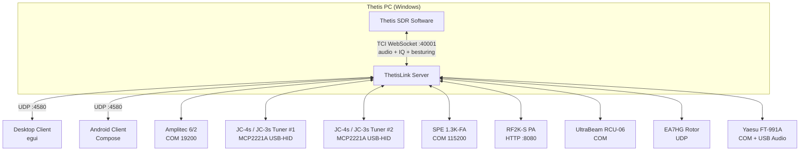

# ThetisLink v2.1.0 — Gebruikershandleiding

## Inhoudsopgave

1. [Overzicht](#overzicht)
2. [Server configuratie](#server-configuratie)
3. [Server starten](#server-starten)
4. [Client verbinden](#client-verbinden)
5. [Bediening](#bediening)
6. [Apparaten](#apparaten)
7. [Yaesu FT-991A](#yaesu-ft-991a)
8. [Diversity ontvangst](#diversity-ontvangst)
9. [DX Cluster](#dx-cluster)
10. [Macro's](#macros)
11. [Naamconventies](#naamconventies)

---

## Overzicht

ThetisLink is een remote bediening voor de ANAN 7000DLE SDR met Thetis. Het bestaat uit:

- **ThetisLink Server** — draait op de Thetis PC (Windows), bestuurt de radio via TCI
- **ThetisLink Client** — desktop client (Windows/macOS/Linux) met spectrum, waterval en volledige bediening
- **ThetisLink Android** — mobiele client app

De server communiceert met Thetis via TCI WebSocket voor zowel besturing als audio. Audio wordt via Opus codec over UDP verzonden met minimale latency.

### Thetis versie

ThetisLink is getest met en vereist **Thetis v2.10.3.15** (officiële release door ramdor). Dit is de basisversie: alle kernfunctionaliteit (audio, spectrum, PTT, TCI besturing) werkt volledig met ongewijzigde Thetis.

Optioneel is er de **PA3GHM Thetis fork** met ThetisLink-specifieke uitbreidingen. Deze uitbreidingen zitten achter de "ThetisLink extensions" checkbox in Thetis (Setup > Network > IQ Stream). Met de vink uit blijft het stock TCI-extensiegedrag behouden (de fork bevat wel een eigen build-tag, release-notes en About-metadata). ThetisLink detecteert automatisch of extensions beschikbaar zijn en schakelt over. Voordelen van de fork:

- Extended IQ-bandbreedte tot **1536 kHz** (stock cap is 384 kHz), per RX selecteerbaar
- Server-side **CTUN auto-recenter** — DDC volgt automatisch de VFO bij snel tunen
- **Diversity auto-null suite**: Auto/Smart/Ultra met live circle-broadcast voor remote tuning
- **`tci_caps_ex` capability broadcast** — clients detecteren beschikbare extensies automatisch
- Filter-preset push (`rx_filter_preset_ex`), per-RX DDC-rate push (`ddc_sample_rate_ex`)
- Extra TCI `_ex` commando's voor NB2, AGC-auto, VFO-swap, FM-deviation, step/preamp att

### Distributie

ThetisLink wordt gedistribueerd als een zip bestand met de volgende inhoud:

| Bestand | Beschrijving |
|---------|-------------|
| `ThetisLink-Server.exe` | Server executable (Windows) |
| `ThetisLink-Client.exe` | Desktop client executable |
| `ThetisLink-2.1.0.apk` | Android client app |
| `Installatie.pdf` | Installatiehandleiding (Nederlands) |
| `User-Manual.pdf` | Gebruikershandleiding (Nederlands, dit document) |
| `Technische-Referentie.pdf` | Technische referentie (Nederlands) |
| `Installation.pdf` | Installation guide (English) |
| `User-Manual-EN.pdf` | User manual (English) |
| `Technical-Reference.pdf` | Technical reference (English) |
| `LICENSE` | Licentie (GPL-2.0-or-later) |
| `SHA256SUMS.txt` | SHA-256 checksums voor verificatie van de binaries |

> **Configuratiebestanden:** `thetislink-server.conf` en `thetislink-client.conf` zijn niet bijgesloten. Ze worden automatisch aangemaakt met standaardwaarden bij de eerste start van respectievelijk server en client (in dezelfde map als de exe).

### Systeemvereisten

- **Server:** Windows 10/11, Thetis v2.10.3.15 of PA3GHM fork, ANAN 7000DLE (of compatibel)
- **Client:** Windows/macOS/Linux of Android 8+
- **Netwerk:** WiFi of LAN, UDP poort 4580

---

Deze handleiding gaat ervan uit dat ThetisLink is geinstalleerd en geconfigureerd volgens de **Installatiehandleiding** (`Installatie.md`). Daar vind je: installatie van server, desktop client en Android app, Thetis TCI configuratie, firewall-instellingen en netwerk/port forwarding.

---

### Architectuur



Alle audio (RX/TX), IQ spectrum data en besturing gaan via één enkele TCI WebSocket verbinding. ThetisLink v2.1.0 gebruikt geen aparte CAT TCP verbinding — TCI dekt alle benodigde commando's, zowel met stock Thetis v2.10.3.15 als met de PA3GHM fork. Geen VB-Cable of andere drivers nodig.

---


## Server configuratie

De basisverbinding met Thetis (TCI/CAT adressen, apparaat COM-poorten) wordt ingesteld tijdens de installatie — zie `Installatie.md`. Hieronder de geavanceerde configuratie-opties.

### DX Cluster

| Instelling | Voorbeeld | Beschrijving |
|---|---|---|
| `dxcluster_server` | `dxc.pi4cc.nl:8000` | DX cluster server adres |
| `dxcluster_callsign` | `PA3GHM` | Callsign voor cluster login |
| `dxcluster_enabled` | `true` | DX cluster aan/uit |
| `dxcluster_expiry_min` | `10` | Spot verlooptijd in minuten |

### Amplitec labels

```
amplitec_label1=JC-4s
amplitec_label2=A2
amplitec_label3=A3
amplitec_label4=A4
amplitec_label5=DummyL
amplitec_label6=UltraBeam
```

> **Belangrijk:** Zie [Naamconventies](#naamconventies) voor speciale integraties.

---

## Server starten

1. Start Thetis en schakel TCI in (Setup > Serial/Network/Midi CAT > Network → TCI Server)
2. Start `ThetisLink-Server.exe`
3. Controleer de verbindingsinstellingen
4. Vink de gewenste apparaten aan
5. Klik **Start**
6. De server luistert op UDP poort 4580

### Server UI

De server toont:
- Verbindingsstatus (TCI WebSocket)
- Actieve apparaat vensters (Tuner, Amplitec, SPE, RF2K, UltraBeam, Rotor, Yaesu)
- Macro knoppen (2 rijen van 12)
- Uptime en client info

---

## Client verbinden

1. Start de client.
2. Bij de eerste run scant de client het lokale netwerk via **mDNS** voor draaiende ThetisLink-servers. Gevonden servers verschijnen automatisch in een dropdown.
3. Selecteer een server uit de lijst, óf voer het IP-adres handmatig in (bijv. `192.168.1.79:4580`).
4. Klik **Connect**.

De client ontvangt automatisch:
- Real-time spectrum en waterval
- VFO frequentie, mode en filter
- S-meter waarden
- Apparaat status (Amplitec, UltraBeam, Yaesu, etc.)
- DX cluster spots

### Auto-discovery werkt niet (mDNS)

Als de mDNS-dropdown leeg blijft maar handmatig IP invoeren wél werkt: mDNS gebruikt UDP multicast (`224.0.0.251:5353`), wat in sommige situaties niet doorkomt.

- **WiFi-routers met AP-isolation / client-isolation**: multicast tussen clients wordt geblokt. Schakel die optie uit in de router-config of gebruik een bedrade verbinding.
- **Intermittent op WiFi** (werkt direct na opstart, faalt na enkele minuten): typisch een laptop-WiFi-driver / power-management probleem dat de multicast-subscription droopt. Workaround: UTP-kabel, of WiFi-driver bijwerken / NIC uit-en-aan.
- **Cross-subnet**: mDNS heeft TTL=1 en springt niet over routers. Server en client moeten in hetzelfde IP-subnet zitten.

Een handmatig ingevuld IP-adres werkt onafhankelijk van mDNS; je hoeft dus niet te wachten op een fix als dit niet meteen werkt.

---

## Bediening

### VFO en frequentie

- **Frequentie display:** klik om direct een frequentie in te voeren
- **Stap knoppen:** +/- in stappen van 10 Hz, 100 Hz, 1 kHz, 10 kHz
- **Scroll wheel:** op het spectrum = 1 kHz stappen
- **Klik op spectrum:** tune naar die frequentie
- **Waterval klik (Android):** tune naar klik-positie

### Band geheugen

Per band wordt automatisch opgeslagen:
- Frequentie
- Mode (LSB/USB/CW/AM/FM/DIG)
- Filter breedte
- NR niveau

Bij bandwisseling worden deze automatisch hersteld. Daarnaast zijn er 5 vrije geheugenplaatsen (M1-M5).

### Mode

Selecteerbaar: LSB, USB, CW, AM, FM, DATA-FM, DIG

### CW keyer (v2.0.0)

In CW-mode is een remote keyer beschikbaar via TCI:

- **CW key down/up:** een toegewezen knop of MIDI-pad activeert `keyer:0,true,duration_ms;` voor een dit/dah, of een PTT-stijl pers-en-loslaat. Server-log toont elke key-event.
- **CW macros:** voorgeprogrammeerde tekst-strings (CQ-call, RST-rapport, eigen call/QTH) worden via `cw_macros:0,text;` naar Thetis gestuurd. Thetis seint ze met de actuele keyer-snelheid (`cw_keyer_speed:wpm;`).
- **Stop:** `cw_macros_stop;` cancelt een lopende macro halverwege.

Snelheid en macro-content zijn instelbaar in de client.

### Filter

De filterbreedte is instelbaar met +/- knoppen. Presets zijn beschikbaar per mode:
- **CW:** 50, 100, 200, 500, 1000 Hz
- **SSB:** 1800, 2400, 2700, 3100, 3600 Hz
- **AM/FM:** 6000, 8000, 10000, 12000 Hz

**Filter preset tracking (v2.0.0, met fork):** met de PA3GHM fork synchroniseert de huidige Thetis-filter-preset (F1, F2, F3, VAR1, VAR2 of NONE) live naar de client. De client toont welke preset Thetis nu actief heeft en je kunt via dezelfde knop-set switchen — geen handmatig dubbel-instellen tussen client en Thetis-UI nodig.

### Volume

- **RX Volume:** ontvangstniveau (TCI `volume` / `rx_volume`)
- **TX Gain:** microfoon voorversterking
- **Drive:** zendvermogen 0-100%
- **Mic AGC:** automatische microfoon gain (aan/uit)

### Noise Reduction & Notch

- **NR:** cyclisch: UIT > NR1 > NR2 > NR3 > NR4
- **ANF:** Auto Notch Filter aan/uit

### PTT (Push-to-Talk)

ThetisLink biedt drie PTT modi:

- **Push-to-talk (spatiebalk):** houd de spatiebalk ingedrukt om te zenden, laat los om te stoppen
- **Toggle:** klik op de PTT-knop om te wisselen tussen zenden en ontvangen
- **MIDI PTT:** aparte MIDI PTT-modus via een toegewezen MIDI controller knop, onafhankelijk van de desktop PTT-modus

**Android — externe BT remote (ZL-01 of vergelijkbaar):** een Bluetooth-knop die zich gedraagt als externe touch-device kan als PTT-knop gebruikt worden. ThetisLink onderschept de touch-events en mappt ze naar PTT down/up. Werkt alleen als het scherm actief is (aanraak-events worden alleen door Android afgeleverd op een wakker scherm).

### TX meter (v2.0.0)

Tijdens TX toont de S-meter een TX-meter met:
- **Vermogen** in watts (bijv. `TX  100W`)
- **SWR** kleur-coded — onder 1:2 groen, 1:2-1:3 oranje, boven 1:3 rood (bijv. `SWR 1.50`)

De SWR-waarde wordt door Thetis broadcast via TCI tijdens elke TX-burst en is realtime zichtbaar voor alle verbonden clients.

### Spectrum en waterval

- **Zoom:** verstelbaar, geeft nauwkeuriger frequentieweergave
- **Pan:** verschuif het zichtbare spectrum links/rechts (0 = gecentreerd op VFO)
- **Referentieniveau:** verschuif het dB bereik omhoog/omlaag
- **Auto Ref:** automatische referentieniveau-aanpassing op basis van ruisvloer
- **Contrast:** waterval helderheid per band (wordt onthouden)
- **DDC sample rate (v2.0.0):** dropdown voor de IQ-bandbreedte van de DDC. Stock Thetis biedt 384 kHz; met de PA3GHM fork kan per RX gekozen worden uit 48, 96, 192, 384, 768 of 1536 kHz. Hogere rates tonen meer spectrum maar belasten netwerk en CPU zwaarder.

**Server-side CTUN auto-recenter (v2.0.0, met fork):** als de fork-extensie `auto_recenter_ex` actief is, herrekent de server zelf de DDC-center wanneer de VFO snel buiten de huidige DDC-zone gaat. Geen handmatige actie nodig — het spectrum-venster volgt de VFO automatisch.

#### TX spectrum override

Tijdens zenden (TX) wordt het spectrum automatisch aangepast voor goede weergave van het zendsignaal:
- **Referentieniveau:** wordt overschreven naar -30 dB
- **Bereik:** wordt overschreven naar 120 dB
- **Auto Ref:** wordt automatisch uitgeschakeld tijdens TX en de instelling wordt opgeslagen
- Na het loslaten van PTT worden de originele instellingen (inclusief Auto Ref) hersteld met een korte vertraging, zodat het spectrum stabiel terugkeert

### Popout vensters

De client ondersteunt losse vensters:
- **RX1 spectrum** — alleen RX1 spectrum + waterval met bediening
- **RX2 spectrum** — alleen RX2 spectrum + waterval met bediening
- **Joined** — RX1 en RX2 naast elkaar met gedeelde bediening

In popout vensters zijn beschikbaar:
- S-meter (bar of analoog naaldmeter, wisselbaar via toggle knop)
- Alle band/mode/filter/NR/ANF bediening
- VFO A<>B wisselknop (links-onder bij analoge naaldmeter)

### VFO B / RX2

Volledige tweede ontvanger ondersteuning:
- Onafhankelijke frequentie, mode, filter, S-meter
- Eigen spectrum en waterval
- VFO Sync: VFO B volgt automatisch VFO A
- A<>B: wissel VFO A en B

### WebSDR/KiwiSDR (Desktop)

Ingebouwde WebView voor WebSDR en KiwiSDR ontvangst:
- Frequentie synchronisatie: WebSDR volgt de VFO
- Automatisch muten tijdens zenden
- Favorietenlijst met ster-icoon

### MIDI Controller

Desktop en Android ondersteunen USB MIDI controllers:
- **Scan** knop zoekt beschikbare MIDI apparaten
- **Learn** modus: druk op een MIDI knop/slider, wijs een functie toe
- Beschikbare functies: PTT (met LED), VFO tune, volumes, drive, NR, ANF, mode, band, power
- Encoder stappen: 1 Hz, 10 Hz, 100 Hz, 1 kHz
- **MIDI PTT modus:** aparte PTT-modus voor MIDI, onafhankelijk van de spatiebalk PTT-modus

---

## Apparaten

### Amplitec 6/2 Antenne Schakelaar

Serieel USB verbinding (19200 baud). Toont:
- Huidige schakelstand poort A en B
- 6 antenne posities met configureerbare labels
- Schakel knoppen per poort

### StockCorner JC-4s / JC-3s automatische tuners (multi-tuner via MCP2221A)

Vanaf v2.0.3 ondersteunt de server **twee fysieke tuners parallel**, elk via een eigen Adafruit MCP2221A USB-HID breakout. JC-4s en JC-3s hebben hetzelfde besturingsprotocol — het modellabel is alleen cosmetisch. Per tuner-slot stel je het bord-serienummer en (optioneel) de Amplitec-A-antennepositie in waarachter de tuner fysiek hangt; de server stuurt vervolgens automatisch de juiste tuner aan bij een Tune-actie.

**Hardware-koppeling (per tuner):**
- **GP2** → in serie met een gate-weerstand naar de gate (2N7000) of basis (MMBT3904) van een transistor; bij `HIGH` trekt de transistor de **grijze "start"-draad** van de JC-Control naar GND (mechanisch gelijk aan de start-knop indrukken).
- **GP1** → ADC-ingang op het middenpunt van een **1 MΩ + 1 MΩ 1:1 spanningsdeler** op de **gele "tune-status"-draad**. Idle ≈ 4.5 V, tune-actief ≈ 0 V; de hoge impedantie belast de JC-Control LED-keten niet noemenswaardig.
- **GND** → gemeenschappelijke massa met de JC-Control.
- Het volledige schema (inclusief 2N7000- en MMBT3904-varianten) staat in de technische referentie.

**Eerste keer instellen:**
1. Plug alle MCP2221A-borden in en open het **MCP2221A tuner bridges**-blok onderin het server status-paneel (klap uit met het driehoekje; de stand wordt onthouden tot de volgende keer).
2. Klik **Scan** onder "Detected MCP2221A boards" — alle borden op de USB-bus worden opgelijst met hun pad en huidig serienummer.
3. Voor elk **anoniem** bord (leeg serienummer): vul een unieke naam in onder "Set serial:" (bijvoorbeeld `JC-4s loop` of `JC-3s vertical`) en klik **Program serial**. Het bord onthoudt de naam in EEPROM; klik nogmaals op **Scan** om de nieuwe naam te zien.
4. Voor elk **Tuner1** / **Tuner2** blok in het paneel: kies onder "MCP serial:" het bord dat bij dat slot hoort en kies onder "Amplitec pos:" de antennepositie (1–6) waarachter de tuner fysiek zit. Beide acties triggeren een server-auto-restart zodat de bridge op het gekozen bord opent.

**Per-tuner status-rij toont:**
- Header: tuner-label + "Connected" / "Not connected" / "Error: …"
- **MCP serial** dropdown en **Amplitec pos** dropdown.
- **Live:** actuele spanning op de gele draad (V, na ×2 deler-correctie).
- **Threshold** schuif (0.5–4.5 V, default 2.25 V): de schakelgrens op de gele draad.
- **Hysteresis** schuif (0.1–2.0 V, default 0.50 V): doodband rondom de threshold om transient-ruis te onderdrukken.
- **Edges:** de afgeleide grenzen (`active < … V`, `idle > … V`). Bij een onmogelijke combinatie (bijv. threshold 0.5 V + hysterese 2.0 V → active < 0 V) verschijnt een amber **⚠ clamped**-waarschuwing met hover-tip die uitlegt dat de combinatie nooit zal triggeren — verlaag de hysterese of beweeg de threshold weg van de rand.

**Tune-volgorde (per tuner):**
1. PA standby (SPE/RF2K) als één van beide in Operate staat.
2. GP2 HIGH (start asserted) en wacht tot de gele draad onder de active-edge zakt = tuner ACK.
3. GP2 LOW (start released).
4. Thetis carrier ON (`ZZTU1;`).
5. Wacht tot de gele draad terug boven de idle-edge komt = tune compleet.
6. Thetis carrier OFF (`ZZTU0;`).
7. PA terug naar Operate.

Een timeout treedt op als de tuner binnen 3 s na GP2 HIGH niet ACK't (status **Timeout**), of als de tune-cyclus binnen 30 s niet compleet is (idem). **Abort** breekt de cyclus af en zet GP2 weer LOW. Eén ADC-poll is rate-limited tot 100 ms per bord; de tuner-thread checkt expliciet de sample-timestamp om dubbel-tellen van rate-limited cached samples te voorkomen.

**USB auto-reconnect:** zodra een bridge "Connected" is geweest en de verbinding daarna wegvalt (kabel los, slaap-modus, hub reset, …) probeert de tuner-thread elke 5 s zelfstandig opnieuw te openen. Een succesvolle reconnect reset de timer zodat een volgende drop direct opnieuw geprobeerd wordt — geen server-restart nodig.

> **Tune-knop zichtbaarheid:** De Tune-knop in het hoofdscherm is alleen zichtbaar wanneer er ten minste één Amplitec label naar een woord verwijst dat een tuner herkent (`JC-4s`, `JC4s`, `JC-3s`, `JC3s`, of `Tuner`). De routing naar het juiste fysieke tuner-slot gebeurt automatisch op basis van de actieve Amplitec-A positie — zie [Naamconventies](#naamconventies).

### SPE Expert 1.3K-FA

Serieel USB verbinding. Toont:
- Vermogen, SWR, temperatuur
- Antenne selectie
- Operate/Standby status

### RF2K-S

TCP/IP verbinding (poort 8080). ThetisLink ondersteunt zowel de originele RF2K-S firmware als de aangepaste v190 firmware met uitgebreide drive control.

**Originele firmware — basisfunctionaliteit:**
- Band- en frequentie-uitlezing
- Operate/Standby schakelen
- Tuner bediening (mode, L/C waarden)
- Error status en antenne selectie
- Vermogen, SWR, temperatuur

**Aangepaste firmware (v190+) — extra functionaliteit:**
- Drive vermogen uitlezen en aanpassen (increment/decrement)
- Drive configuratie per band en modulatietype (SSB/AM/Continuous)
- Debug telemetrie (bias spanning, PSU spanning, uptime)
- Controller versie met hardware revisie

ThetisLink detecteert automatisch welke firmware actief is. Met de originele firmware werkt alles behalve drive-bediening.

De RF2K-S kan gereset worden via de server UI wanneer dat nodig is.

### UltraBeam RCU-06

Serieel USB verbinding (19200 baud). Functies:
- **Frequentie display** met band indicatie
- **Direction knoppen:** Normal, 180 graden, Bi-Dir
- **Frequentie stap knoppen:** -100, -50, -25, +25, +50, +100 kHz
- **Sync VFO:** stel de UltraBeam in op de huidige VFO frequentie (A of B, afhankelijk van Amplitec schakelstand)
- **Auto:** automatische frequentie-tracking van de actieve VFO
  - Minimale stap: 25 kHz (voorkomt overbelasting van de motoren)
  - VFO selectie wordt automatisch bepaald via de Amplitec (zie [Naamconventies](#naamconventies))
- **Band presets:** snelkeuze knoppen per band
- **Motor-indicatoren M1 / M2 (v2.0.0):** twee badges naast de voortgangsbalk die per motor aangeven of die op dat moment beweegt. Oranje = motor draait, grijs = motor stilstand. Bij een grote band-wissel (bv. 80m → 10m) zie je vaak even allebei oranje, en wanneer één motor zijn doelpositie eerder bereikt zie je die badge naar grijs gaan terwijl de andere nog door draait.
- **Motor voortgang:** gedeelde progressiebalk tijdens element-verplaatsing. De RCU-06 deelt slechts één voortgangswaarde voor beide motoren samen — exacte per-motor voortgang is niet via de controller beschikbaar.
- **Retract:** trek alle elementen in (met bevestiging)
- **Element weergave:** actuele element lengtes in mm

### Rotor backends

ThetisLink ondersteunt drie rotor-backends. Kies in het server-config-venster onder *Rotor → backend* welke je gebruikt; één tegelijk actief.

In het client-paneel (kompas, GoTo, Stop) is geen verschil zichtbaar — de keuze van backend bepaalt alleen hoe de server met de rotor-hardware praat.

#### EA7HG Visual Rotor

Directe UDP-verbinding met de EA7HG Visual Rotor software (Prosistel-protocol). Vul het adres van de Visual Rotor in (bv. `192.168.1.60:3010`); verder geen configuratie nodig.

#### Yaesu G-1000DXC via Adafruit MCP2221A (v2.1.0+)

Directe aansturing van de Yaesu G-1000DXC EXT CONTROL connector vanaf de ThetisLink-server PC via een Adafruit MCP2221A breakout (op 5 V gejumperd). Geen extra controller-PCB of derde-partij software nodig. Vervangt EA7HG voor wie liever ThetisLink in-process houdt.

**Hardware**

- Adafruit MCP2221A breakout (#4471) met de 3 V solder-jumper aan de onderkant doorgesneden en de 5 V pad gebrugd
- 2× BST82 (SOT-23) als low-side switches op pin 1 (R/CW) en pin 2 (L/CCW) van de Yaesu DIN-7
- 2× 100 kΩ gate-pulldown (voorkomt spontane rotatie tijdens USB-reset)
- 1× 1,8 kΩ + 1× 2,2 kΩ spanningsdeler op pin 4 (position-feedback) naar GP3 ADC; **niet** 1,8 kΩ + 10 kΩ — die clipt boven ~365° op rotors waar pin 4 boven 4,8 V uitkomt
- Optioneel: 10 µF condensator parallel aan de 2,2 kΩ tegen 100 Hz netvoedings-ripple
- 7-pin mini-DIN kabel naar de rotor

**Setup in ThetisLink-server**

1. Open de **MCP2221A** sectie in het Status-paneel.
2. Klik **Scan** — de Adafruit verschijnt als "Unprogrammed" board.
3. Kies *function = Rotor*, vul een naam in (bv. `rotor1`), klik **Add**. Het bord krijgt de USB-serial `rot_<naam>` geschreven naar zijn EEPROM.
4. Herstart de server zodat het bord opgepakt wordt.
5. Stel onder *Rotor → backend* in op **Yaesu G-1000DXC (MCP2221A)**.

**Kalibratie**

Voordat GoTo werkt moet de spanning-naar-graden mapping ingelezen worden:

1. Draai handmatig naar het CCW-eindpunt (mechanisch hard tegen de stop, 0°).
2. Klik **Park CCW (0°)** in de rotor-row.
3. Draai handmatig naar het CW-eindpunt (450° bij de G-1000DXC).
4. Klik **Park CW (450°)**.

De server slaat de twee spanningen op als `v_at_0deg` en `v_at_max_deg` in `thetislink-server.conf`. Bij hardware-wijziging (deler-verhouding) altijd opnieuw kalibreren.

**Configuratie per rotor**

- *max°* — fullscale van de rotor (default 450 voor G-1000DXC)
- *ramp* — soft-start / soft-stop snelheid in %/sec (1-200, default 50). Lager = traagheidsvriendelijker voor zware antennes; hoger = sneller reactief.
- *shortest route* — alleen zichtbaar als `max_deg > 360`. Bij aanvinken kiest een GoTo de kortste mechanische route via de overlap-zone (bv. huidig 350°, target 30° → CW via 390° i.p.v. CCW via 0°). Default uit zodat "ga naar 30°" letterlijk op 30° fysiek eindigt.

**Diagnostiek**

De rotor-row toont de live positie in hele graden, de mediaan pin-4 spanning, de laatste raw ADC sample en de peak-to-peak spread (ruis-indicator). Tijdens een GoTo zie je het soft-start ramp-omhoog en de soft-stop ramp-omlaag in de DAC-slider. Bij stilstand poll't de server op 1 Hz (60-sample mediaan); bij beweging op 30 Hz (10-sample mediaan).

**Test-knoppen + speed-slider**

De CW/CCW/Stop knoppen + DAC speed-slider in de rotor-row staan los van de GoTo-loop. Zodra je de slider beweegt of een test-knop indrukt schakelt de server naar *manual mode* en respecteert je instelling tot een client een nieuwe GoTo/Stop/CW/CCW commando stuurt.

#### PstRotator (XML/UDP)

PstRotator (yo3dmu) ondersteunt vrijwel alle merken rotor-hardware. Aanbevolen wanneer je geen EA7HG Visual Rotor gebruikt of een rotor wilt aansturen die niet rechtstreeks door ThetisLink wordt ondersteund.

**Vereisten**

- PstRotator (of variant zoals PstRotatorAZ voor azimuth-only) draait op een PC in hetzelfde LAN. Dat mag dezelfde PC zijn als de ThetisLink-server of een andere.

**Setup in ThetisLink-server** (Connecties → Rotor)

1. *Backend* = **PstRotator (XML/UDP)**.
2. *PstRotator host* = IP-adres van de PC waar PstRotator op draait.
3. *Poort* = `12000` (PstRotator default).
4. *Feedback poort (lokaal)* = `12001` (= PstRotator's listener-poort + 1).
5. *Heeft elevation* = alleen aan bij een AZ+ELE rotor (PstRotator); uit bij PstRotatorAZ.

**Setup in PstRotator**

1. *Communication → UDP Control Port…* → `12000`.
2. *Setup → UDP Control* aanvinken.
3. In de UDP-instellingen het **IP van de ThetisLink-server-PC** invullen. PstRotator stuurt z'n positie-feedback naar dit IP op poort 12001.

**Firewall**

- ThetisLink-server-PC: inbound UDP 12001 toestaan voor `ThetisLink-Server.exe`. Een app-toelating via Microsoft Defender Firewall (`Allow an app through firewall`) dekt dit automatisch.
- PstRotator-PC: inbound UDP 12000 toestaan voor `PstRotator.exe` of `PstRotatorAZ.exe`. PstRotator vraagt hier vaak zelf om bij eerste start.

**Bekende beperking — geen doel-lijn voor PstRotator-gestuurde GoTos.** Wanneer je een doel in PstRotator's eigen compass-cirkel klikt, ziet TL2 alleen de actuele positie-feedback (`AZ:nnn.n`) en niet het target. De doel-lijn in TL2's rotor-window wordt daarom niet getekend voor zo'n GoTo — alleen de naald loopt mee. Dit is een limiet van PstRotator's outgoing feedback-protocol, geen TL2-bug.

### Externe input: PstRotator of Log4OM rechtstreeks op de Adafruit-rotor (v2.1.1+)

Vanaf v2.1.1 luistert de server parallel aan de actieve rotor-backend op UDP+TCP poort `12001` (configureerbaar via `pstrotator_listen_enabled` / `pstrotator_listen_port` in `thetislink-server.conf`). Dat maakt het mogelijk om Log4OM of een externe PstRotator-instantie **direct de Adafruit-rotor** te laten besturen, zonder dat je de rotor-backend hoeft te switchen. De listener accepteert vier protocol-formaten (auto-detect per packet):

| Protocol | Goto-commando | Query | Bron |
|---|---|---|---|
| Yaesu GS-232A/B | `M<nnn>\r` | `C\r` → `+<nnn>\r` | Vrijwel alle ham-software |
| Prosistel binair (EA7HG) | `\x02AG<nnn>\r` of `AAG<nnn>\r` | `\x02A?\r` → `\x02A,?,<nnn>,<R\|B>\r` | PstRotator EA7HG-mode |
| PstRotator native XML | `<PST><AZIMUTH>nnn</AZIMUTH></PST>` | `<PST>AZ?</PST>` → `AZ:<nnn.n>\r` | PstRotator native, Log4OM |
| AZ-tekst | `AZ:nnn.n\r` | — | PstRotator UDP-output |

De TCP-pad is bidirectioneel: als een TL2-client (desktop, Android, of server-UI) zelf een nieuw target zet, pusht de listener `M<nnn>\r` of `\x02AG<nnn>\r` (afhankelijk van het gedetecteerde protocol) terug naar PstRotator. **Let op:** PstRotator's client-mode UI laat zo'n extern gestuurde target meestal niet visueel zien — dat is een beperking van het GS-232A/Prosistel protocol-ontwerp, niet van TL2.

#### Setup PstRotator → Adafruit rotor (zonder PstRotator als backend)

Wanneer je rotor-backend op **Yaesu G-1000DXC (Adafruit MCP2221A)** staat:

1. In TL2 server-UI: PstRotator listener aanvinken (default poort `12001`).
2. In PstRotator: kies een controller-type. **Aanbevolen: TCP-client** (Setup → "Start as TCP client") met host = TL2-IP en poort `12001`. Alternatief is een controller met UDP-output (EA7HG, GS-232A) op dezelfde poort.
3. PstRotator commandeert de Adafruit-rotor direct via de listener. Server-log toont `compass X° → mech Y°` voor elke klik.

#### Setup Log4OM → Adafruit rotor (PstRotator helemaal niet meer nodig)

Log4OM ondersteunt alleen PstRotator als rotor-protocol. Truc: laat Log4OM denken dat TL2 **PstRotator is**.

1. **PstRotator afsluiten** op de Win4OM-PC (volledig stoppen).
2. In **Log4OM → Settings → External Services → PstRotator** (of equivalent paneel):
   - **Host** = TL2-server IP (bijv. `192.168.1.97`) — **wijzig van `localhost` / `127.0.0.1`**
   - **Port** = `12001` (TL2's PstRotator listener-poort)
3. Klaar — klik in Log4OM op een DX-spot, de Adafruit-rotor draait direct naar de berekende richting.

Log4OM stuurt voor elke spot een handvol PstRotator-XML packets (azimuth + callsign + naam + QTH + frequentie + mode + grid + comment + continent). TL2 verwerkt alleen de azimuth en negeert de metadata-tags stil. Geen tussenliggend programma nodig, geen UDP-simulator-drift, één configuratie-stap.

#### Beperkingen en bekende gedragsregels

- **Aan/uitzetten vereist server-restart.** De listener-threads worden alleen gespawned bij server-start. Toggle `pstrotator_listen_enabled` in de UI of het conf-bestand werkt pas na een herstart van de server. Stoppen is wel direct (server-stop sluit de poort binnen ~500 ms).
- **Manual rotate (`R\r` / `L\r` in GS-232A) wordt genegeerd.** De listener accepteert alleen target-gestuurde commando's. Continu draaien zonder eindpunt is een hardware-knop functie en moet via de rotor-UI van TL2 zelf gebeuren.
- **Stop-commando's wél doorgezet** (`S\r` in GS-232A, `\x02AR\r` / `AAR\r` / `AG999` in Prosistel, `<STOP>` in PstRotator-XML) — die stoppen de rotor onmiddellijk via de actieve backend.

#### Diagnose

De RX-packet-log staat default op debug-level zodat de server-log niet vervuilt met de 2 Hz status-queries. Voor diagnose: start de server met `RUST_LOG=debug` voor de volledige RX-stream. Goto-events, connect/disconnect en parse-warnings blijven altijd op info-level zichtbaar.

---

## Yaesu FT-991A

ThetisLink kan een Yaesu FT-991A transceiver aansturen als tweede radio naast de ANAN. De Yaesu wordt verbonden via een serieel USB COM-poort.

### Functies

- **Frequentie:** uitlezen en instellen van de huidige frequentie
- **Mode:** uitlezen en instellen (LSB, USB, CW, AM, FM, DATA-FM, DIG)
- **VFO A/B:** schakelen tussen VFO A en VFO B
- **Geheugenkanalen:** worden automatisch ingeladen bij het inschakelen van de Yaesu in de server. Kanalen met naam worden weergegeven in de UI. Edit + "Write radio" past frequentie, naam, mode, shift en tone-mode (aan/uit) per kanaal aan. **Let op (v2.1.1+):** de specifieke CTCSS-tone-frequentie wordt niet door TL2 geschreven — alleen "tone aan/uit" gaat mee. Tone-frequentie per kanaal stel je in op de FT-991A zelf.
- **Menu editor:** Yaesu menu-instellingen uitlezen en wijzigen via de server UI
- **Audio:** de Yaesu USB audio wordt door de server gecaptured en via het AudioRx2 kanaal naar de client gestuurd, waar het gemixt wordt met het ANAN RX-signaal
- **Auto-DFM tijdens TX (v2.0.0):** zie subsectie hieronder

### Auto-DFM PTT-toggle (FM ↔ DATA-FM)

Op de FT-991A werkt USB-mic-TX in stand FM niet — alleen DATA-FM accepteert USB-mic-audio. Voor remote-FM-werken zou je daarom de Yaesu permanent in DATA-FM moeten zetten, maar dan luister je ook in DATA-FM (geen squelch, andere filtering).

Vanaf v2.0.0 schakelt ThetisLink hier automatisch tussen:

- **PTT-press** in stand FM ('4'): server stuurt `MD0A;` (DATA-FM) → korte settle → `TX1;`. Yaesu zendt nu via USB-mic-audio.
- **PTT-release** na auto-DFM-cyclus: server stuurt `TX0;` → settle → `MD04;` (terug naar FM). RX-audio is weer normale FM.
- **Memory-mode:** als Yaesu in Memory-mode op een FM-kanaal staat, bewaart de server het kanaal-nummer bij PTT-on en herstelt het kanaal via `MC<nnn>;` na PTT-off, zodat je in Memory-mode blijft op het oorspronkelijke kanaal.

Auto-DFM is niet actief in DATA-FM ('A'), USB ('2'), FM-N ('B') of andere modes — die houden hun normale TX-pad.

Bekende beperkingen: mode-wijziging tijdens active TX kan de auto-restore verwarren; vermijd mode-knoppen drukken terwijl PTT actief is. Bij server-crash tijdens TX moet je handmatig terug naar FM (de server kan z'n tussenstaat niet automatisch herstellen).

### Configuratie

```
yaesu_port=COM5
yaesu_enabled=true
```

De Yaesu audio wordt automatisch afgespeeld op de client als het apparaat is ingeschakeld.

---

## Diversity ontvangst

ThetisLink ondersteunt diversity ontvangst via RX1 en RX2. Dit combineert twee antennes (bijvoorbeeld de ANAN op twee verschillende antenne-ingangen) voor verbeterde ontvangst.

### Gebruik

1. Schakel RX2 in via de client
2. Stel beide VFO's in op dezelfde frequentie (of gebruik VFO Sync)
3. De server stuurt onafhankelijke spectrum- en audiostreams voor RX1 en RX2
4. Gebruik de volume-regelaars om de balans tussen RX1 en RX2 in te stellen

Diversity werkt ook in combinatie met de popout vensters (Joined view) voor een overzichtelijke weergave van beide ontvangers.

### Smart en Ultra Auto-Null (Diversity)

Naast handmatige diversity-instelling biedt ThetisLink twee automatische null-algoritmen:

- **Smart:** voert een AVG sweep uit over 360° + 90° in stappen van 5° met settle-tijd per stap. Duurt circa 9 seconden. Betrouwbaar en nauwkeurig.
- **Ultra:** continue forward/backward sweep zonder settle-tijd, aanzienlijk sneller (circa 5 seconden). Geschikt als je snel een nulpunt wilt vinden.

Beide algoritmen zijn beschikbaar in de dropdown naast de **Auto Null** knop. Na afloop wordt het resultaat getoond in dB verbetering: groen betekent een goed nulpunt, oranje betekent weinig verschil met de uitgangssituatie.

**Live circle-broadcast (v2.0.0, met fork):** tijdens een Smart of Ultra sweep zendt de PA3GHM fork de actuele phase/gain-positie realtime mee. De client toont de huidige meting als bewegende stip op de circle-plot, zodat je live ziet hoe het algoritme door het zoekgebied gaat. Dit werkt ook als de sweep door een andere client gestart is — alle verbonden clients zien dezelfde live-trace.

Op Android is er een **Smart Null** knop die het resultaat in dB toont na afloop.

---

### Audio opname en afspelen

De client heeft een ingebouwde audio recorder en speler:

- **Record** knop in de Server tab met checkboxes voor **RX1**, **RX2** en **Yaesu** — selecteer welke audiokanalen je wilt opnemen
- Opnames worden opgeslagen als WAV bestanden (8 kHz, mono) naast de client executable, met een timestamp in de bestandsnaam
- **Play** knop speelt de laatste opname af:
  - **Zonder PTT:** het opgenomen geluid wordt via de speakers afgespeeld, gemixt met de ontvangst-audio
  - **Met PTT ingedrukt:** de opname vervangt de microfoon (TX inject) — handig om je eigen modulatie te testen of een CQ-bericht te herhalen
- **Stop** knop breekt het afspelen af. Aan het einde van de opname stopt het automatisch.

---

### Spectrum en waterval kleuren

Het spectrum en de waterval gebruiken een signaalniveau-afhankelijke kleurschaal:

- **Blauw** (zwak signaal) → **cyaan** → **geel** → **rood** → **wit** (sterk signaal)
- Zowel de spectrumlijn als de waterval gebruiken dezelfde kleurschaal
- De kleuren zijn identiek op desktop en Android

---

### Remote beheer

In de Server tab zit een **Remote Reboot / Shutdown** knop waarmee je de server-PC op afstand kunt herstarten of afsluiten:

- Na het klikken kies je tussen **herstart** of **afsluiten**
- Voor reboot is een `ThetisLinkReboot` scheduled task vereist op de server-PC (zie Installatie.md voor de configuratie)

---

### Audio modus (Mono/BIN/Split)

In de RX1 sectie zit een dropdown voor de audio-modus:

- **Mono:** RX1 en RX2 audio worden gemixt op beide oren (standaard)
- **BIN:** RX1 binaural audio op links en rechts + RX2 (vereist dat Thetis in BIN-modus staat)
- **Split:** RX1 op het linkeroor, RX2 op het rechteroor, met onafhankelijke volume-regelaars per kanaal

---

## DX Cluster

ThetisLink verbindt direct met een DX cluster server (telnet). Spots worden:
- Op het spectrum weergegeven als gekleurde stippellijnen met callsign labels
- Gefilterd op de band van VFO A en VFO B
- Automatisch verwijderd na de ingestelde verlooptijd

**Spot kleuren per mode:**
- CW: geel
- SSB/Phone: groen
- FT8/FT4/Digital: cyaan
- Overig: wit

Spots worden ook naar Thetis doorgestuurd via TCI `SPOT:` commando, zodat ze ook op het Thetis panorama verschijnen.

**Click-to-tune (v2.0.0):** klik op een spot-label op het spectrum (15-pixel snap-zone) om VFO direct naar de spot-frequentie te tunen. De snap-zone houdt rekening met label-overlap: clicks dichter bij een ander label gaan naar dat label. Als je buiten de snap-zone klikt valt het terug op normale click-to-tune (afgerond op 1 kHz).

---

## Macro's

De server ondersteunt 24 programmeerbare macro knoppen in 2 rijen:
- **Rij 1:** F1 t/m F12 (typisch VFO A presets)
- **Rij 2:** ^F1 t/m ^F12 (typisch VFO B presets)

### Macro acties

Elke macro kan een reeks acties bevatten:
- **CAT commando:** bijv. `ZZFA00014292000;` (stel VFO A in op 14.292 MHz)
- **Delay:** bijv. `delay:200` (wacht 200ms)
- **Tune:** start de tuner die bij de actieve Amplitec-A positie hoort (één of twee fysieke tuners; zie [StockCorner JC-4s / JC-3s automatische tuners](#stockcorner-jc-4s--jc-3s-automatische-tuners-multi-tuner-via-mcp2221a))

### Macro configuratie

Macro's worden opgeslagen in `thetislink-macros.conf`:
```
macro_0_label=20m 14292
macro_0=ZZFA00014292000; ZZMD01;
```

### Veelgebruikte CAT commando's

| Commando | Beschrijving |
|---|---|
| `ZZFA00014292000;` | VFO A naar 14.292 MHz |
| `ZZFB00007073000;` | VFO B naar 7.073 MHz |
| `ZZMD00;` | VFO A mode naar CW |
| `ZZMD01;` | VFO A mode naar LSB |
| `ZZME00;` | VFO B mode naar CW |
| `ZZME01;` | VFO B mode naar LSB |

> **Let op:** Gebruik `ZZFA`/`ZZMD` voor VFO A en `ZZFB`/`ZZME` voor VFO B. Een veelgemaakte fout is ZZMD gebruiken in VFO B macro's — dit wijzigt dan de mode van VFO A!

---

## Naamconventies

ThetisLink gebruikt de Amplitec antenne label namen voor automatische integraties tussen apparaten. Als de labelnamen niet kloppen gaat er niets stuk, maar werken bepaalde automatische functies niet.

### UltraBeam integratie

De Amplitec label voor de UltraBeam antenne-uitgang moet een van deze woorden bevatten (niet hoofdlettergevoelig):
- `UltraBeam`
- `Ultra Beam`
- `UB`

**Wat dit oplevert:**
- De **Sync VFO** knop en **Auto** tracking in het UltraBeam panel kiezen automatisch de juiste VFO:
  - Als Amplitec poort **B** op de UltraBeam positie staat -> volgt **VFO B**
  - Als Amplitec poort **A** op de UltraBeam positie staat -> volgt **VFO A**
  - Geen match -> default **VFO A**

### JC-4s / JC-3s tuner integratie (multi-tuner)

De Amplitec label voor elke tuner-uitgang moet één van deze woorden bevatten (hoofdletter-ongevoelig):
- `JC-4s`
- `JC4s`
- `JC-3s`
- `JC3s`
- `Tuner`

**Wat dit oplevert:**
- De **Tune** knop in het hoofdscherm is alleen zichtbaar als ten minste één Amplitec label een van deze woorden bevat.
- Wanneer de Amplitec-A naar een positie wordt geschakeld die in het server status-paneel aan een fysiek tuner-slot gekoppeld is (zie [tuner-blok](#stockcorner-jc-4s--jc-3s-automatische-tuners-multi-tuner-via-mcp2221a)), routeert de server een Tune-actie automatisch naar de juiste fysieke tuner — de andere tuner blijft idle.

**Voorbeeld configuratie (twee tuners):**
```
amplitec_label1=JC-4s loop
amplitec_label2=JC-3s vertical
amplitec_label3=Dipole
amplitec_label4=Beverage
amplitec_label5=DummyLoad
amplitec_label6=UltraBeam
```

In dit voorbeeld:
- Positie 1 = JC-4s loop → in het server status-paneel toegewezen aan **Tuner1**, MCP serial `JC-4s loop`.
- Positie 2 = JC-3s vertical → toegewezen aan **Tuner2**, MCP serial `JC-3s vertical`.
- Positie 6 = UltraBeam → Sync VFO / Auto tracking voor de UltraBeam (zie [UltraBeam integratie](#ultrabeam-integratie)).

Een Tune-druk bij Amplitec-A op positie 1 start fysiek Tuner1; positie 2 start Tuner2. Alleen één van beide draait tegelijk — de PA-orchestration en RF-carrier worden door de actieve tuner gecoördineerd.

---

## Probleemoplossing

Voor verbindings- en installatieproblemen (server start niet, client kan niet verbinden, firewall, COM-poorten, wachtwoord en 2FA), zie `Installatie.md`.

### Audio hakkelt

Hoge loss% (zichtbaar onderaan de client) duidt op een netwerkprobleem. Probeer een bedrade verbinding in plaats van WiFi. Op mobiel (4G/5G) past de jitter buffer zich automatisch aan, maar bij hoge packet loss blijft audio haperen.

### BT headset niet herkend (Android)

Koppel de headset opnieuw via Android Bluetooth-instellingen en herstart de ThetisLink app.

**EQ profiel auto-switch (v2.0.0):** ThetisLink Android houdt twee aparte TX-EQ profielen bij — één voor de interne mic (`mic_profile_android_mic`) en één voor de BT headset (`mic_profile_android_bt`). Bij PTT-on detecteert de app of er een actieve BT-headset is en kiest automatisch het bijbehorende profiel. Configureer beide profielen via Setup → TX EQ; bij twijfel welk profiel actief is, kijk in de PTT-status van de app.

### UltraBeam timeout bij snel stappen

De UltraBeam RCU-06 heeft een beperkte serieel commando snelheid. Bij snel achter elkaar drukken op stap-knoppen worden tussenliggende commando's overgeslagen en alleen het laatste verzonden. Dit is normaal gedrag en voorkomt overbelasting.

### Spectrum en waterval lopen niet synchroon

Als het spectrum (lijn) en de waterval niet synchroon lopen bij het pannen, herstart de client en controleer dat server en client beide op de actuele versie draaien.

---

## Versiegeschiedenis

| Versie | Hoogtepunten |
|---|---|
| **2.1.0** | **Yaesu G-1000DXC rotor via MCP2221A, opt-in wideband Thetis RX, Amplitec reconnect, RX2 filter-fixes.** Backwards-compatible met v2.0.4 — wire-protocol ongewijzigd; 2.0.4-clients praten gewoon met 2.1.0-server (en omgekeerd). **Yaesu G-1000DXC rotor-backend** als 3e optie naast EA7HG en PstRotator: directe aansturing via Adafruit MCP2221A breakout (5 V mod), met soft-start/soft-stop ramp (1-200 %/s, default 50%), adaptive ADC poll-rate (30 Hz tijdens beweging / 1 Hz bij stilstand, mediaan-filter tegen 50/100 Hz netvoeding-ripple), kortste-route optie voor rotors met overlap-zone (max_deg > 360°), en kalibratie-wizard (Park CCW / Park CW). **Opt-in wideband Thetis RX** via fork-extensie — breekt geen stock-Thetis pad. **Amplitec 6/2 reconnect** na power-cycle + venster verschijnt ook bij offline-start (was: venster bleef onzichtbaar tot server-restart). **RX2 mode-switch filter-restore** (modulation-handler honoreert server filter-update bij modus-wissel) + per-channel filter-edge drag (RX1/RX2 drag-state gescheiden). **Yaesu EQ profile mic-gain persistence** (mic-slider wordt mee opgeslagen met band/treble); **scherpere TX resampler anti-alias filter**. **Modulaire multi-tuner wizard** met per-slot Add/Rename/Delete, classificatie-scan, inklapbaar MCP2221A-blok. **Status-paneel scroll-stabiliteit** (snapshot-cache bij lock-contentie; MCP2221A uitgeklapte sectie springt niet meer terug omhoog). UI-polish: chevron-labels op alle collapsible toggles, Settings-tab ScrollArea, Amplitec antenne-rename via right-click. Pair met **Thetis fork PA3GHM TL2-4** voor de volledige feature-set; stock Thetis blijft ondersteund. |
| **2.0.4** | **Bandbreedte-toolkit, preventieve TX-inhibit, power-cap, PstRotator.** Backwards-compatible met v2.0.3 — wire-protocol uitsluitend additief. **Preventieve RX-only TX-inhibit** via nieuw `rx_only_ex` TCI-commando (vereist Thetis-fork PA3GHM TL2-3): MOX/spatiebalk/hardware-PTT/VOX worden aan de bron geweigerd op een RX-only Amplitec-positie, niet reactief teruggeflipt; stock Thetis valt terug op de reactieve `ZZTX0` catch-all. **Reactieve RF-power cap per positie** met PA-eigen DriveDown (SPE + RF2K-S), mode-multipliers (SSB/CW × 1.0, AM × 0.5, FM/DIG × 0.4); rate-limit 1 s/stap — korte CW-bursts (<1 s) kunnen de reactieve cap passeren, preventieve dekking bestaat alleen op RX-only posities. **PstRotator UDP/XML rotor-backend** (host = numeriek IP-adres, geen DNS). **Server-tab bandbreedte-monitor** (Down/Up Kbit/s, klikbaar voor per-stream breakdown) — telt UDP application-payload bytes (de Windows-netwerkmeter leest ~1,5-2× hoger door IP/UDP/Ethernet-headers). **Per-client DX-spots opt-out** (Desktop + Android Settings), met server-side dedup (~90 Kbit/s broadcast storm → ~6 Kbit/s). **WebSDR favorites edit-toggle**. Server-log cleanup (PowerCap state-change-only + DXC reconnect 1-regel-per-cycle). |
| **2.0.3** | **Multi-tuner release + wire-protocol breaking change.** Twee fysieke StockCorner JC-4s/JC-3s tuners parallel via Adafruit MCP2221A USB-HID breakouts (vervangt de v2.0.2 serial-port RTS/CTS aansturing); per-tuner threshold + hysterese schuiven op de gele tune-status draad (1 MΩ + 1 MΩ deler, default 2.25 V / 0.50 V); board scan + serial programming UI; automatische USB-reconnect; inklapbaar MCP2221A-blok in het status-paneel. Daarnaast: S-meter herschreven met drie bronnen (Sig peak-hold, Avg true-mean, MaxBin), `rx_channel_sensors_ex` subscription, S9-frequency band shift; CTUN coupled-recenter + RX1/RX2 spectrum-mirror; MIDI client-side VFO-coalesce + auto-recenter handshake met de Thetis-fork; per-PA drive-snapshot persistence over proces-restart heen; collapsible window-states onthouden. **Wire-protocol u8 bumped van 2 → 3** (S-meter payload herschikt); v2.0.2-clients tegen v2.0.3-server (en omgekeerd) krijgen `ProtocolVersionMismatch` met gelocaliseerde melding ("Server is te oud" / "Client is te oud"). |
| **2.0.2** | **Log-spam hotfix:** server-side `DiversityPhaseEx`, `DiversityGainEx` en `DiversityGainMultiEx` notifications loggen nu alleen INFO bij echte value-change. Thetis pusht deze elke diversity-tick (~10-20 Hz), waardoor het server-log per sessie honderdduizenden regels telde. Functioneel gedrag en wire-protocol ongewijzigd — volledig interoperabel met v2.0.0 / v2.0.1. |
| 2.0.1 | **Connect-ervaring release:** first-run 4-stappen setup-wizard (Vind server → Wachtwoord → 2FA → Verbonden), mDNS local-network discovery (auto-vind servers op hetzelfde WiFi/LAN), 9 gedifferentieerde connect-states met platform-bewuste NL/EN hints, server Status-paneel (bind-adres, TCI-status, actieve clients met RTT/loss/jitter, audio-routing chips, recente connect-pogingen), slimme TciUnreachable hint (weet of Thetis draait, opstart of gestopt is), server-side RX2 audio-filter fix (geen fantoom CH2-stream meer als RX2 uit staat), Setup-wizard opnieuw starten knop. Wire-protocol ongewijzigd (VERSION = 2) — volledig interoperabel met 2.0.0. |
| 2.0.0 | **TL2 release:** Yaesu auto-DFM PTT-toggle (FM ↔ DATA-FM met memory-restore), server-side CTUN auto-recenter, live diversity null-circle broadcast (Smart/Ultra), filter-preset push (F1..VAR2/NONE), per-RX DDC sample rate (48..1536 kHz), `tci_caps_ex` capability broadcast, DX cluster click-to-tune, SWR display in TX meter, CW keyer + macros over TCI, single-TCI-only architectuur (geen aparte CAT meer), wire-protocol VERSION = 2 |
| 1.0.0 | Eerste publieke release op `cjenschede/ThetisLink` |
| 0.5.0 | Yaesu FT-991A ondersteuning, Bluetooth headset (Android), diversity ontvangst fix, TCI besturingselementen, RF2K-S reset, PTT modi, DX Cluster |
| 0.4.9 | Wideband Opus TX, device switch fix |
| 0.4.2 | Configureerbaar FFT formaat, dynamische spectrum bins, Android power knop fix |
| 0.4.1 | WebSDR/KiwiSDR integratie, frequentie sync, TX spectrum auto-override |
| 0.4.0 | TCI WebSocket, waterval click-to-tune Android |
| 0.3.2 | MIDI controller ondersteuning, PTT toggle met LED, Mic AGC |
| 0.3.1 | Band geheugen, FM filter fix, macOS client |
| 0.3.0 | Volledige RX2/VFO-B ondersteuning, DDC spectrum+waterval |


