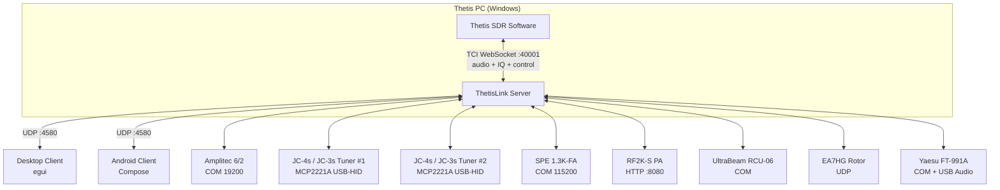

# ThetisLink v2.0.4 - User Manual

## Table of Contents

1. [Overview](#overview)
2. [Server configuration](#server-configuration)
3. [Starting the server](#starting-the-server)
4. [Connecting the client](#connecting-the-client)
5. [Operation](#operation)
6. [Devices](#devices)
7. [Yaesu FT-991A](#yaesu-ft-991a)
8. [Diversity reception](#diversity-reception)
9. [DX Cluster](#dx-cluster)
10. [Macros](#macros)
11. [Naming conventions](#naming-conventions)

---

## Overview

ThetisLink is a remote control application for the ANAN 7000DLE SDR with Thetis. It consists of:

- **ThetisLink Server** — runs on the Thetis PC (Windows), controls the radio via TCI
- **ThetisLink Client** — desktop client (Windows/macOS/Linux) with spectrum, waterfall and full control
- **ThetisLink Android** — mobile client app

The server communicates with Thetis via TCI WebSocket for both control and audio. Audio is transmitted via the Opus codec over UDP with minimal latency.

### Thetis version

ThetisLink has been tested with and requires **Thetis v2.10.3.15** (official release by ramdor). This is the base version: all core functionality (audio, spectrum, PTT, TCI control) works fully with unmodified Thetis.

Optionally there is the **PA3GHM Thetis fork** with ThetisLink-specific extensions. These extensions are behind the "ThetisLink extensions" checkbox in Thetis (Setup > Network > IQ Stream). With the checkbox unchecked, the stock TCI extension behaviour is preserved (the fork still carries its own build tag, release notes and About metadata). ThetisLink automatically detects whether extensions are available and switches over. Advantages of the fork:

- Extended IQ bandwidth up to **1536 kHz** (stock cap is 384 kHz), selectable per RX
- Server-side **CTUN auto-recenter** — DDC follows the VFO automatically on rapid tuning
- **Diversity auto-null suite**: Auto/Smart/Ultra with live circle broadcast for remote tuning visualisation
- **`tci_caps_ex` capability broadcast** — clients auto-detect which extensions the build offers
- Filter-preset push (`rx_filter_preset_ex`), per-RX DDC-rate push (`ddc_sample_rate_ex`)
- Additional TCI `_ex` commands for NB2, AGC-auto, VFO-swap, FM-deviation, step/preamp att

### Distribution

ThetisLink is distributed as a zip file with the following contents:

| File | Description |
|---------|-------------|
| `ThetisLink-Server.exe` | Server executable (Windows) |
| `ThetisLink-Client.exe` | Desktop client executable |
| `ThetisLink-2.0.3.apk` | Android client app |
| `Installation.pdf` | Installation guide (English) |
| `User-Manual-EN.pdf` | User manual (English, this document) |
| `Technical-Reference.pdf` | Technical reference (English) |
| `Installatie.pdf` | Installatiehandleiding (Nederlands) |
| `User-Manual.pdf` | Gebruikershandleiding (Nederlands) |
| `Technische-Referentie.pdf` | Technische referentie (Nederlands) |
| `LICENSE` | License (GPL-2.0-or-later) |
| `SHA256SUMS.txt` | SHA-256 checksums for binary verification |

> **Configuration files:** `thetislink-server.conf` and `thetislink-client.conf` are not bundled. They are created automatically with default values on the first start of the server and client (in the same folder as the exe).

### System requirements

- **Server:** Windows 10/11, Thetis v2.10.3.15 or PA3GHM fork, ANAN 7000DLE (or compatible)
- **Client:** Windows/macOS/Linux or Android 8+
- **Network:** WiFi or LAN, UDP port 4580

---

This manual assumes that ThetisLink has been installed and configured according to the **Installation Guide** (`Installation.md`). There you will find: installation of the server, desktop client and Android app, Thetis TCI configuration, firewall settings and network/port forwarding.

---

### Architecture



All audio (RX/TX), IQ spectrum data and control go through a single TCI WebSocket connection. ThetisLink v2.0.4 does not use a separate CAT TCP connection — TCI covers all required commands, with both stock Thetis v2.10.3.15 and the PA3GHM fork. No VB-Cable or other drivers required.

---


## Server configuration

The basic connection with Thetis (TCI/CAT addresses, device COM ports) is set up during installation — see `Installation.md`. Below are the advanced configuration options.

### DX Cluster

| Setting | Example | Description |
|---|---|---|
| `dxcluster_server` | `dxc.pi4cc.nl:8000` | DX cluster server address |
| `dxcluster_callsign` | `PA3GHM` | Callsign for cluster login |
| `dxcluster_enabled` | `true` | DX cluster on/off |
| `dxcluster_expiry_min` | `10` | Spot expiry time in minutes |

### Amplitec labels

```
amplitec_label1=JC-4s
amplitec_label2=A2
amplitec_label3=A3
amplitec_label4=A4
amplitec_label5=DummyL
amplitec_label6=UltraBeam
```

> **Important:** See [Naming conventions](#naming-conventions) for special integrations.

---

## Starting the server

1. Start Thetis and enable TCI (Setup > Serial/Network/Midi CAT > Network → TCI Server)
2. Start `ThetisLink-Server.exe`
3. Check the connection settings
4. Check the desired devices
5. Click **Start**
6. The server listens on UDP port 4580

### Server UI

The server displays:
- Connection status (TCI WebSocket)
- Active device windows (Tuner, Amplitec, SPE, RF2K, UltraBeam, Rotor, Yaesu)
- Macro buttons (2 rows of 12)
- Uptime and client info

---

## Connecting the client

1. Start the client.
2. On first run the client scans the local network via **mDNS** for running ThetisLink servers. Discovered servers appear automatically in a dropdown.
3. Select a server from the list, or enter the IP address manually (e.g. `192.168.1.79:4580`).
4. Click **Connect**.

The client automatically receives:
- Real-time spectrum and waterfall
- VFO frequency, mode and filter
- S-meter values
- Device status (Amplitec, UltraBeam, Yaesu, etc.)
- DX cluster spots

### Auto-discovery not working (mDNS)

If the mDNS dropdown stays empty but typing the IP manually works fine: mDNS uses UDP multicast (`224.0.0.251:5353`), which is sometimes blocked.

- **WiFi routers with AP isolation / client isolation**: multicast between clients is dropped. Disable that option in the router config or use a wired connection.
- **Intermittent on WiFi** (works right after boot, fails after a few minutes): typically a laptop WiFi driver / power-management issue dropping the multicast subscription. Workaround: UTP cable, or update the WiFi driver / disable-enable the NIC.
- **Cross-subnet**: mDNS uses TTL=1 and does not cross routers. Server and client must be in the same IP subnet.

Manually entered IP addresses work regardless of mDNS, so you do not need to wait for a fix if discovery fails.

---

## Operation

### VFO and frequency

- **Frequency display:** click to enter a frequency directly
- **Step buttons:** +/- in steps of 10 Hz, 100 Hz, 1 kHz, 10 kHz
- **Scroll wheel:** on the spectrum = 1 kHz steps
- **Click on spectrum:** tune to that frequency
- **Waterfall click (Android):** tune to click position

### Band memory

Per band the following is automatically saved:
- Frequency
- Mode (LSB/USB/CW/AM/FM/DIG)
- Filter width
- NR level

When changing bands these are automatically restored. In addition there are 5 free memory slots (M1-M5).

### Mode

Selectable: LSB, USB, CW, AM, FM, DATA-FM, DIG

### CW keyer (v2.0.0)

In CW mode a remote keyer is available over TCI:

- **CW key down/up:** an assigned button or MIDI pad triggers `keyer:0,true,duration_ms;` for a dit/dah, or a PTT-style press-and-release. The server log shows every key event.
- **CW macros:** pre-programmed text strings (CQ call, RST report, own call/QTH) are sent to Thetis via `cw_macros:0,text;`. Thetis sends them at the current keyer speed (`cw_keyer_speed:wpm;`).
- **Stop:** `cw_macros_stop;` cancels a running macro mid-character.

Speed and macro content are adjustable in the client.

### Filter

The filter width is adjustable with +/- buttons. Presets are available per mode:
- **CW:** 50, 100, 200, 500, 1000 Hz
- **SSB:** 1800, 2400, 2700, 3100, 3600 Hz
- **AM/FM:** 6000, 8000, 10000, 12000 Hz

**Filter preset tracking (v2.0.0, with fork):** with the PA3GHM fork the current Thetis filter preset (F1, F2, F3, VAR1, VAR2 or NONE) is synchronised live to the client. The client shows which preset Thetis currently has active and you can switch via the same button set — no manual double-setting between client and Thetis UI needed.

### Volume

- **RX Volume:** receive level (TCI `volume` / `rx_volume`)
- **TX Gain:** microphone preamplification
- **Drive:** transmit power 0-100%
- **Mic AGC:** automatic microphone gain (on/off)

### Noise Reduction & Notch

- **NR:** cyclic: OFF > NR1 > NR2 > NR3 > NR4
- **ANF:** Auto Notch Filter on/off

### PTT (Push-to-Talk)

ThetisLink offers three PTT modes:

- **Push-to-talk (spacebar):** hold the spacebar to transmit, release to stop
- **Toggle:** click the PTT button to switch between transmit and receive
- **MIDI PTT:** separate MIDI PTT mode via an assigned MIDI controller button, independent of the desktop PTT mode

**Android — external BT remote (ZL-01 or similar):** a Bluetooth button that behaves as an external touch device can be used as a PTT button. ThetisLink intercepts the touch events and maps them to PTT down/up. Only works while the screen is active (touch events are only delivered to a wakeful screen on Android).

### TX meter (v2.0.0)

During TX the S-meter switches to a TX meter showing:
- **Power** in watts (e.g. `TX  100W`)
- **SWR** colour-coded — below 1:2 green, 1:2-1:3 orange, above 1:3 red (e.g. `SWR 1.50`)

The SWR value is broadcast by Thetis over TCI during every TX burst and is visible in real time on every connected client.

### Spectrum and waterfall

- **Zoom:** adjustable, provides more accurate frequency display
- **Pan:** shift the visible spectrum left/right (0 = centered on VFO)
- **Reference level:** shift the dB range up/down
- **Auto Ref:** automatic reference level adjustment based on noise floor
- **Contrast:** waterfall brightness per band (remembered)
- **DDC sample rate (v2.0.0):** dropdown for the DDC IQ bandwidth. Stock Thetis offers 384 kHz; with the PA3GHM fork the per-RX selection is 48, 96, 192, 384, 768 or 1536 kHz. Higher rates show more spectrum but load network and CPU more heavily.

**Server-side CTUN auto-recenter (v2.0.0, with fork):** when the fork extension `auto_recenter_ex` is active, the server itself recenters the DDC when the VFO moves rapidly outside the current DDC zone. No manual action needed — the spectrum window follows the VFO automatically.

#### TX spectrum override

During transmission (TX) the spectrum is automatically adjusted for good display of the transmit signal:
- **Reference level:** overridden to -30 dB
- **Range:** overridden to 120 dB
- **Auto Ref:** automatically disabled during TX and the setting is saved
- After releasing PTT the original settings (including Auto Ref) are restored with a short delay, so the spectrum returns stably

### Popout windows

The client supports separate windows:
- **RX1 spectrum** — RX1 spectrum + waterfall with controls only
- **RX2 spectrum** — RX2 spectrum + waterfall with controls only
- **Joined** — RX1 and RX2 side by side with shared controls

In popout windows the following are available:
- S-meter (bar or analog needle meter, switchable via toggle button)
- All band/mode/filter/NR/ANF controls
- VFO A<>B swap button (bottom-left with analog needle meter)

### VFO B / RX2

Full second receiver support:
- Independent frequency, mode, filter, S-meter
- Own spectrum and waterfall
- VFO Sync: VFO B automatically follows VFO A
- A<>B: swap VFO A and B

### WebSDR/KiwiSDR (Desktop)

Built-in WebView for WebSDR and KiwiSDR reception:
- Frequency synchronization: WebSDR follows the VFO
- Automatically muted during transmission
- Favorites list with star icon

### MIDI Controller

Desktop and Android support USB MIDI controllers:
- **Scan** button searches for available MIDI devices
- **Learn** mode: press a MIDI button/slider, assign a function
- Available functions: PTT (with LED), VFO tune, volumes, drive, NR, ANF, mode, band, power
- Encoder steps: 1 Hz, 10 Hz, 100 Hz, 1 kHz
- **MIDI PTT mode:** separate PTT mode for MIDI, independent of the spacebar PTT mode

---

## Devices

### Amplitec 6/2 Antenna Switch

Serial USB connection (19200 baud). Displays:
- Current switch position port A and B
- 6 antenna positions with configurable labels
- Switch buttons per port

### StockCorner JC-4s / JC-3s automatic tuners (multi-tuner via MCP2221A)

From v2.0.3 the server supports **two physical tuners in parallel**, each via its own Adafruit MCP2221A USB-HID breakout. JC-4s and JC-3s use the same control protocol — the model label is cosmetic only. For each tuner slot you assign a board serial number and (optionally) the Amplitec-A antenna position the tuner physically sits behind; the server then automatically routes a Tune action to the correct physical tuner.

**Hardware wiring (per tuner):**
- **GP2** → through a gate resistor to the gate (2N7000) or base (MMBT3904) of a transistor; on `HIGH` the transistor pulls the **grey "start" wire** of the JC-Control to GND (mechanically equivalent to pressing the start button).
- **GP1** → ADC input on the midpoint of a **1 MΩ + 1 MΩ 1:1 voltage divider** on the **yellow "tune-status" wire**. Idle ≈ 4.5 V, tune-active ≈ 0 V; the high impedance does not appreciably load the JC-Control LED circuit.
- **GND** → common ground with the JC-Control.
- The full schematic (with both 2N7000 and MMBT3904 variants) lives in the technical reference.

**First-time setup:**
1. Plug in all MCP2221A boards and open the **MCP2221A tuner bridges** section at the bottom of the server status panel (expand with the triangle; the open/closed state is remembered across restarts).
2. Click **Scan** under "Detected MCP2221A boards" — every board on the USB bus is listed with its HID path and current serial number.
3. For each **anonymous** board (empty serial): enter a unique name under "Set serial:" (for example `JC-4s loop` or `JC-3s vertical`) and click **Program serial**. The board persists the name in EEPROM; click **Scan** again to confirm the new name.
4. For each **Tuner1** / **Tuner2** block: pick the board for that slot under "MCP serial:" and pick the antenna position (1–6) the tuner sits behind under "Amplitec pos:". Both actions trigger an auto-restart so the bridge re-opens against the chosen board.

**Per-tuner status row shows:**
- Header: tuner label + "Connected" / "Not connected" / "Error: …"
- **MCP serial** dropdown and **Amplitec pos** dropdown.
- **Live:** current voltage on the yellow wire (V, post-divider).
- **Threshold** slider (0.5–4.5 V, default 2.25 V): the switch level on the yellow wire.
- **Hysteresis** slider (0.1–2.0 V, default 0.50 V): dead band around the threshold to reject transient noise.
- **Edges:** the derived edges (`active < … V`, `idle > … V`). When the combination is impossible (e.g. threshold 0.5 V + hysteresis 2.0 V → active < 0 V) an amber **⚠ clamped** warning appears with a hover tip explaining the combo will never trigger — reduce the hysteresis or move the threshold away from the boundary.

**Tune sequence (per tuner):**
1. PA standby (SPE/RF2K) if either is in Operate.
2. GP2 HIGH (start asserted) and wait for the yellow wire to drop below the active edge = tuner ACK.
3. GP2 LOW (start released).
4. Thetis carrier ON (`ZZTU1;`).
5. Wait for the yellow wire to return above the idle edge = tune complete.
6. Thetis carrier OFF (`ZZTU0;`).
7. PA back to Operate.

A timeout fires if the tuner does not ACK within 3 s after GP2 HIGH (status **Timeout**), or if the tune cycle does not complete within 30 s (idem). **Abort** breaks the cycle and forces GP2 back to LOW. A single ADC poll is rate-limited to 100 ms per board; the tuner thread explicitly checks the sample timestamp to avoid double-counting rate-limited cached samples.

**USB auto-reconnect:** once a bridge has been "Connected" at least once and the link drops afterwards (cable unplugged, sleep mode, hub reset, …), the tuner thread retries the open every 5 s on its own. A successful reconnect resets the timer so a subsequent drop is retried immediately — no server restart needed.

> **Tune-button visibility:** The Tune button in the main screen is only visible when at least one Amplitec label contains a tuner-recognising word (`JC-4s`, `JC4s`, `JC-3s`, `JC3s`, or `Tuner`). Routing to the correct physical tuner slot happens automatically based on the active Amplitec-A position — see [Naming conventions](#naming-conventions).

### SPE Expert 1.3K-FA

Serial USB connection. Displays:
- Power, SWR, temperature
- Antenna selection
- Operate/Standby status

### RF2K-S

TCP/IP connection (port 8080). ThetisLink supports both the original RF2K-S firmware and the modified v190 firmware with extended drive control.

**Original firmware — basic functionality:**
- Band and frequency readout
- Operate/Standby switching
- Tuner control (mode, L/C values)
- Error status and antenna selection
- Power, SWR, temperature

**Modified firmware (v190+) — additional functionality:**
- Drive power readout and adjustment (increment/decrement)
- Drive configuration per band and modulation type (SSB/AM/Continuous)
- Debug telemetry (bias voltage, PSU voltage, uptime)
- Controller version with hardware revision

ThetisLink automatically detects which firmware is active. With the original firmware everything works except drive control.

The RF2K-S can be reset via the server UI when needed.

### UltraBeam RCU-06

Serial USB connection (19200 baud). Functions:
- **Frequency display** with band indication
- **Direction buttons:** Normal, 180 degrees, Bi-Dir
- **Frequency step buttons:** -100, -50, -25, +25, +50, +100 kHz
- **Sync VFO:** set the UltraBeam to the current VFO frequency (A or B, depending on Amplitec switch position)
- **Auto:** automatic frequency tracking of the active VFO
  - Minimum step: 25 kHz (prevents motor overload)
  - VFO selection is automatically determined via the Amplitec (see [Naming conventions](#naming-conventions))
- **Band presets:** quick-select buttons per band
- **Motor indicators M1 / M2 (v2.0.0):** two badges next to the progress bar showing per-motor activity. Orange = motor running, grey = motor idle. During a large band change (e.g. 80m → 10m) you typically see both orange briefly, and when one motor reaches its target first you see that badge turn grey while the other keeps running.
- **Motor progress:** shared progress bar during element movement. The RCU-06 only exposes a single combined progress value for both motors — exact per-motor progress is not available from the controller.
- **Retract:** retract all elements (with confirmation)
- **Element display:** current element lengths in mm

### Rotor backends

ThetisLink supports two rotor backends. In the server config window under *Rotor → backend* you choose which one to use; one at a time is active.

The client panel (compass, GoTo, Stop) looks the same for both — the backend choice only affects how the server talks to the rotor hardware.

#### EA7HG Visual Rotor

Direct UDP connection to EA7HG Visual Rotor software (Prosistel protocol). Enter the Visual Rotor address (e.g. `192.168.1.60:3010`); no further configuration needed.

#### PstRotator (XML/UDP)

PstRotator (yo3dmu) supports nearly all rotor hardware brands. Recommended when you don't use EA7HG Visual Rotor, or when you want to drive a rotor that is not directly supported by ThetisLink.

**Requirements**

- PstRotator (or a variant such as PstRotatorAZ for azimuth-only) runs on a PC in the same LAN. That can be the same PC as the ThetisLink server, or a different one.

**Setup in the ThetisLink server** (Connections → Rotor)

1. *Backend* = **PstRotator (XML/UDP)**.
2. *PstRotator host* = IP address of the PC running PstRotator.
3. *Port* = `12000` (PstRotator default).
4. *Feedback port (local)* = `12001` (= PstRotator's listener port + 1).
5. *Has elevation* = on only for an AZ+ELE rotor (PstRotator); off for PstRotatorAZ.

**Setup in PstRotator**

1. *Communication → UDP Control Port…* → `12000`.
2. Tick *Setup → UDP Control*.
3. In the UDP settings, enter the **IP address of the ThetisLink server PC**. PstRotator sends its position feedback to this IP on port 12001.

**Firewall**

- ThetisLink server PC: allow inbound UDP 12001 for `ThetisLink-Server.exe`. An app-level allow through Microsoft Defender Firewall (`Allow an app through firewall`) covers this automatically.
- PstRotator PC: allow inbound UDP 12000 for `PstRotator.exe` or `PstRotatorAZ.exe`. PstRotator typically asks for this on first launch.

---

## Yaesu FT-991A

ThetisLink can control a Yaesu FT-991A transceiver as a second radio alongside the ANAN. The Yaesu is connected via a serial USB COM port.

### Functions

- **Frequency:** read and set the current frequency
- **Mode:** read and set (LSB, USB, CW, AM, FM, DATA-FM, DIG)
- **VFO A/B:** switch between VFO A and VFO B
- **Memory channels:** automatically loaded when the Yaesu is enabled in the server. Channels with a name are displayed in the UI
- **Menu editor:** read and modify Yaesu menu settings via the server UI
- **Audio:** the Yaesu USB audio is captured by the server and sent via the AudioRx2 channel to the client, where it is mixed with the ANAN RX signal
- **Auto-DFM during TX (v2.0.0):** see subsection below

### Auto-DFM PTT toggle (FM ↔ DATA-FM)

On the FT-991A, USB-mic TX in plain FM mode does not work — only DATA-FM accepts USB-mic audio. To work FM remotely you would therefore need to leave the radio permanently in DATA-FM, which also forces RX audio to DATA-FM (no squelch, different filtering).

From v2.0.0 ThetisLink toggles this automatically:

- **PTT press** while in FM ('4'): the server sends `MD0A;` (DATA-FM) → short settle → `TX1;`. Yaesu now transmits via the USB-mic audio path.
- **PTT release** after an auto-DFM cycle: the server sends `TX0;` → settle → `MD04;` (back to FM). RX audio is plain FM again.
- **Memory mode:** if the radio is in Memory mode on an FM channel, the server captures the channel number on PTT-on and restores it via `MC<nnn>;` after PTT-off, so Memory mode and the original channel are preserved across the cycle.

Auto-DFM is inactive in DATA-FM ('A'), USB ('2'), FM-N ('B') and other modes — they keep their normal TX path.

Known limits: a mode change during active TX can confuse the auto-restore; avoid pressing mode buttons while PTT is active. After a server crash during TX you must manually return to FM (the server cannot automatically recover its in-flight state).

### Configuration

```
yaesu_port=COM5
yaesu_enabled=true
```

The Yaesu audio is automatically played on the client when the device is enabled.

---

## Diversity reception

ThetisLink supports diversity reception via RX1 and RX2. This combines two antennas (for example the ANAN on two different antenna inputs) for improved reception.

### Usage

1. Enable RX2 via the client
2. Set both VFOs to the same frequency (or use VFO Sync)
3. The server sends independent spectrum and audio streams for RX1 and RX2
4. Use the volume controls to set the balance between RX1 and RX2

Diversity also works in combination with the popout windows (Joined view) for a clear display of both receivers.

### Smart and Ultra Auto-Null (Diversity)

In addition to manual diversity adjustment, ThetisLink offers two automatic null algorithms:

- **Smart:** performs an AVG sweep over 360° + 90° in steps of 5° with settle time per step. Takes approximately 9 seconds. Reliable and accurate.
- **Ultra:** continuous forward/backward sweep without settle time, considerably faster (approximately 5 seconds). Suitable when you want to quickly find a null.

Both algorithms are available in the dropdown next to the **Auto Null** button. After completion the result is shown in dB improvement: green means a good null, orange means little difference from the starting situation.

On Android there is a **Smart Null** button that shows the result in dB after completion.

**Live circle broadcast (v2.0.0, with fork):** during a Smart or Ultra sweep the PA3GHM fork streams the current phase/gain position in real time. The client shows the live measurement as a moving dot on the circle plot, so you can see the algorithm walking the search space. This also works when another client started the sweep — all connected clients see the same live trace.

---

### Audio recording and playback

The client has a built-in audio recorder and player:

- **Record** button in the Server tab with checkboxes for **RX1**, **RX2** and **Yaesu** — select which audio channels you want to record
- Recordings are saved as WAV files (8 kHz, mono) next to the client executable, with a timestamp in the filename
- **Play** button plays back the last recording:
  - **Without PTT:** the recorded audio is played through the speakers, mixed with the receive audio
  - **With PTT held:** the recording replaces the microphone (TX inject) — useful for testing your own modulation or repeating a CQ message
- **Stop** button cancels playback. At the end of the recording it stops automatically.

---

### Spectrum and waterfall colors

The spectrum and waterfall use a signal level-dependent color scale:

- **Blue** (weak signal) -> **cyan** -> **yellow** -> **red** -> **white** (strong signal)
- Both the spectrum line and the waterfall use the same color scale
- The colors are identical on desktop and Android

---

### Remote management

In the Server tab there is a **Remote Reboot / Shutdown** button with which you can remotely restart or shut down the server PC:

- After clicking, choose between **reboot** or **shutdown**
- For reboot a `ThetisLinkReboot` scheduled task is required on the server PC (see Installation.md for the configuration)

---

### Audio mode (Mono/BIN/Split)

In the RX1 section there is a dropdown for the audio mode:

- **Mono:** RX1 and RX2 audio are mixed on both ears (default)
- **BIN:** RX1 binaural audio on left and right + RX2 (requires Thetis to be in BIN mode)
- **Split:** RX1 on the left ear, RX2 on the right ear, with independent volume controls per channel

---

## DX Cluster

ThetisLink connects directly to a DX cluster server (telnet). Spots are:
- Displayed on the spectrum as colored dotted lines with callsign labels
- Filtered on the band of VFO A and VFO B
- Automatically removed after the configured expiry time

**Spot colors per mode:**
- CW: yellow
- SSB/Phone: green
- FT8/FT4/Digital: cyan
- Other: white

Spots are also forwarded to Thetis via TCI `SPOT:` command, so they also appear on the Thetis panorama.

**Click-to-tune (v2.0.0):** click a spot label on the spectrum (15-pixel snap zone) to tune the VFO directly to the spot frequency. The snap zone accounts for label overlap: clicks closer to another label go to that label. Clicks outside any snap zone fall back to normal click-to-tune (rounded to 1 kHz).

---

## Macros

The server supports 24 programmable macro buttons in 2 rows:
- **Row 1:** F1 through F12 (typically VFO A presets)
- **Row 2:** ^F1 through ^F12 (typically VFO B presets)

### Macro actions

Each macro can contain a sequence of actions:
- **CAT command:** e.g. `ZZFA00014292000;` (set VFO A to 14.292 MHz)
- **Delay:** e.g. `delay:200` (wait 200ms)
- **Tune:** start the tuner bound to the active Amplitec-A position (one or two physical tuners; see [StockCorner JC-4s / JC-3s automatic tuners](#stockcorner-jc-4s--jc-3s-automatic-tuners-multi-tuner-via-mcp2221a))

### Macro configuration

Macros are stored in `thetislink-macros.conf`:
```
macro_0_label=20m 14292
macro_0=ZZFA00014292000; ZZMD01;
```

### Common CAT commands

| Command | Description |
|---|---|
| `ZZFA00014292000;` | VFO A to 14.292 MHz |
| `ZZFB00007073000;` | VFO B to 7.073 MHz |
| `ZZMD00;` | VFO A mode to CW |
| `ZZMD01;` | VFO A mode to LSB |
| `ZZME00;` | VFO B mode to CW |
| `ZZME01;` | VFO B mode to LSB |

> **Note:** Use `ZZFA`/`ZZMD` for VFO A and `ZZFB`/`ZZME` for VFO B. A common mistake is using ZZMD in VFO B macros — this then changes the mode of VFO A!

---

## Naming conventions

ThetisLink uses the Amplitec antenna label names for automatic integrations between devices. If the label names are incorrect nothing breaks, but certain automatic functions will not work.

### UltraBeam integration

The Amplitec label for the UltraBeam antenna output must contain one of these words (case insensitive):
- `UltraBeam`
- `Ultra Beam`
- `UB`

**What this provides:**
- The **Sync VFO** button and **Auto** tracking in the UltraBeam panel automatically choose the correct VFO:
  - If Amplitec port **B** is on the UltraBeam position -> follows **VFO B**
  - If Amplitec port **A** is on the UltraBeam position -> follows **VFO A**
  - No match -> default **VFO A**

### JC-4s / JC-3s tuner integration (multi-tuner)

The Amplitec label for each tuner output must contain one of these words (case-insensitive):
- `JC-4s`
- `JC4s`
- `JC-3s`
- `JC3s`
- `Tuner`

**What this provides:**
- The **Tune** button in the main screen is only visible when at least one Amplitec label contains one of these words.
- When the Amplitec-A is switched to a position bound to a physical tuner slot in the server status panel (see [tuner section](#stockcorner-jc-4s--jc-3s-automatic-tuners-multi-tuner-via-mcp2221a)), the server automatically routes the Tune action to the correct physical tuner — the other one stays idle.

**Example configuration (two tuners):**
```
amplitec_label1=JC-4s loop
amplitec_label2=JC-3s vertical
amplitec_label3=Dipole
amplitec_label4=Beverage
amplitec_label5=DummyLoad
amplitec_label6=UltraBeam
```

In this example:
- Position 1 = JC-4s loop → bound to **Tuner1** in the server status panel, MCP serial `JC-4s loop`.
- Position 2 = JC-3s vertical → bound to **Tuner2**, MCP serial `JC-3s vertical`.
- Position 6 = UltraBeam → Sync VFO / Auto tracking for the UltraBeam (see [UltraBeam integration](#ultrabeam-integration)).

Pressing Tune with Amplitec-A on position 1 physically drives Tuner1; on position 2 drives Tuner2. Only one tuner runs at a time — PA orchestration and RF carrier are coordinated by the active tuner.

---

## Troubleshooting

For connection and installation problems (server won't start, client cannot connect, firewall, COM ports, password and 2FA), see `Installation.md`.

### Audio stutters

High loss% (visible at the bottom of the client) indicates a network problem. Try a wired connection instead of WiFi. On mobile (4G/5G) the jitter buffer adjusts automatically, but with high packet loss audio will continue to stutter.

### BT headset not recognized (Android)

Re-pair the headset via Android Bluetooth settings and restart the ThetisLink app.

**EQ profile auto-switch (v2.0.0):** ThetisLink Android keeps two separate TX-EQ profiles — one for the internal mic (`mic_profile_android_mic`) and one for the BT headset (`mic_profile_android_bt`). On PTT-on the app detects whether an active BT headset is present and automatically selects the corresponding profile. Configure both profiles via Setup → TX EQ; if in doubt which profile is active, check the PTT status display of the app.

### UltraBeam timeout when stepping quickly

The UltraBeam RCU-06 has a limited serial command speed. When pressing step buttons in rapid succession, intermediate commands are skipped and only the last one is sent. This is normal behavior and prevents motor overload.

### Spectrum and waterfall out of sync

If the spectrum (line) and the waterfall are not in sync when panning, restart the client and verify that both server and client run the current version.

---

## Version history

| Version | Highlights |
|---|---|
| **2.0.4** | **Bandwidth toolkit, preventive TX-inhibit, power-cap, PstRotator.** Backwards-compatible with v2.0.3 — wire-protocol additive only. **Preventive RX-only TX-inhibit** via the new `rx_only_ex` TCI command (requires Thetis fork PA3GHM TL2-3): MOX, spacebar, hardware-PTT and VOX refused at the source on an RX-only Amplitec position rather than reactively flipped back; stock Thetis falls back to the reactive `ZZTX0` catch-all. **Reactive RF power-cap per position** with PA-native DriveDown (SPE + RF2K-S), mode-multipliers (SSB/CW × 1.0, AM × 0.5, FM/DIG × 0.4); rate-limited to one step per second — brief CW-bursts (<1 s) can pass the reactive cap, preventive coverage exists only on RX-only positions. **PstRotator UDP/XML rotor backend** (host = numeric IP address, no DNS resolution). **Server-tab bandwidth monitor** (Down/Up Kbit/s, clickable for per-stream breakdown) — counts UDP application-payload bytes (the Windows network meter reads ~1.5-2× higher because it includes IP/UDP/Ethernet headers). **Per-client DX-spots opt-out** (Desktop + Android Settings), with server-side dedup (~90 Kbit/s broadcast storm → ~6 Kbit/s). **WebSDR favorites edit-toggle**. Server-log cleanup (PowerCap state-change-only + DXC reconnect one-line-per-cycle). |
| **2.0.3** | **Multi-tuner release + wire-protocol breaking change.** Two physical StockCorner JC-4s/JC-3s tuners in parallel via Adafruit MCP2221A USB-HID breakouts (replaces the v2.0.2 serial-port RTS/CTS flow); per-tuner threshold + hysteresis sliders on the yellow tune-status wire (1 MΩ + 1 MΩ divider, default 2.25 V / 0.50 V); board scan + serial programming UI; automatic USB reconnect; collapsible MCP2221A section in the status panel. Also: S-meter rewritten with three sources (Sig peak-hold, Avg true-mean, MaxBin), `rx_channel_sensors_ex` subscription, S9-frequency band shift; CTUN coupled-recenter + RX1/RX2 spectrum mirror; MIDI client-side VFO coalesce + auto-recenter handshake with the Thetis fork; per-PA drive-snapshot persistence across process restarts; collapsible window states remembered. **Wire-protocol u8 bumped from 2 → 3** (S-meter payload rearranged); v2.0.2 clients against a v2.0.3 server (and vice versa) receive `ProtocolVersionMismatch` with a localised message ("Server is too old" / "Client is too old"). |
| **2.0.2** | **Log-spam hotfix:** server-side `DiversityPhaseEx`, `DiversityGainEx` and `DiversityGainMultiEx` notifications now log INFO only on a real value change. Thetis pushes these on every diversity tick (~10-20 Hz), which previously filled the server log at hundreds of thousands of lines per session. Functional behaviour and wire protocol unchanged — fully interoperable with v2.0.0 / v2.0.1. |
| 2.0.1 | **Connect-experience release:** first-run 4-step setup wizard (Find server → Password → 2FA → Connected), mDNS local-network discovery (auto-find servers on the same WiFi/LAN), 9 differentiated connect-states with platform-aware NL/EN hints, server Status panel (bind addr, TCI state, active clients with RTT/loss/jitter, audio-routing chips, recent connect attempts), smart TciUnreachable hint (knows if Thetis is running, starting up or stopped), server-side RX2 audio filter fix (no phantom CH2 stream when RX2 is off), Re-run setup wizard button. Wire protocol unchanged (VERSION = 2) — fully interoperable with 2.0.0. |
| 2.0.0 | **TL2 release:** Yaesu auto-DFM PTT toggle (FM ↔ DATA-FM with memory restore), server-side CTUN auto-recenter, live diversity null-circle broadcast (Smart/Ultra), filter preset push (F1..VAR2/NONE), per-RX DDC sample rate (48..1536 kHz), `tci_caps_ex` capability broadcast, DX cluster click-to-tune, SWR display in TX meter, CW keyer + macros over TCI, single-TCI-only architecture (no separate CAT anymore), wire protocol VERSION = 2 |
| 1.0.0 | First public release on `cjenschede/ThetisLink` |
| 0.5.0 | Yaesu FT-991A support, Bluetooth headset (Android), diversity reception fix, TCI controls, RF2K-S reset, PTT modes, DX Cluster |
| 0.4.9 | Wideband Opus TX, device switch fix |
| 0.4.2 | Configurable FFT format, dynamic spectrum bins, Android power button fix |
| 0.4.1 | WebSDR/KiwiSDR integration, frequency sync, TX spectrum auto-override |
| 0.4.0 | TCI WebSocket, waterfall click-to-tune Android |
| 0.3.2 | MIDI controller support, PTT toggle with LED, Mic AGC |
| 0.3.1 | Band memory, FM filter fix, macOS client |
| 0.3.0 | Full RX2/VFO-B support, DDC spectrum+waterfall |
